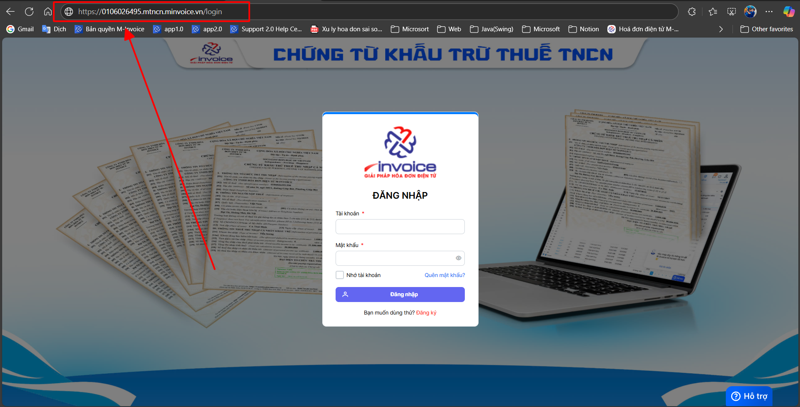
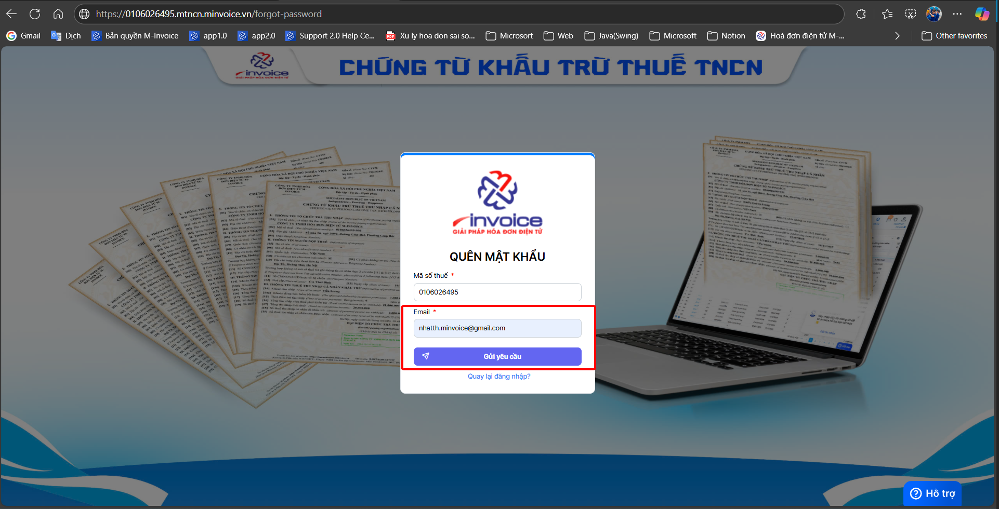

# **Đăng nhập mTNCN**

Dưới đây là những hướng dẫn thao tác cơ bản trên phần mềm chứng từ khấu trừ thuế TNCN ở phiên bản 2.0 vô cùng mạch lạc và dễ hiểu.

## **Hướng dẫn đăng nhập mTNCN**

**Thao tác cài đặt và thực hiện như sau**

### **Bước 1: Truy cập trình duyệt**

???+ note "Quý khách truy cập vào trình duyệt đang dùng"

    ví dụ:

    - Google Chrome
    :fontawesome-brands-chrome:
    - Microsoft Edge
    :fontawesome-brands-edge:
    - Cốc Cốc, ...

**Đường link mà quý khách có thể truy cập:**

1.  Mã_số_thuế.mtncn.minvoice.vn

Mã_số_thuế: là mã số thuế của công ty
**VD: 0106026495.mtncn.minvoice.vn**

### **Bước 2: Điền thông tin tài khoản để đăng nhập**

**Trường hợp quý khách quên mật khẩu thì có thể bấm vào QUÊN MẬT KHẨU để có thể lấy lại bằng email đã đăng ký khi đăng ký phần mềm**

???+ info "Xin chân thành cảm ơn quý khách hàng đã tin dùng sản phẩm của M-Invoice"

    Có bất kỳ vướng mắc nào trong quá trình sử dụng hãy liên hệ với M-Invoice tại mục Hỗ trợ kỹ thuật góc phải bên dưới màn hình hoặc gọi tổng đài kỹ thuật của M-Invoice (1900.955.557 Nhánh 1)

Last updated on <strong>Jun 13, 2025</strong> by <strong>NHATTH</strong>

