# **Danh mục người nộp thuế**

Dưới đây là những hướng dẫn thao tác cơ bản trên phần mềm chứng từ điện tử M-Invoice ở phiên bản 2.0 vô cùng mạch lạc và dễ hiểu.

## **Thêm danh mục người nộp thuế**

???+ Note "Ghi chú"

    Trong quá trình lập chứng từ cần điền thông tin người nộp thuế và để giảm bớt thao tác điền thông tin người nộp thuế khi nhập nhiều cho cùng 1 người nộp thuế, M-invoice hướng dẫn NSD thực hiện thêm danh mục người nộp thuế

### **Trên giao diện trang chủ truy cập Danh mục --> người nộp thuế**

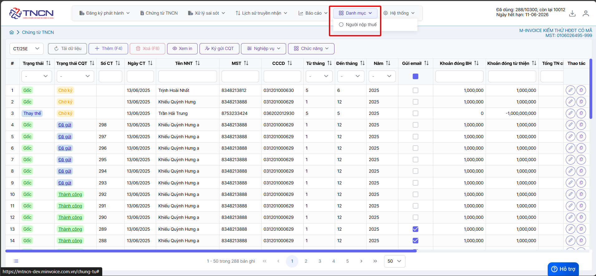

=== "Cách 1: Nhập thủ công"

    Bạn nhấn nút **Thêm(F4)** để bắt đầu thêm người nộp thuế

    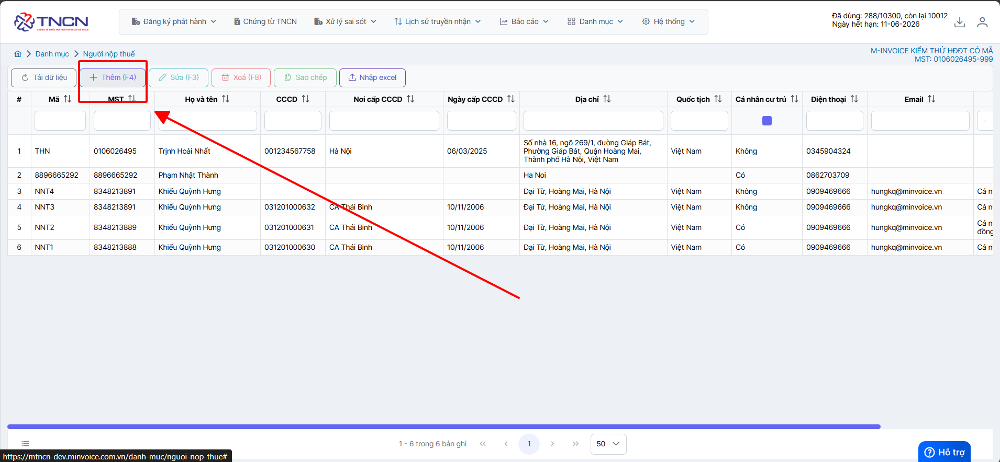

    Nhập thông tin như **Mã người nộp thuế, mã số thuế, Tên người nộp thuế, Địa chỉ, CCCDAN ....**

    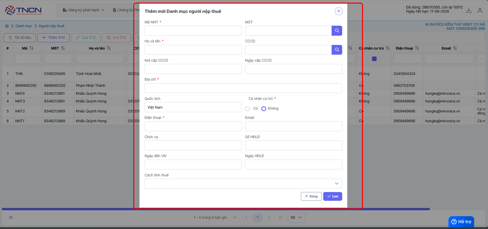

    **Khi nhập xong bạn nhấn Lưu để lưu người nộp thuế này vào**

    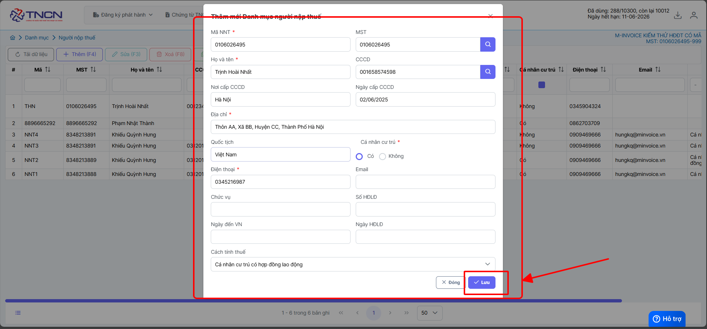

    **Sau khi nhập thành công**

    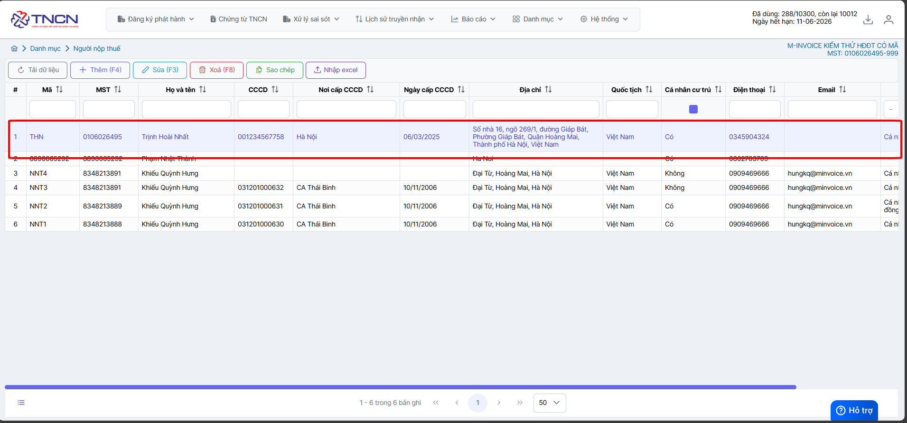

    **Cách để chọn người nộp thuế khi lập chứng từ sau khi vừa thêm vào danh mục - người nộp thuế**

    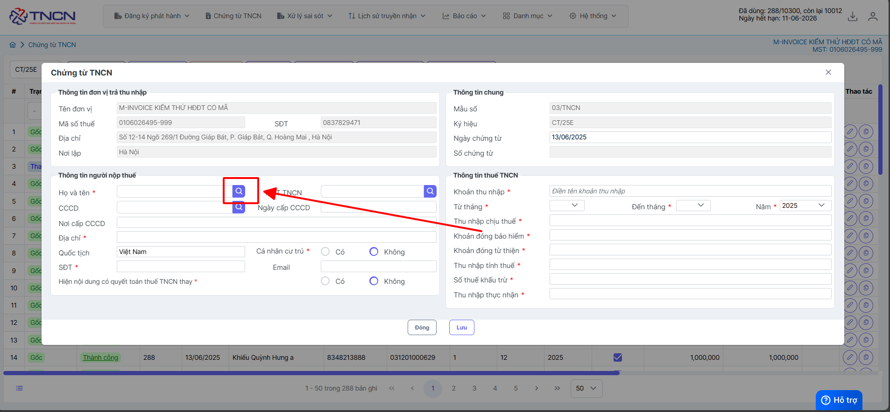

    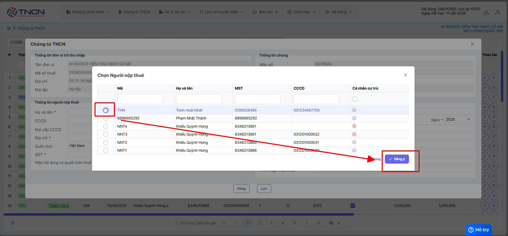

    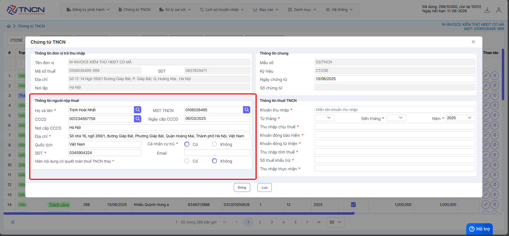

    Như vậy bạn đã tạo 1 người nộp thuế thành công trên hệ thống

=== "Cách 2: Nhập từ file excel"

    Trên giao diện Danh mục người nộp thuế bạn chọn **Nhập Excel**, sau đó nhấn **Tải file mẫu**

    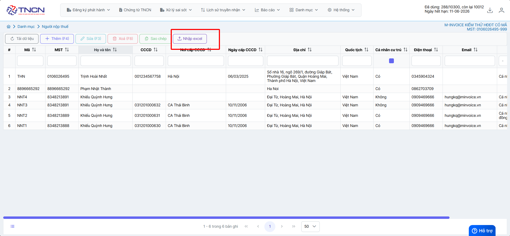

    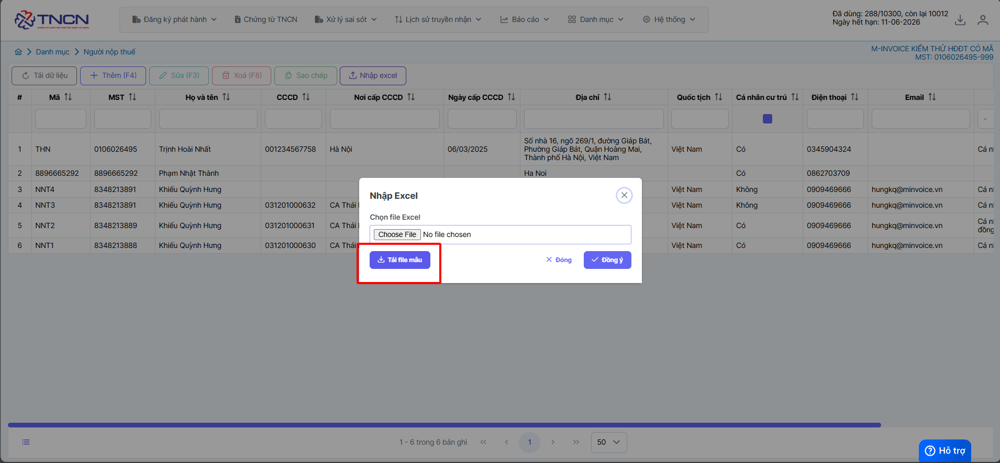

    Nhập đầy đủ thông tin bạn muốn tải lên vào file mẫu sau đó lưu lại (Những mục có dấu * là bắt buộc)

    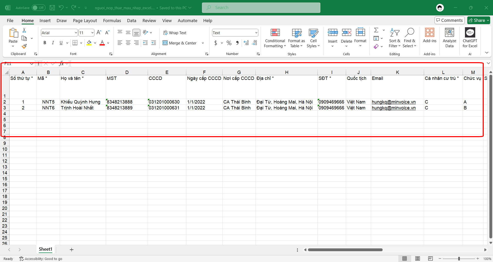

    Quay trở lại phần mềm nhấn Choose File để chọn file vừa lưu, sau đó nhấn Nhận File

    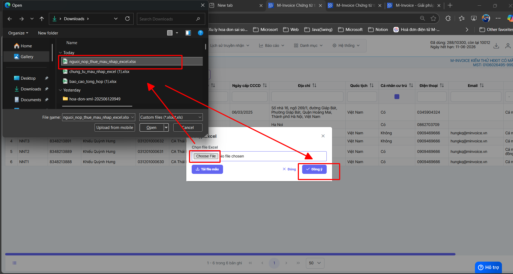

    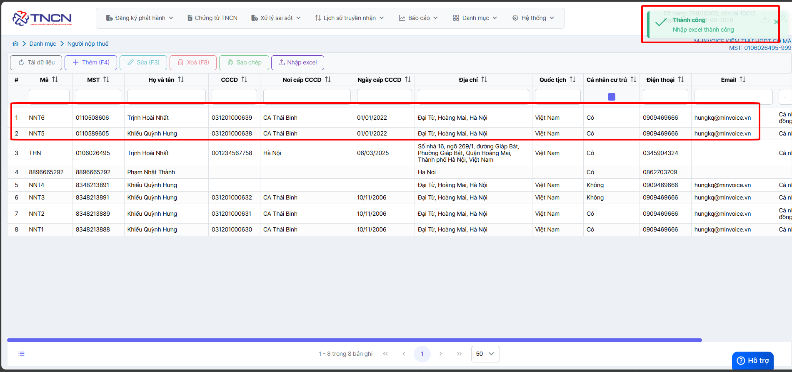

    Như vậy là bạn đã tải file excel lên thành công

???+ info "Xin chân thành cảm ơn quý người nộp thuế đã tin dùng sản phẩm của M-Invoice"

    Có bất kỳ vướng mắc nào trong quá trình sử dụng hãy liên hệ với M-Invoice tại mục Hỗ trợ kỹ thuật góc phải bên dưới màn hình hoặc gọi tổng đài kỹ thuật của M-Invoice (1900.955.557 Nhánh 1)

Last updated on <strong>Jun 13, 2025</strong> by <strong>NHATTH</strong>

