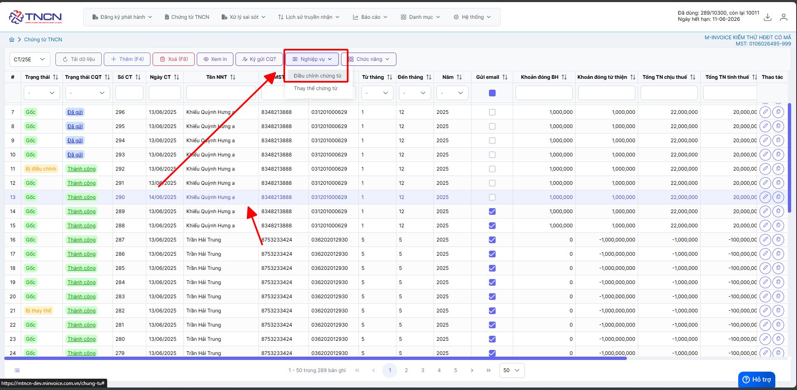
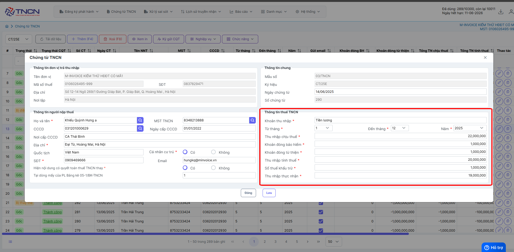
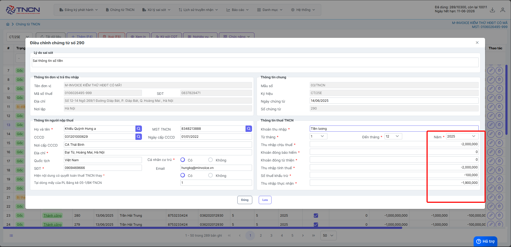

# **Điều chỉnh chứng từ**

Dưới đây là những hướng dẫn thao tác cơ bản trên phần mềm chứng từ điện tử M-Invoice ở phiên bản 2.0 vô cùng mạch lạc và dễ hiểu.

## **Hướng dẫn điều chỉnh chứng từ có sai sót**

???+ Note "Ghi chú"

    Trong quá trình phát hành chứng từ không tránh khỏi những sai sót. Sau đây, M-Invoice hướng dẫn NSD thực hiện xử lý chứng từ đã lập có sai sót
    Chỉ được phép sử dụng nghiệp vụ điều chỉnh chứng từ với các điều kiện sau:

    1. chứng từ cần điều chỉnh đã được gửi CQT thành công

    2. chứng từ cần điều chỉnh ở Trạng thái Gốc (Mới) hoặc `bị điều chỉnh`

???+ Warning "Lưu ý"

    Nếu đã lựa chọn nghiệp vụ điều chỉnh thì không được thay thế chứng từ

**Thao tác điều chỉnh như sau**

=== "Điều chỉnh giảm thu nhập chịu thuế"

    ### **Bước 1: Chọn chứng từ cần điều chỉnh --> Nghiệp vụ --> Điều chỉnh chứng từ**

    

    ### **Bước 2: Ghi âm thu nhập chịu thuế cần giảm và giảm các thông tin bị giảm theo**

    **VD: Trước khi điều chỉnh**

    

    **VD: Sau khi điều chỉnh**

    **Trường hơp trên khoản đóng bảo hiểm và khoản đóng từ thiện không giảm thì không điền**

    

Sau khi điều chỉnh nội dung chứng từ thành 1 chứng từ đúng. Người sử dụng có thể Ký và gửi chứng từ đã được lập điều chỉnh như một chứng từ thông thường.

???+ info "Xin chân thành cảm ơn quý khách hàng đã tin dùng sản phẩm của M-Invoice"

    Có bất kỳ vướng mắc nào trong quá trình sử dụng hãy liên hệ với M-Invoice tại mục Hỗ trợ kỹ thuật góc phải bên dưới màn hình hoặc gọi tổng đài kỹ thuật của M-Invoice (1900.955.557 Nhánh 1)

Last updated on <strong>Jun 13, 2025</strong> by <strong>NHATTH</strong>

