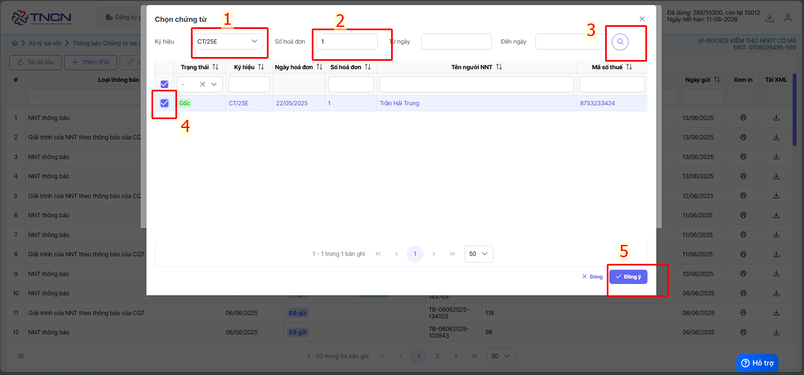

# **Giải trình chứng từ**

Dưới đây là những hướng dẫn thao tác cơ bản trên phần mềm chứng từ điện tử M-Invoice ở phiên bản 2.0 vô cùng mạch lạc và dễ hiểu.

## **Hướng dẫn lập giải trình 04ss**

???+ Note "Ghi chú"

    Mẫu 04/SS giải trình phù hợp trong các trường hợp sai sót sau

    - sai về tên, địa chỉ của người mua, ... nhưng không sai mã số thuế, phần tiền

**Thao tác cài đặt và thực hiện như sau**

### **Bước 1: Nhấn vào xử ký sai sót => Thông báo chứng từ sai sót 04/ss**

### **Bước 2: Bấm thêm**

### **Bước 3 : Click chọn chứng từ**

### **Bước 4 : Chọn ký hiệu, số chứng từ cần giải trình**

### **Bước 5 : Điền lý do sai sót cụ thể và điên thông tin đúng**

### **Bước 6 : Ký gửi CQT và gửi email**

**Anh chị có thể check khi bấm xem in ở đây**

Như vậy quý khách đã giải trình thành công chứng từ bị sai xót bằng mẫu 04/ss

???+ info "Xin chân thành cảm ơn quý khách hàng đã tin dùng sản phẩm của M-Invoice"

    Có bất kỳ vướng mắc nào trong quá trình sử dụng hãy liên hệ với M-Invoice tại mục Hỗ trợ kỹ thuật góc phải bên dưới màn hình hoặc gọi tổng đài kỹ thuật của M-Invoice (1900.955.557 Nhánh 1)

Last updated on <strong>Jun 13, 2025</strong> by <strong>NHATTH</strong>

