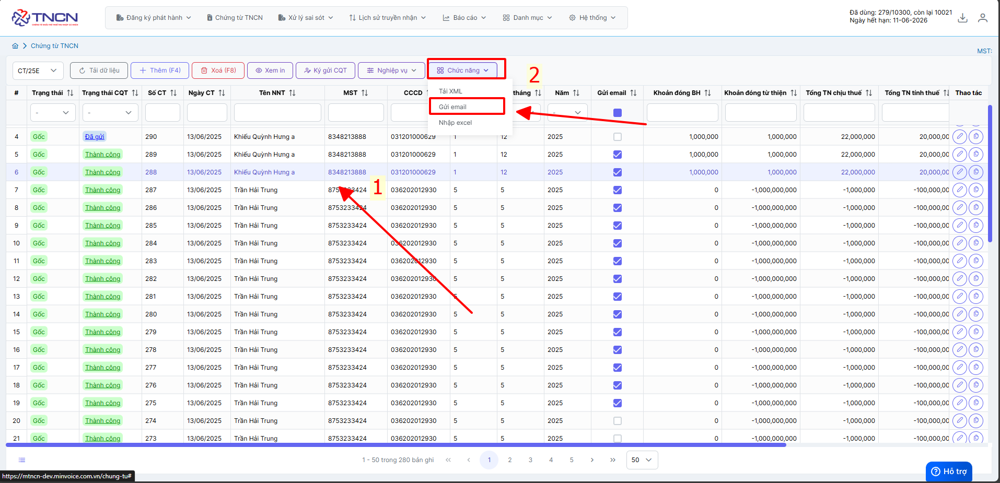
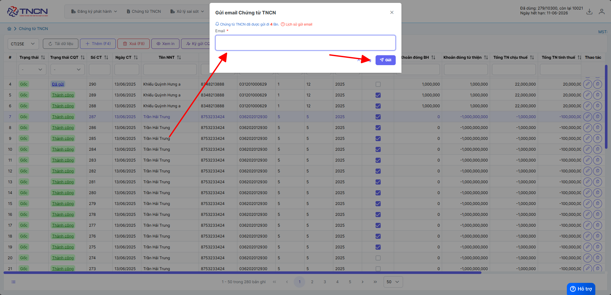
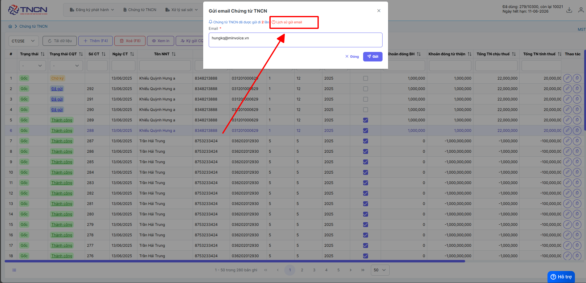
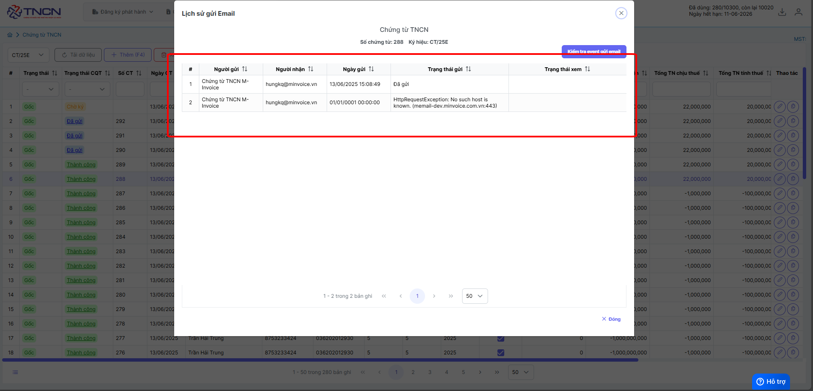
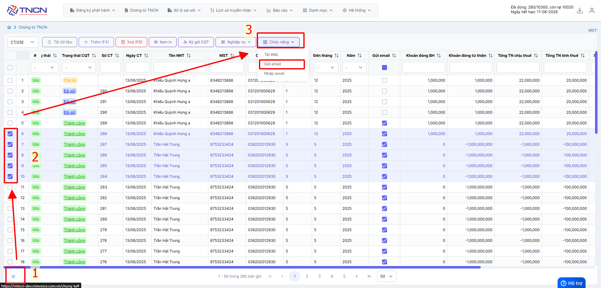

# **Gửi Email**

Dưới đây là những hướng dẫn thao tác cơ bản trên phần mềm chứng từ M-Invoice ở phiên bản 2.0 vô cùng mạch lạc và dễ hiểu.

## **Gửi Email chứng từ**

???+ Note "Ghi chú"

    Trong quá trình phát hành chứng từ, khách hàng sẽ cần thông tin để tra cứu chứng từ. M-invoice xin giới thiệu và hướng dẫn người dùng gửi thông tin tra cứu chứng từ cho khách hàng qua email, và đính kèm File PDF và XML

???+ Warning "Lưu ý"

    Chỉ gửi được chứng từ cho khách hàng khi chứng từ đã được ký (ở trạng thái thành công)

Gửi Email chứng từ

### **Bước 1: Chọn chứng từ cần gửi email -> chức năng -> gửi mail**

### **Bước 2: Nhập địa chỉ email cần gửi đến**

**Trường hợp chưa nhập mail ở trong thông tin người nộp thuế ở chứng từ thì quý khách cần điền mail của người nộp thuế**

**Kiểm tra xem được gửi thành công hay chưa**

### **Bước 3: Hướng dẫn gửi chứng từ hàng loạt**

???+ Danger "Lưu ý"

    Chức năng gửi hàng hoạt yêu cầu chứng từ đã được điền sẵn email của người nộp thuế.

Như vậy quý khách đã gửi thành công chứng từ cho người nộp thuế

???+ info "Xin chân thành cảm ơn quý khách hàng đã tin dùng sản phẩm của M-Invoice"

    Có bất kỳ vướng mắc nào trong quá trình sử dụng hãy liên hệ với M-Invoice tại mục Hỗ trợ kỹ thuật góc phải bên dưới màn hình hoặc gọi tổng đài kỹ thuật của M-Invoice (1900.955.557 Nhánh 1)

Last updated on <strong>Jun 13, 2025</strong> by <strong>NHATTH</strong>

