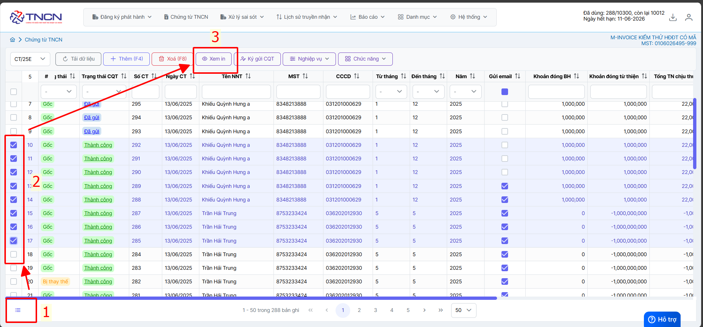
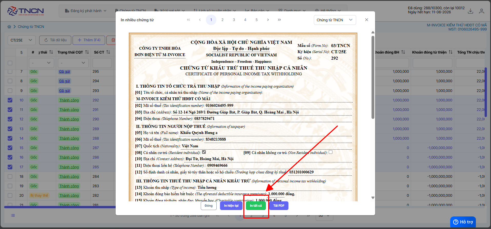
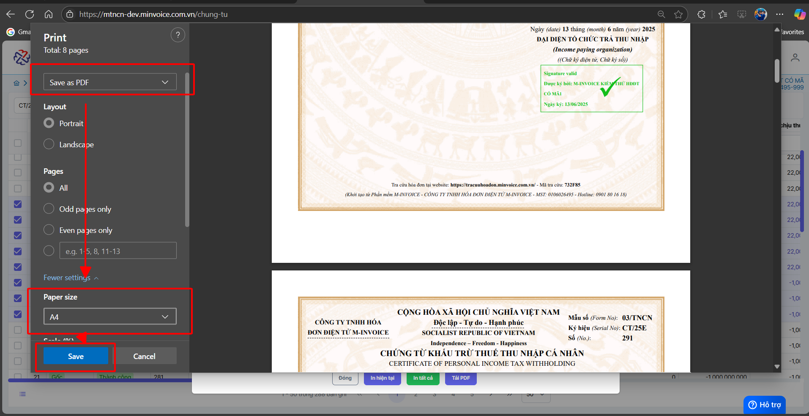
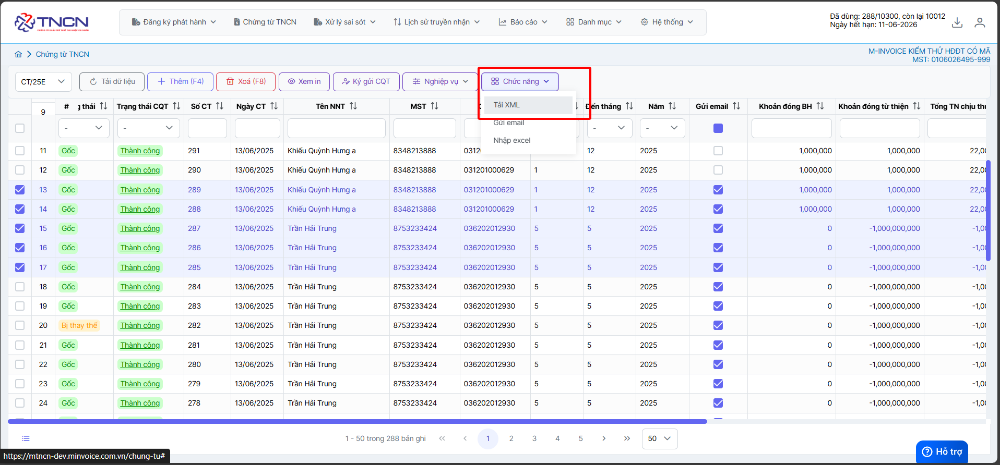
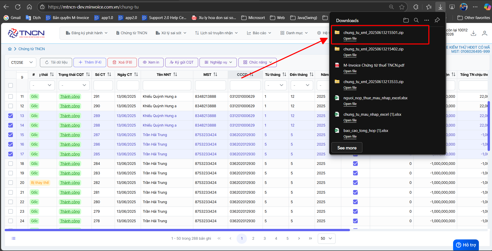

# **In hàng loạt PDF và XML**

Dưới đây là những hướng dẫn thao tác cơ bản trên phần mềm chứng từ điện tử M-Invoice ở phiên bản 2.0 vô cùng mạch lạc và dễ hiểu.

## **Hướng dẫn In hàng loạt PDF và XML**

Trong quá trình phát hành chứng từ người dùng sẽ có nhu cầu in chứng từ PDF và XML. M-invoice xin giới thiệu với khách hàng và người sử dụng tính năng in chứng từ PDF và XML

=== "Cách 1: In nhiều chứng từ PDF"

    ### **Bước 1: Tích chọn chứng từ muốn tải hoặc chọn tất cả**

    

    ### **Bước 2: Chọn **in tất cả**

    

    ### **Bước 3: Chọn SAVE AS PDF và chọn size A4 -> SAVE**

    

=== "In nhiều XML"

    ### **Bước 1: Tích chọn chứng từ muốn tải hoặc chọn tất cả**

    

    ### **Bước 2: Chọn chức năng --> tải xml**

    

    

Như vậy quý khách đã tải PDF và XML hàng loạt thành công

???+ info "Xin chân thành cảm ơn quý khách hàng đã tin dùng sản phẩm của M-Invoice"

    Có bất kỳ vướng mắc nào trong quá trình sử dụng hãy liên hệ với M-Invoice tại mục Hỗ trợ kỹ thuật góc phải bên dưới màn hình hoặc gọi tổng đài kỹ thuật của M-Invoice (1900.955.557 Nhánh 1)

Last updated on <strong>Jun 13, 2025</strong> by <strong>NHATTH</strong>

