# **Hướng dẫn phát hành chứng từ**

Dưới đây là những hướng dẫn thao tác cơ bản trên phần mềm chứng từ khấu trừ thuế TNCN ở phiên bản 2.0 vô cùng mạch lạc và dễ hiểu.

=== "Thêm chứng từ"

    ## **Hướng dẫn lập và phát hành chứng từ**

    ???+ Note "Ghi chú"

        Khi sử dụng phần mềm chứng từ, NSD sẽ cần lập và phát hành chứng từ. M-invoice sẽ giới thiệu với NSD tính năng lập và phát hành chứng từ trên hệ thống

    
Hướng dẫn lập và phát hành chứng từ

    
Anh chị có thể kiểm tra thông tin bản quyền và số lượng mua chứng từ theo ảnh sau

    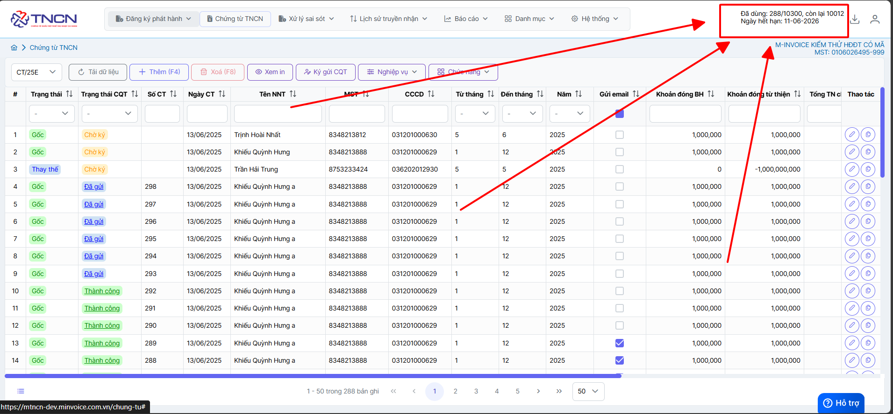

    ### **Bước 1: Truy cập vào phần lập chứng từ**

    Truy cập vào trang chứng từ điện tử M-invoice chọn phần **Chứng từ TNCN**

    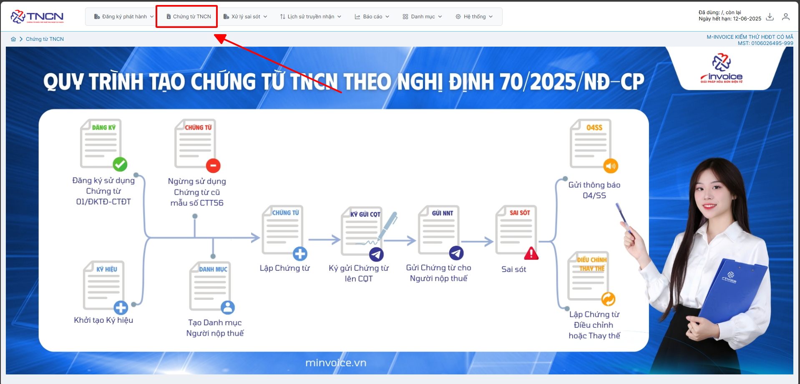

    Bấm thêm để điền thông tin chứng từ

    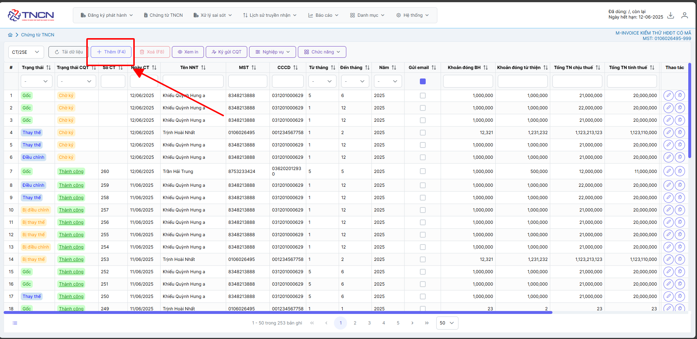

    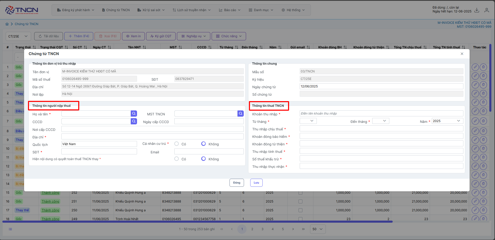

    ### **Bước 2: Nhập thông tin của chứng từ**

    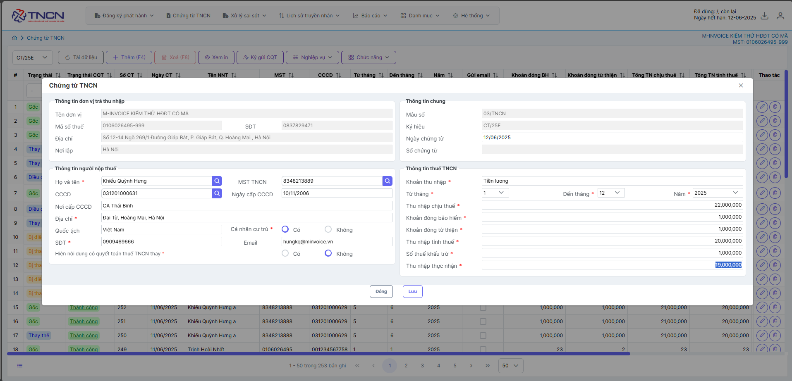

    ???+ note "Nội dung trên chứng từ (Khoản 18, Điều 1, nghị định 70)"

        **a)** Tên chứng từ khấu trừ thuế; ký hiệu mẫu chứng từ khấu trừ thuế, ký hiệu chứng từ khấu trừ thuế, số thứ tự chứng từ khấu trừ thuế;

        **b)** Tên, địa chỉ, mã số thuế của tổ chức, cá nhân chi trả thu nhập;

        **c)** Tên, địa chỉ, số điện thoại, mã số thuế của cá nhân nhận thu nhập (nếu cá nhân đã có mã số thuế) hoặc số định danh cá nhân;

        **d)** Quốc tịch (nếu người nộp thuế không thuộc quốc tịch Việt Nam);

        **đ)** Khoản thu nhập, thời điểm trả thu nhập, tổng thu nhập chịu thuế, khoản đóng bảo hiểm bắt buộc; khoản từ thiện, nhân đạo, khuyến học; số thuế đã khấu trừ;

        **e)** Ngày, tháng, năm lập chứng từ khấu trừ thuế;

        **g)** Họ tên, chữ ký của người trả thu nhập.

    ???+ note "Thông tin người nộp thuế"

        - Anh chị điền tin của người nộp thuế như Họ và tên, CCCDAN, MST TNCN, ....

        - Trường hợp là khách nước ngoài không cứ trú thì anh chị chọn không

        - Nếu khách ủy quyền quyết toán thuế thay -> chọn `có` và điền `Tại dòng mấy của PL Bảng kê 05-1/BK-TNCN`

        👉 Đây là số thứ tự dòng của người lao động trong Phụ lục 05-1/BK-TNCN – là bảng kê chi tiết danh sách những người được quyết toán thay.

        **Trường hợp quý khách xuất nhiều cho một thông tin người nộp thuế**  -> có thể thêm vào phần danh mục -> người nộp thuế theo hướng dẫn sau đây [Danh mục người nộp thuế](danh-muc-khach-hang.md#attribute-lists){ data-preview }

    ???+ note "Cách xác định số thuế khấu trừ"

        ???+ note "Đối với cá nhân có hợp đồng lao động trên 03 tháng"

            Cách tính thuế TNCN đối với cá nhân cư trú có hợp đồng lao động trên 03 tháng và có nguồn thu nhập từ tiền công, tiền lương

            Những công thức áp dụng để tính thuế TNCN:

            **(1)** Thuế TNCN cần nộp = Thu nhập tính thuế × Thuế suất.

            **(2)** Thu nhập tính thuế = Thu nhập phải chịu thuế − các khoản giảm trừ.

            **(3)** Thu nhập phải chịu thuế = Tổng tiền lương nhận được − Các khoản được miễn thuế.

        ??? note "Đối với cá nhân ký hợp đồng lao động dưới 03 tháng hoặc không ký hợp đồng"

            Căn cứ điểm i khoản 1 Điều 25 Thông tư 111/2013/TT-BTC quy định với nội dung là cá nhân cư trú ký kết hợp đồng lao động dưới 03 tháng hoặc không ký kết hợp đồng lao động có mức thu nhập dưới 2.000.000 đồng/tháng thì không cần chịu thuế với mức 10%. Trường hợp cá nhân cư trú ký kết hợp đồng lao động dưới 03 tháng hoặc không ký kết hợp đồng lao động có mức thu nhập từ tiền lương, tiền công trên 2.000.000 đồng/tháng thì phải khấu trừ là 10%.

            Công thức tính thuế thu nhập cá nhân cho trường hợp 02 là:

            Thuế thu nhập cá nhân phải nộp = 10% × Tổng thu nhập trước khi trả

        ??? note "Cách tính thuế TNCN đối với cá nhân không cư trú"

            Theo quy định của pháp luật cá nhân không cư trú sẽ không được tính khoản giảm trừ gia cảnh nên chỉ cần có mức thu nhập lớn hơn 0 thì sẽ phải chịu mức khấu trừ thuế thu nhập cá nhân là 20%. Những khoản mà nhóm đối tượng cá nhân không cư trú được giảm là khoản đóng bảo hiểm, quỹ hưu trí, đóng góp khuyến học, làm thiện nguyện.

            Công thức tính thuế thu nhập cá nhân đối với cá nhân không cư trú là:

            Thuế thu nhập cá nhân phải nộp = 20% × Thu nhập chịu thuế

            Trong đó: Thu nhập chịu thuế bao gồm tiền công, tiền lương và những khoản thu khác mà cá nhân nộp thuế nhận trong kỳ tính thuế.

    ???+ note "Thông tin thuế TNCN"

        - Điền tên khoản thu nhập

        - Điền từ tháng đến tháng và năm muốn lập  Trường hợp người nộp thuế làm thời vụ và lập tháng ngắt quãng thì lập ra những tờ khác nhau. VD:1, 5, 8 -> LẬP 3 TỜ

        - Điền các thông tin tính thuế,....

    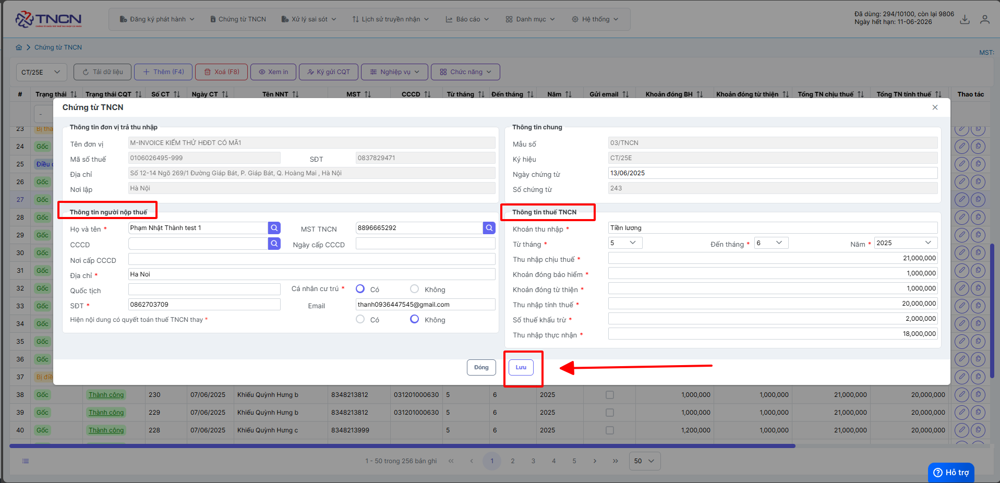

    ### **Bước 3: Kiểm tra thông tin trước khi ký gửi thuế**

    **Chọn dòng cần xem in** ---> **XEM IN**

    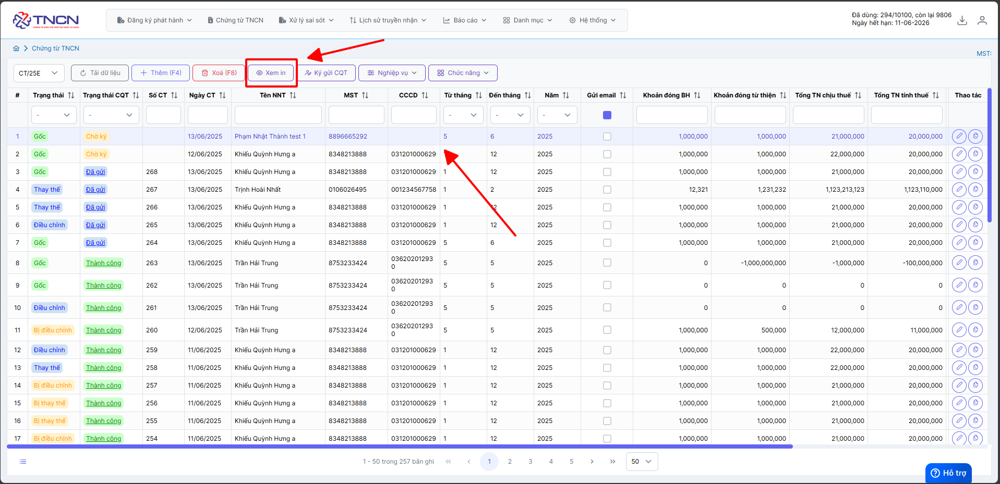

    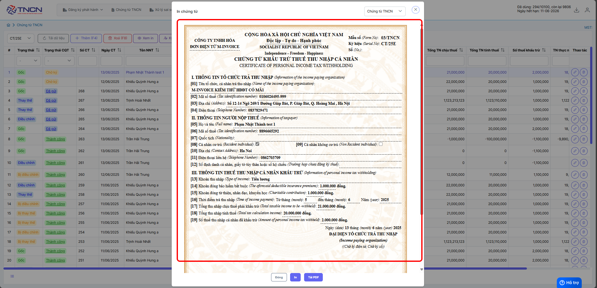

    ### **Bước 4: Ký gửi CQT**

    **Chọn dòng cần ký** ---> **Ký gửi CQT**

    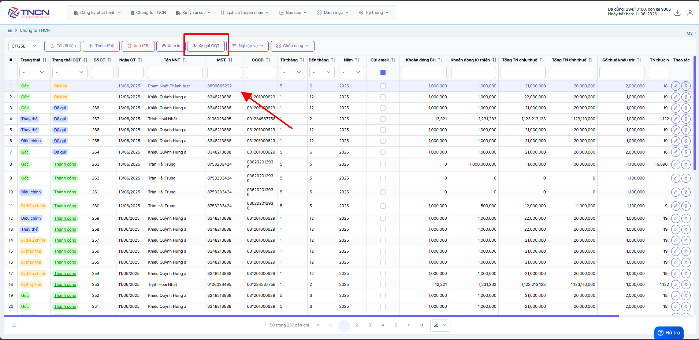

    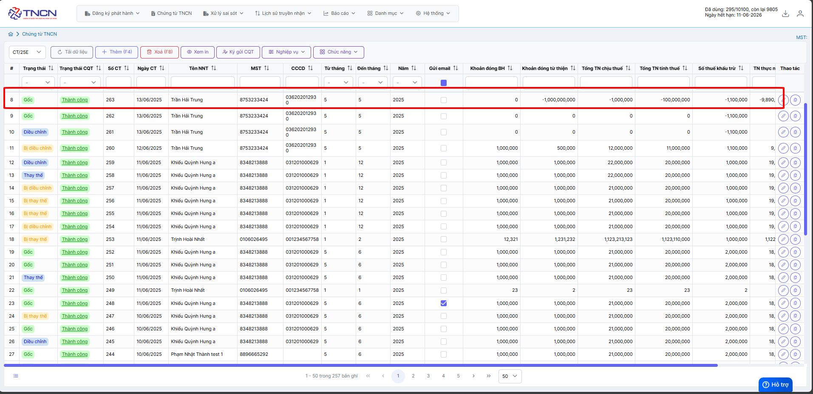

    Chứng từ ngay sau khi ký sẽ tự động nhảy số chứng từ tiếp theo và ngày chứng từ sẽ ngày ký chứng từ

    ???+ note "THỜI ĐIỂM GỬI CHỨNG TỪ LÊN CQT (Khoản 22, Điều 1, Nghị định 70)"

        Tổ chức cá nhân khấu trừ thuế sau khi lập đầy đủ các nội dung trên chứng từ khấu trừ thuế thu nhập cá nhận điện tử gửi cho người bị khấu trừ thuế và đồng thời gửi cho cơ quan thuế ngày trong ngày lập chứng từ.

    Như vậy quý khách đã phát hành thành công chứng từ

    ### **Bước 5: Tùy chọn mẫu chứng từ**

    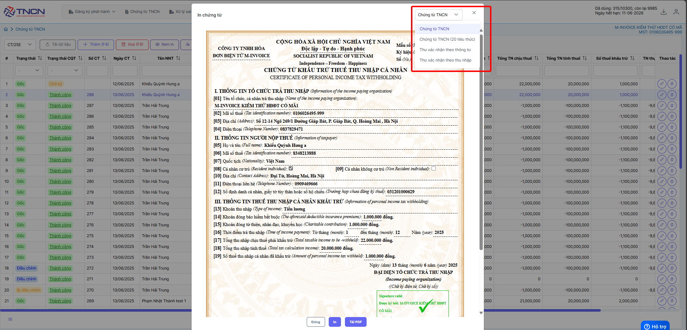

    1. Trường hợp muốn chọn tiêu thức (từ NĐ70 sẽ có thêm tiêu thức 20, tiêu thức 20 là `Số thu nhập thực nhập`)

    2. Thư xác nhận theo thông tư

    3. Thư xác nhận theo thu nhập

    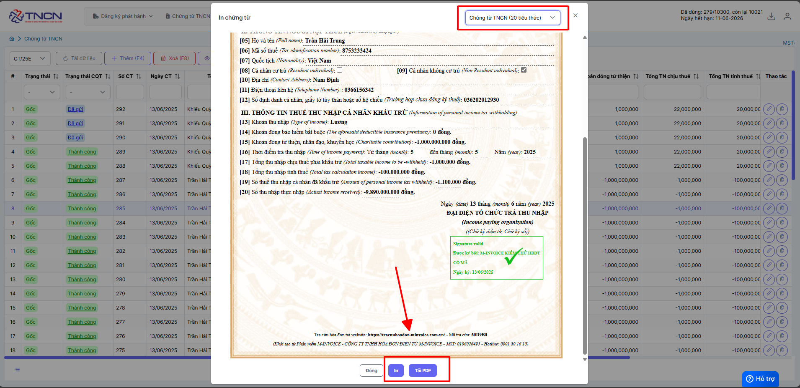

    Trường hợp Anh chị muốn in và tải PDF chứng từ thì có thể làm theo hướng dẫn trên

=== "Sửa chứng từ"

    ## **Hướng dẫn sửa chứng từ Chờ ký**

    ???+ Note "Ghi chú"

        Trong quá trình sử dụng phần mềm chứng từ điện tử M-invoice, NSD nhiều lúc sẽ tạo sai thông tin của chứng từ nháp và NSD sẽ muốn sửa lại sao cho đúng với yêu cầu. M-invoice xin giới thiệu với khách hàng và người sử dụng tính năng sửa chứng từ nháp trên phần mềm

    ### **Bước 1: Tại màn hình danh sách chứng từ, chọn chứng từ chờ ký muốn sửa**

    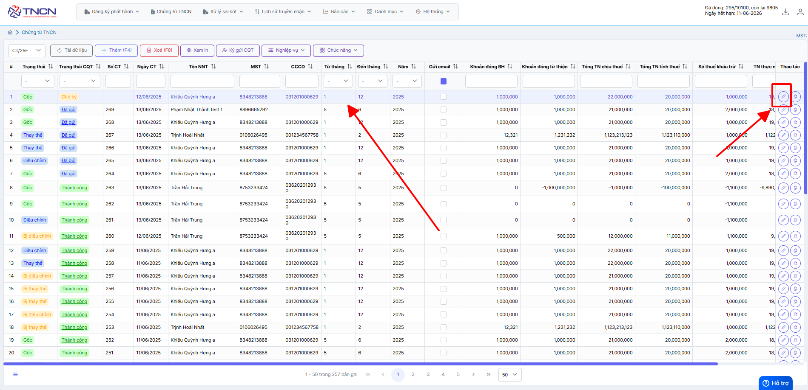

    Chỉ sửa được chứng từ khi ở trạng thái `Chờ ký`

    ### **Bước 2: Sửa nội dung chứng từ và click "Lưu" để lưu lại thông tin**

    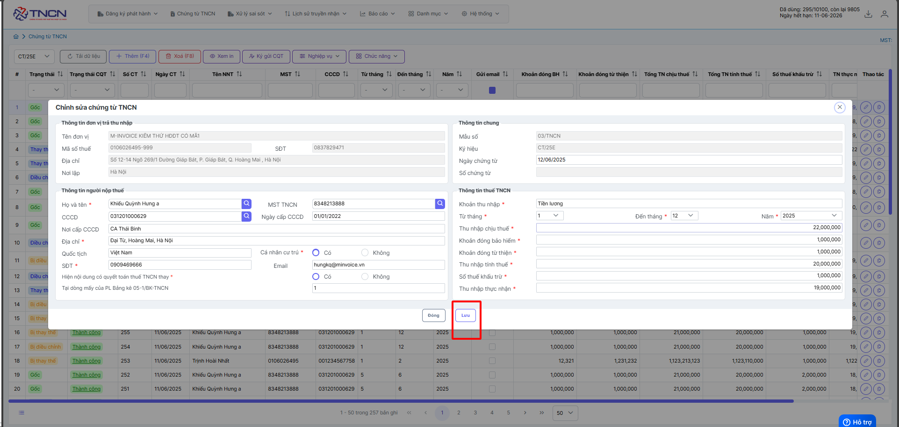

    Như vậy quý khách đã sửa thành công chứng từ

=== "Xoá chứng từ"

    ## **Hướng dẫn xóa chứng từ chờ ký**

    ???+ Note "Ghi chú"

        Trong quá trình sử dụng phần mềm chứng từ điện tử M-invoice, NSD nhiều lúc sẽ tạo nhầm hoặc sai thông tin của chứng từ nháp và NSD sẽ muốn xóa đi và lập lại tờ chứng từ mới. M-invoice xin giới thiệu với khách hàng và người sử dụng tính năng xóa chứng từ nháp trên phần mềm

    ### **Bước 1: Tại màn hình danh sách chứng từ, chọn chứng từ Chờ ký muốn xóa**

    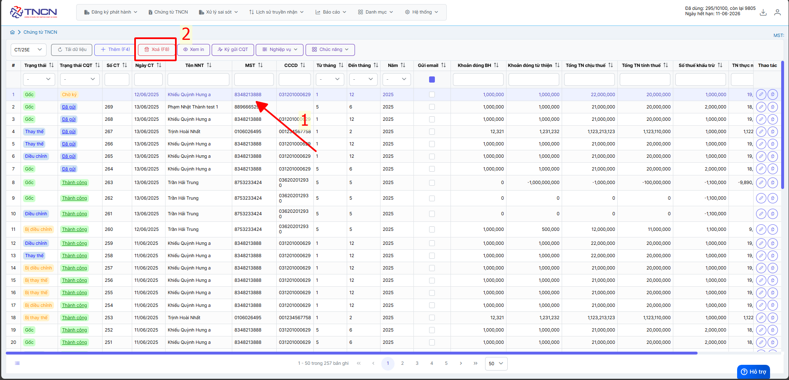

    Chỉ xóa được chứng từ khi ở trạng thái `Chờ ký`

    Trường hợp anh chị muốn xóa nhiều sẽ làm theo hướng dẫn sau đây

    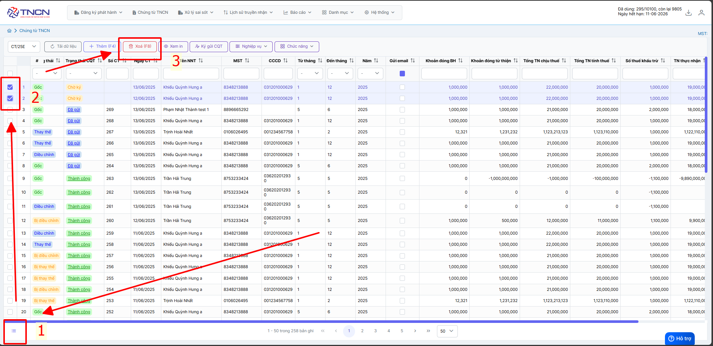

    Như vậy quý khách đã xóa thành công chứng từ

???+ info "Xin chân thành cảm ơn quý khách hàng đã tin dùng sản phẩm của M-Invoice"

    Có bất kỳ vướng mắc nào trong quá trình sử dụng hãy liên hệ với M-Invoice tại mục Hỗ trợ kỹ thuật góc phải bên dưới màn hình hoặc gọi tổng đài kỹ thuật của M-Invoice (1900.955.557 Nhánh 1)

Last updated on <strong>Jun 13, 2025</strong> by <strong>NHATTH</strong>

