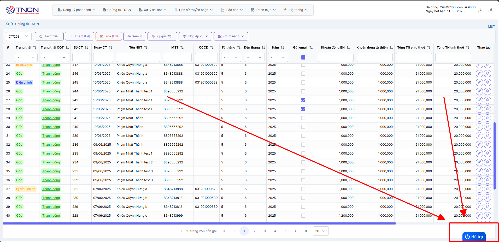

# **Hướng dẫn phát hành chứng từ**

Dưới đây là những hướng dẫn thao tác cơ bản trên phần mềm chứng từ khấu trừ thuế TNCN ở phiên bản 2.0 vô cùng mạch lạc và dễ hiểu.

=== "Thêm chứng từ"

    ## **Hướng dẫn lập và phát hành chứng từ**

    ???+ Note "Ghi chú"

        Khi sử dụng phần mềm chứng từ, NSD sẽ cần lập và phát hành chứng từ. M-invoice sẽ giới thiệu với NSD tính năng lập và phát hành chứng từ trên hệ thống

    
Hướng dẫn lập và phát hành chứng từ

    
Anh chị có thể kiểm tra thông tin bản quyá»n và số lượng mua chứng từ theo ảnh sau

    

    ### **Bước 1: Truy cập vào phần lập chứng từ**

    Truy cập vào trang chứng từ điện tử M-invoice chọn phần **Chứng từ TNCN**

    

    Bấm thêm để điền thông tin chứng từ

    

    

    ### **Bước 2: Nhập thông tin của chứng từ**

    

    ???+ note "Thông tin người nộp thuế"

        - Anh chị điền tin của người nộp thuế như Họ và tên, CCCDAN, MST TNCN, ....

        - Trường hợp là khách nước ngoài không cứ trú thì anh chị chọn không

        - Nếu khách ủy quyền quyết toán thuế thay -> chọn `có` và điền `Tại dòng mấy của PL Bảng kê 05-1/BK-TNCN`

        👉 Đây là số thứ tự dòng của người lao động trong Phụ lục 05-1/BK-TNCN – là bảng kê chi tiết danh sách những người được quyết toán thay.

        **Trường hợp quý khách xuất nhiều cho một thông tin người nộp thuế**  -> có thể thêm vào phần danh mục -> người nộp thuế theo hướng dẫn sau đây

    ???+ note "Thông tin thuế TNCN"

        - Điền tên khoản thu nhập

        - Điá»n từ tháng đến tháng và năm muốn lập  Trường hợp người nộp thuế làm thá»i vụ và lập tháng ngắt quãng thì lập ra những tá» khác nhau. VD:1, 5, 8 -> LẬP 3 TỜ

        - Điền các thông thông tin tính thuế,.... nếu chưa rõ cách tính hãy xem cách tính ở đây -->

    

    ### **Bước 3: Kiểm tra thông tin trước khi ký gửi thuế**

    **Chọn dòng cần xem in** ---> **XEM IN**

    

    

    ### **Bước 4: Ký gửi CQT**

    **Chọn dòng cần ký** ---> **Ký gửi CQT**

    

    

    Chứng từ ngay sau khi ký sẽ tự động nhảy số chứng từ tiếp theo và ngày chứng từ sẽ ngày ký chứng từ

    ???+ note "THỜI ĐIỂM GỬI CHỨNG TỪ LÊN CQT (Khoản 22, Điều 1, Nghị định 70)"

        Tổ chức cá nhân khấu trừ thuế sau khi lập đầy đủ các nội dung trên chứng từ khấu trừ thuế thu nhập cá nhận điện tử gửi cho người bị khấu trừ thuế và đồng thời gửi cho cơ quan thuế ngày trong ngày lập chứng từ.

    Như vậy quý khách đã phát hành thành công chứng từ

    ### **Bước 5: Tùy chọn mẫu chứng từ**

    

    1. Trường hợp muốn chọn tiêu thức (từ NĐ70 sẽ có thêm tiêu thức 20, tiêu thức 20 là `Số thu nhập thực nhập`)

    2. Thư xác nhận theo thông tư

    3. Thư xác nhận theo thu nhập

    

    Trường hợp Anh chị muốn in và tải PDF chứng từ thì có thể làm theo hướng dẫn trên

=== "Sửa chứng từ"

    ## **Hướng dẫn sửa chứng từ Chờ ký**

    ???+ Note "Ghi chú"

        Trong quá trình sử dụng phần mềm chứng từ điện tử M-invoice, NSD nhiều lúc sẽ tạo sai thông tin của chứng từ nháp và NSD sẽ muốn sửa lại sao cho đúng với yêu cầu. M-invoice xin giới thiệu với khách hàng và người sử dụng tính năng sửa chứng từ nháp trên phần mềm

    ### **Bước 1: Tại màn hình danh sách chứng từ, chọn chứng từ chờ ký muốn sửa**

    

    Chỉ sửa được chứng từ khi ở trạng thái `ChỠký`

    ### **Bước 2: Sửa nội dung chứng từ và click "Lưu" để lưu lại thông tin**

    

    Như vậy quý khách đã sửa thành công chứng từ

=== "Xoá chứng từ"

    ## **Hướng dẫn xóa chứng từ chờ ký**

    ???+ Note "Ghi chú"

        Trong quá trình sử dụng phần mềm chứng từ điện tử M-invoice, NSD nhiều lúc sẽ tạo nhầm hoặc sai thông tin của chứng từ nháp và NSD sẽ muốn xóa đi và lập lại tờ chứng từ mới. M-invoice xin giới thiệu với khách hàng và người sử dụng tính năng xóa chứng từ nháp trên phần mềm

    ### **Bước 1: Tại màn hình danh sách chứng từ, chọn chứng từ Chờ ký muốn xóa**

    

    Chỉ xóa được chứng từ khi ở trạng thái `ChỠký`

    Trường hợp anh chị muốn xóa nhiá»u sẽ làm theo hướng dẫn sau đây

    

    Như vậy quý khách đã xóa thành công chứng từ

???+ info "Xin chân thành cảm ơn quý khách hàng đã tin dùng sản phẩm của M-Invoice"

    Có bất kỳ vướng mắc nào trong quá trình sử dụng hãy liên hệ với M-Invoice tại mục Hỗ trợ kỹ thuật góc phải bên dưới màn hình hoặc gọi tổng đài kỹ thuật của M-Invoice (1900.955.557 Nhánh 1)

Last updated on <strong>Jun 13, 2025</strong> by <strong>NHATTH</strong>

