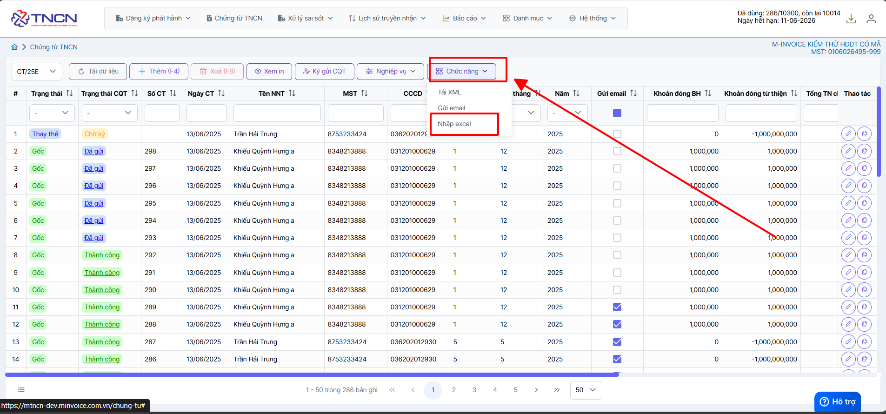
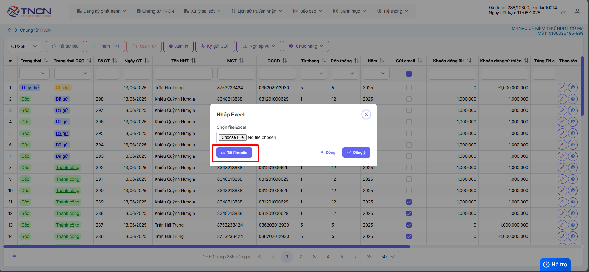
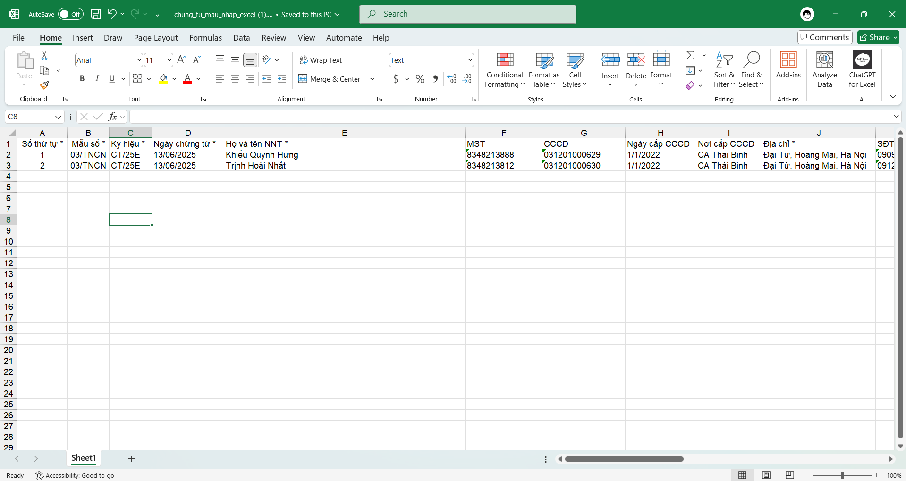
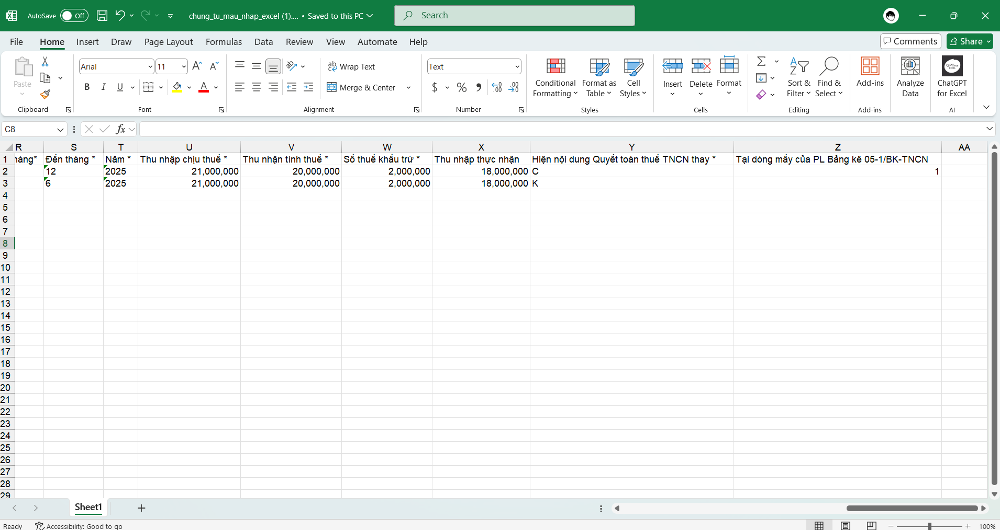
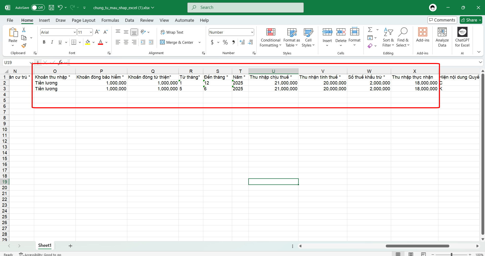
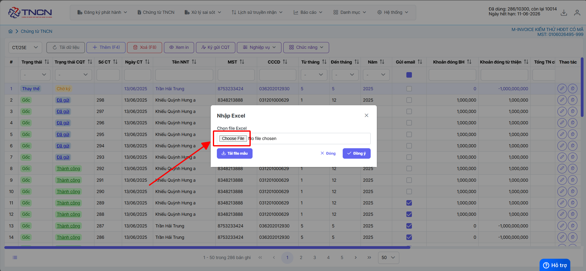
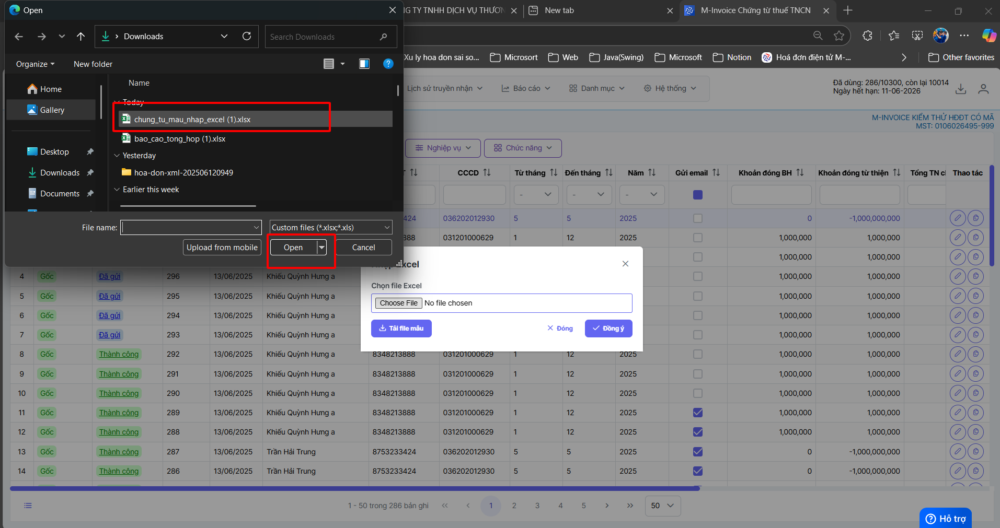
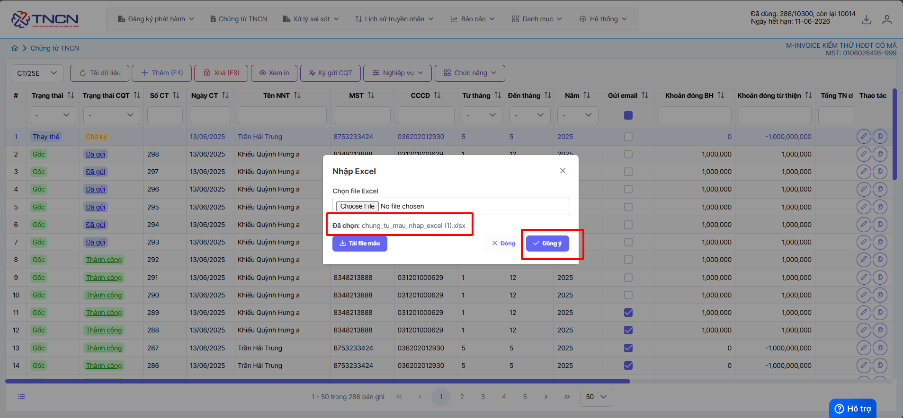
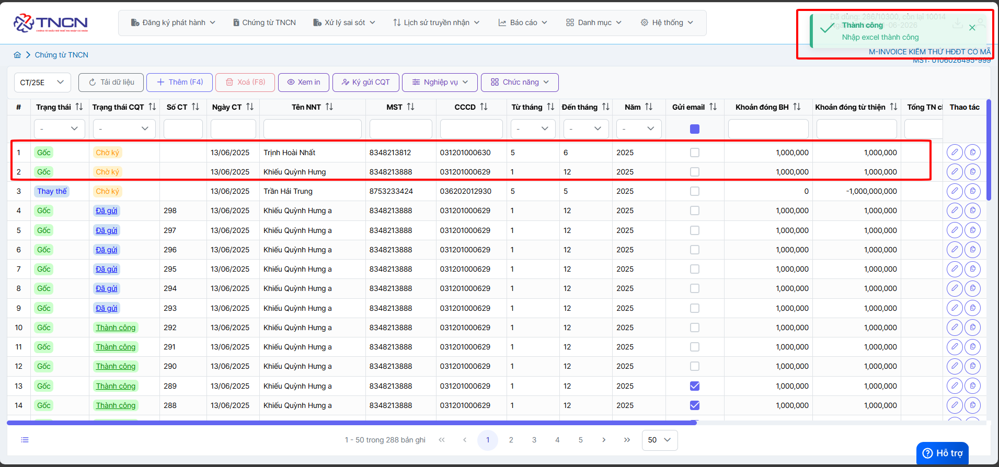

# **Nhập excel hàng loạt chứng từ**

Dưới đây là những hướng dẫn thao tác cơ bản trên phần mềm chứng từ điện tử M-Invoice ở phiên bản 2.0 vô cùng mạch lạc và dễ hiểu.

## **Hướng dẫn nhập excel chứng từ**

???+ Note "Ghi chú"

    Trong quá trình sử dụng, bạn muốn tải một loạt chứng từ lên phần mềm mà không biết làm cách nào, sau đây M-invoice sẽ hướng dẫn quy trình để nhận nhiều chứng từ một lúc bằng file excel

**Thao tác cài đặt và thực hiện như sau**

### **Bước 1: Ở giao diện lập chứng từ chọn mục Chức năng >> Nhận excel**

### **Bước 2: Sau đó tiến hành tải file mẫu excel về**

### **Bước 3: Nhập thông tin người nộp thuế tại excel**

!!! warning "Lưu ý"

    - **Ký hiệu:** và **Mẫu số** kiểm tra xem có đúng mẫu số và ký hiệu mình đang sử dụng hay không

    - Các cột thông tin sẽ giống thêm thủ công trên phần mềm, anh chị có thể lên để đối chiếu và nhập

    - Cột nội dung quyết toán thay sẽ có 2 giá trị `C` - Có và `K` - Không, nếu chọn chọn `Có` anh chị điền thêm dòng mấy tại bảng kê ở cột bên cạnh, còn nếu là `Không` thì bỏ trống cột bên

### **Bước 4: Điền đầy đủ thông tin tại chi tiết**

!!! warning "Lưu ý"

    - Các công thức tính sẽ được tính từ bên excel và nhập thẳng dữ liệu lên excel , lên anh chị kiểm tra dữ liệu thật chính xác trước ký gửi

### **Bước 5: Import excel lên phần mềm**

**Vào lại giao diện lập chứng từ chọn mục Chức năng >> Nhận excel -> chọn file excel**

### **Bước 6: Import excel thành công**

Như vậy quý khách đã nhập excel thành công lên phần mềm

???+ info "Xin chân thành cảm ơn quý khách hàng đã tin dùng sản phẩm của M-Invoice"

    Có bất kỳ vướng mắc nào trong quá trình sử dụng hãy liên hệ với M-Invoice tại mục Hỗ trợ kỹ thuật góc phải bên dưới màn hình hoặc gọi tổng đài kỹ thuật của M-Invoice (1900.955.557 Nhánh 1)

Last updated on <strong>Jun 13, 2025</strong> by <strong>NHATTH</strong>

