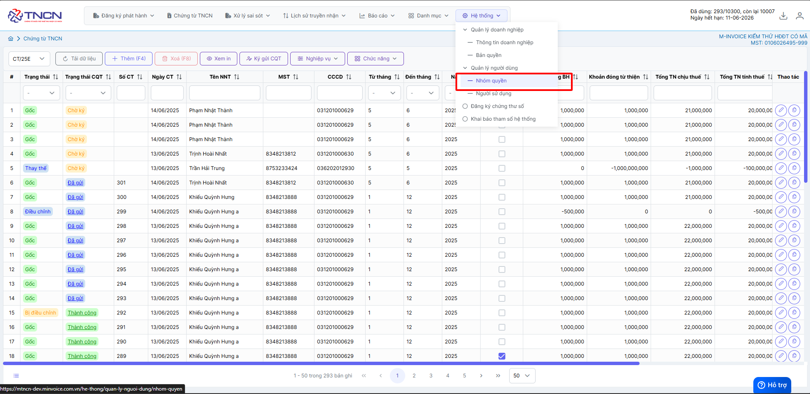
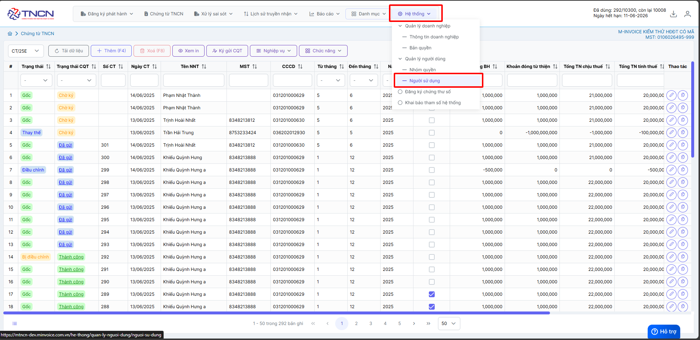

# **Phân quyền**

Dưới đây là những hướng dẫn thao tác cơ bản trên phần mềm chứng từ điện tử M-Invoice ở phiên bản 2.0 vô cùng mạch lạc và dễ hiểu.

## **Cách phân quyền tài khoản người dùng**

???+ Note "Mục đích"

    Dùng để phân quyền tài khoản người dùng với quyền:

    + Xem, sửa, xóa,

    + Ký gửi CQT, tải xml, xem in, điều chỉnh, thay thế chứng từ

    + Gửi mail, nhập excel, xem lịch sử truyền nhận

    + Đăng ký thay đổi tờ khai, Báo cáo, phần Hệ thống, Danh mục

Hướng dẫn phân quyền chi tiết

### **Bước 1: Hệ thống --> Phân quyền**

VD: Chỉ phân quyền cho người sử dụng, thêm, sửa, xóa, chứng từ

### **Bước 2: Bấm thêm quyền - điền tên quyền**

### **Bước 3: Tích chọn các quyền được phép**

### **Bước 4: Truy cập người sử dụng để tạo tài khoản và gán quyền cho user đó**

Hoặc xem chi tiết ở đây [Thêm người sử dụng](them-nguoi-dung.md#attribute-lists){ data-preview }

Như vậy bạn đã hoàn thành việc phân quyền người sử dụng

???+ info "Xin chân thành cảm ơn quý khách hàng đã tin dùng sản phẩm của M-Invoice"

    Có bất kỳ vướng mắc nào trong quá trình sử dụng hãy liên hệ với M-Invoice tại mục Hỗ trợ kỹ thuật góc phải bên dưới màn hình hoặc gọi tổng đài kỹ thuật của M-Invoice (1900.955.557 Nhánh 1)

Last updated on <strong>Jun 5, 2025</strong> by <strong>nhatth</strong>

