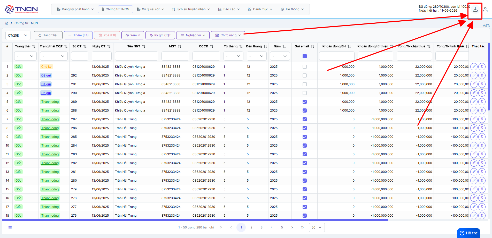
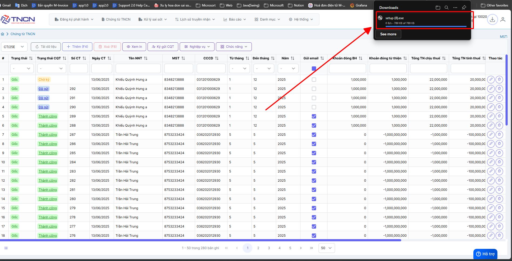

# **Tải cộng cụ ký chứng từ TNCN plugin 2.0**

Dưới đây là những hướng dẫn thao tác cơ bản trên phần mềm chứng từ điện tử M-Invoice ở phiên bản 2.0 vô cùng mạch lạc và dễ hiểu.

## **Hướng dẫn tải cộng cụ ký chứng từ TNCN plugin 2.0**

???+ Danger "Lưu ý"

    Trường hợp quý khách đã sử dụng hóa đơn điện tử  [M-Invoice phiên bản 2.0](../setup/dang-nhap.md#attribute-lists){ data-preview } để ký hóa đơn thì chỉ cần chuột phải vào biểu tượng plugin cập nhật lên phiên bản 1.1.3

**Thao tác cài đặt và thực hiện như sau**

### **Bước 1: Nhấn vào biểu tượng tải xuống trên phần mềm**

### **Bước 2 : Mở bộ cài và cài đặt**

**Bấm vào file setup.exe để cài đặt**

**Truờng hơp không thấy hiện như ảnh, anh chị vào thư mục máy tính mình tìm ở mục DOWNLOAD**

Bạn chon **Install** để bắt đầu cài đặt

**Bạn chờ cho bộ cài Dowload và tự động cài đặt là hoàn thành**

### **Bước 4 : Kiểm tra bộ cài đã được cài đặt thành công hay chưa**

Kích chuột trái vào mũi tên góc phải màn hình, nếu có biểu tượng **M-invoice Plugin Version 2.0** như thế là công cụ ký plugin đã cài đặt thành công

???+ info "Xin chân thành cảm ơn quý khách hàng đã tin dùng sản phẩm của M-Invoice"

    Có bất kỳ vướng mắc nào trong quá trình sử dụng hãy liên hệ với M-Invoice tại mục Hỗ trợ kỹ thuật góc phải bên dưới màn hình hoặc gọi tổng đài kỹ thuật của M-Invoice (1900.955.557 Nhánh 1)

Last updated on <strong>Jun 13, 2025</strong> by <strong>NHATTH</strong>

