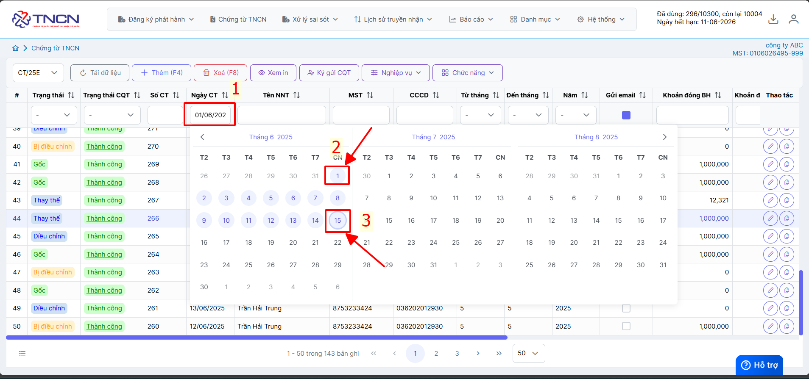
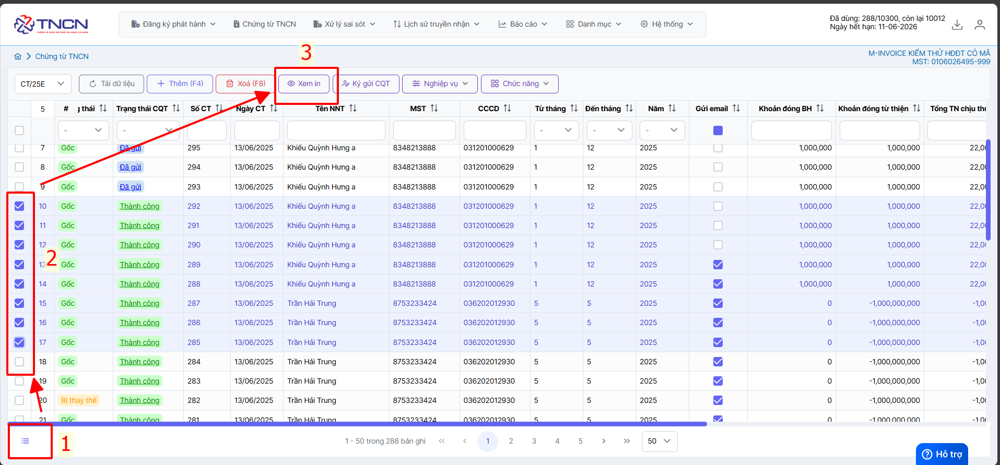
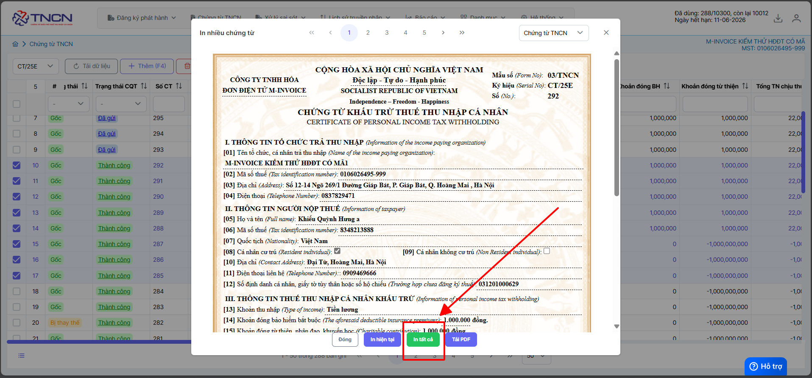
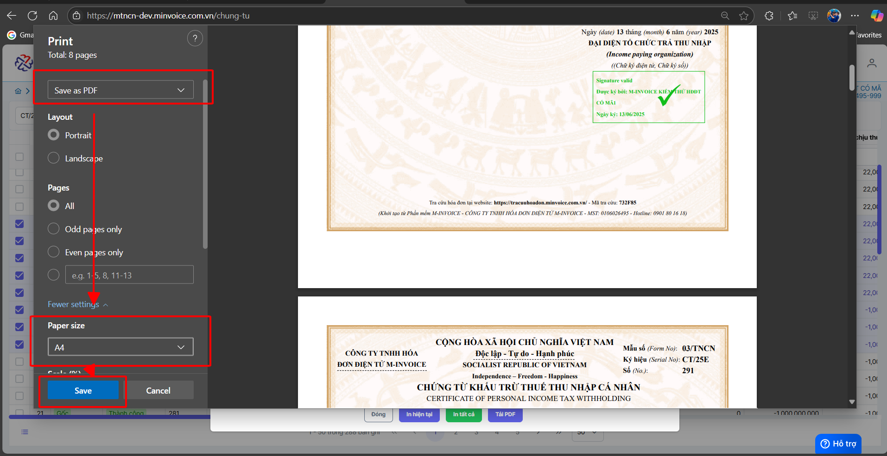
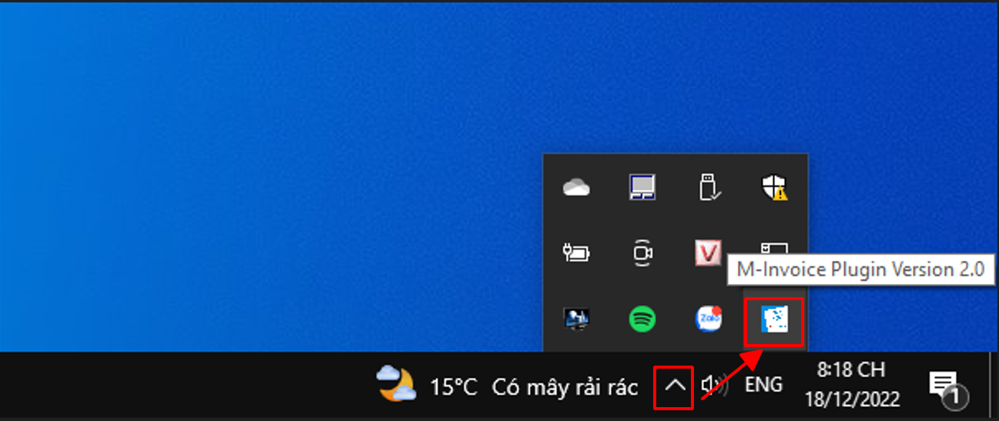
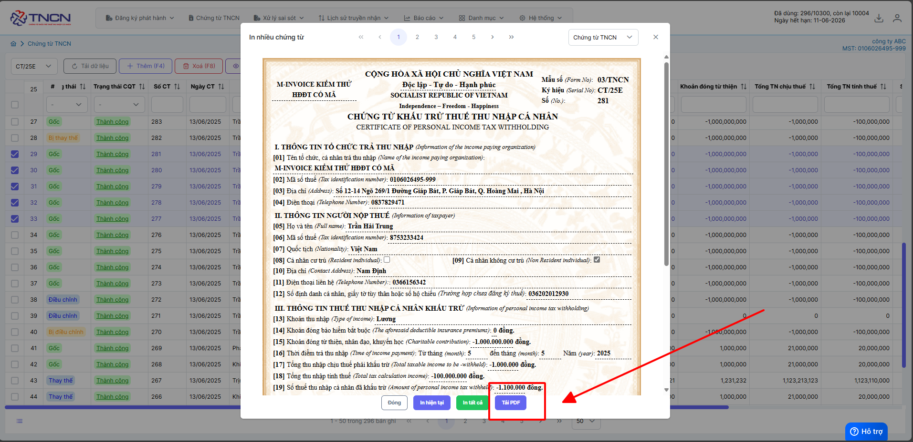
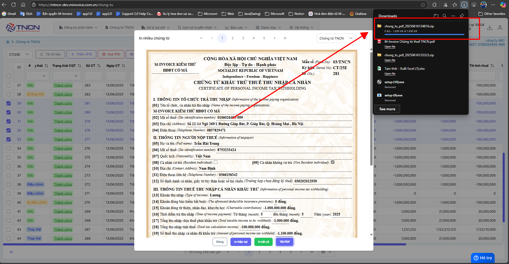
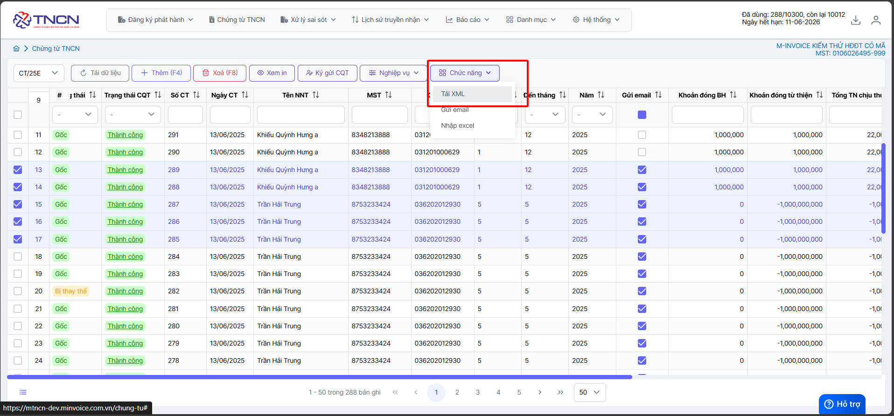
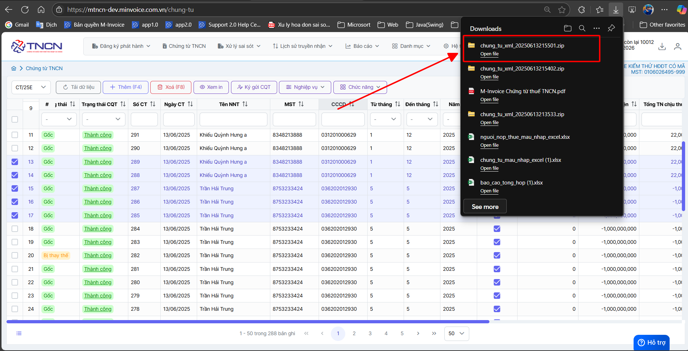

# **Tải hàng loạt PDF và XML**

Dưới đây là những hướng dẫn thao tác cơ bản trên phần mềm chứng từ điện tử M-Invoice ở phiên bản 2.0 vô cùng mạch lạc và dễ hiểu.

## **Hướng dẫn Tải hàng loạt PDF và XML**

???+ Note "Mục đích"

    Trong quá trình phát hành chứng từ người dùng sẽ có nhu cầu tải chứng từ PDF và XML. M-invoice xin giới thiệu với khách hàng và người sử dụng tính năng tải chứng từ PDF và XML

=== "Cách 1: Tải nhiều PDF bằng cách xem in"

    ???+ Note "Ghi chú"

        Cách này sẽ gộp chung nhiều chứng từ 1 file .PDF

    ### **Bước 1: Lọc những chứng từ muốn tải (theo quý hoặc tháng, tùy chọn)**

    

    ### **Bước 2: Tích chọn chứng từ muốn tải hoặc chọn tất cả**

    

    ### **Bước 3: Chọn in tất cả**

    

    ### **Bước 4: Chọn SAVE AS PDF và chọn size A4 -> SAVE**

    

    Như vậy quý khách đã tải PDF hàng loạt thành công

=== "Cách 2: Tải nhiều PDF bằng plugin"

    ???+ Note "Ghi chú"

        Cách này sẽ tách chứng từ ra file .PDF riêng

    Cách này yêu cầu cần cài đặt plugin nếu anh chị chưa cài đặt thì có thể xem [Hướng dẫn](plugin.md#attribute-lists){ data-preview }

    

    **Nếu đã cài đặt theo ảnh trên rồi thì bỏ qua bước cài đặt**

    ### **Bước 1: Lọc những chứng từ muốn tải (theo quý hoặc tháng, tùy chọn)**

    

    ### **Bước 2: Tích chọn chứng từ muốn tải hoặc chọn tất cả**

    

    ### **Bước 3: Chọn tải PDF**

    

    ### **Bước 4: Đợi quá trình tải hoàn tất**

    

    Như vậy quý khách đã tải PDF hàng loạt thành công

=== "Tải nhiều XML"

    ### **Bước 1: Tích chọn chứng từ muốn tải hoặc chọn tất cả**

    

    ### **Bước 2: Chọn chức năng --> tải xml**

    

    

    Như vậy quý khách đã tải XML hàng loạt thành công

???+ info "Xin chân thành cảm ơn quý khách hàng đã tin dùng sản phẩm của M-Invoice"

    Có bất kỳ vướng mắc nào trong quá trình sử dụng hãy liên hệ với M-Invoice tại mục Hỗ trợ kỹ thuật góc phải bên dưới màn hình hoặc gọi tổng đài kỹ thuật của M-Invoice (1900.955.557 Nhánh 1)

Last updated on <strong>Jun 13, 2025</strong> by <strong>NHATTH</strong>

