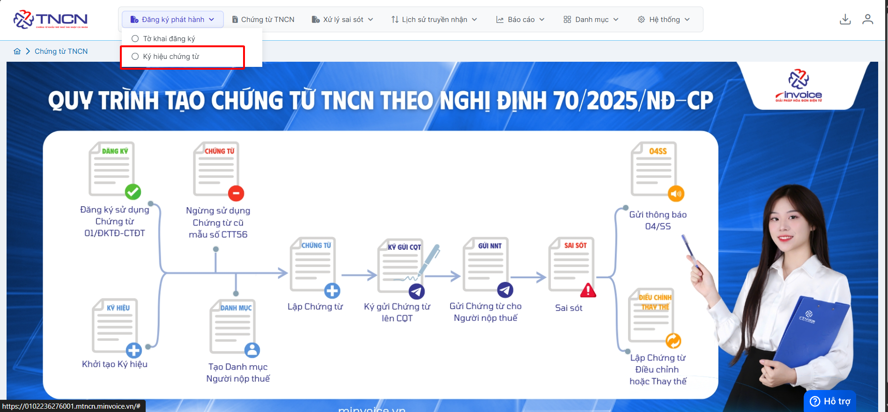
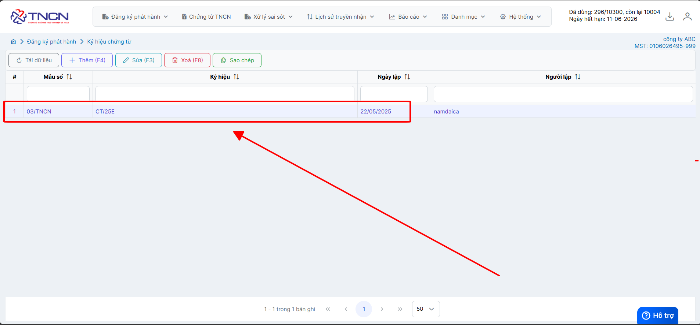
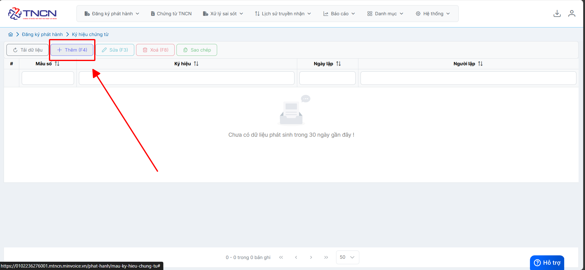
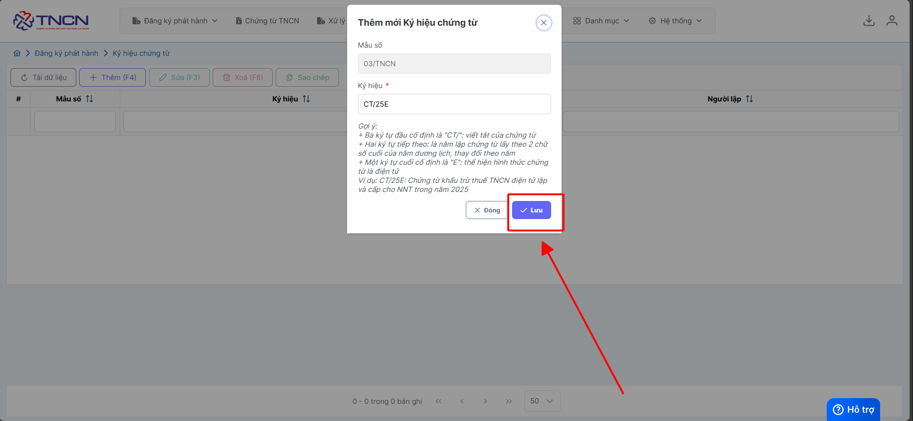
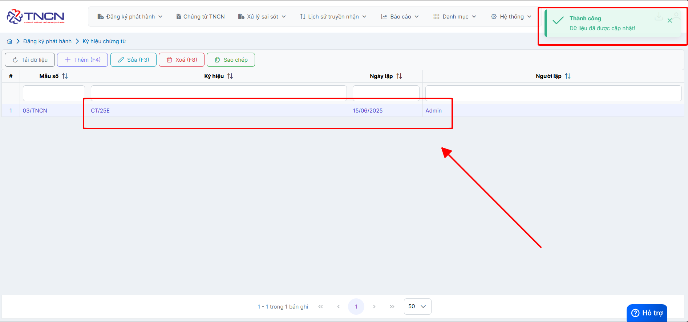

# **Tạo ký hiệu chứng từ**

Dưới đây là những hướng dẫn thao tác cơ bản trên phần mềm chứng từ điện tử M-Invoice ở phiên bản 2.0 vô cùng mạch lạc và dễ hiểu.

## **Hướng dẫn tạo ký hiệu chứng từ**

???+ Note "Mục đích"

    Dùng để tạo ký hiệu chứng từ khi mới phát hành chứng từ trên phần mềm

Hướng dẫn tạo chi tiết

### **Bước 1: Đăng ký phát hành --> chứng từ**

Trường hơp đã tạo sẵn như ảnh dưới đây anh chị không cần thao tác tạo nữa

Bấm **thêm** để tạo ký hiệu chứng từ

**Ký hiệu chứng từ sẽ mặc định là CT/25E**

???+ Note "Gợi ý"

    + Ba ký tự đầu cố định là "CT/": viết tắt của chứng từ

    + Hai ký tự tiếp theo: là năm lập chứng từ lấy theo 2 chữ số cuối của năm dương lịch, thay đổi theo năm

    + Một ký tự cuối cố định là "E": thể hiện hình thức chứng từ là điện tử

    Ví dụ: CT/25E: Chứng từ khấu trừ thuế TNCN điện tử lập và cấp cho NNT trong năm 2025

### **Bước 2: Bấm lưu đê tạo chứng từ**

Như vậy bạn đã hoàn thành việc tạo mới ký hiệu chứng từ

???+ info "Xin chân thành cảm ơn quý khách hàng đã tin dùng sản phẩm của M-Invoice"

    Có bất kỳ vướng mắc nào trong quá trình sử dụng hãy liên hệ với M-Invoice tại mục Hỗ trợ kỹ thuật góc phải bên dưới màn hình hoặc gọi tổng đài kỹ thuật của M-Invoice (1900.955.557 Nhánh 1)

Last updated on <strong>Jun 5, 2025</strong> by <strong>nhatth</strong>

