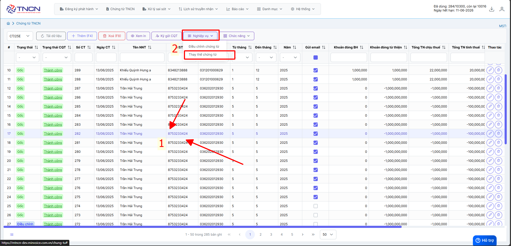
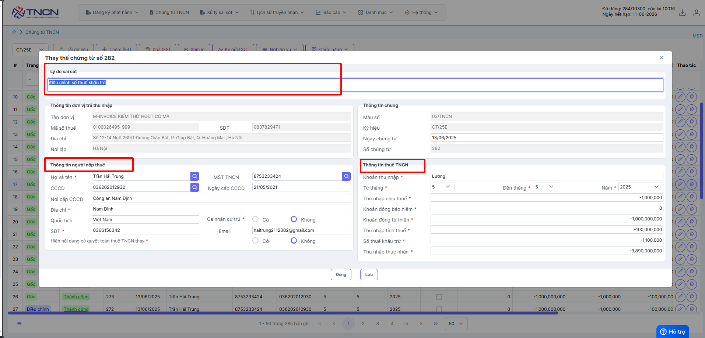
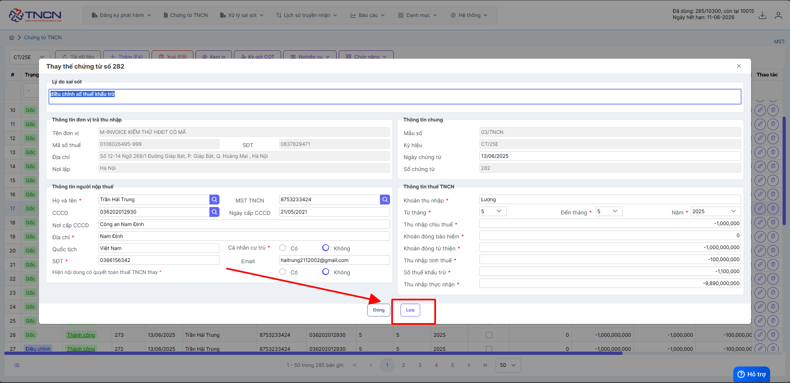
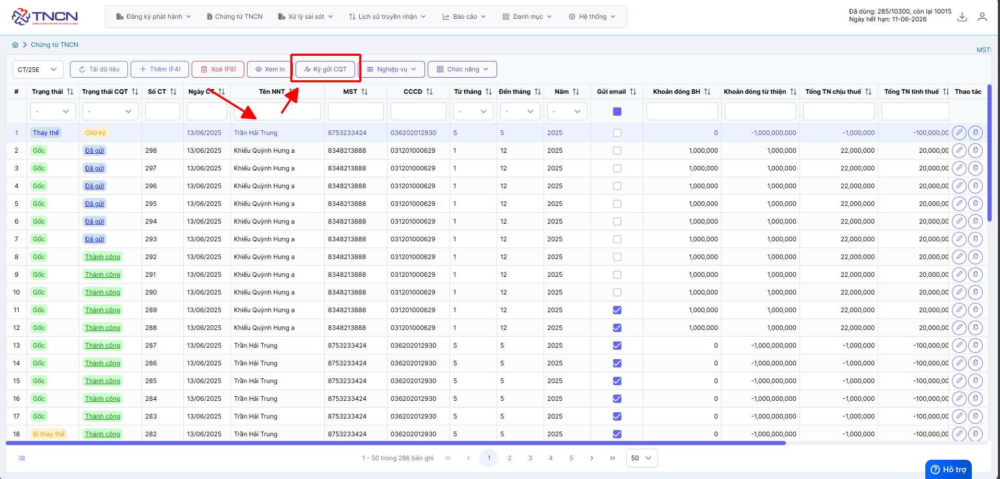
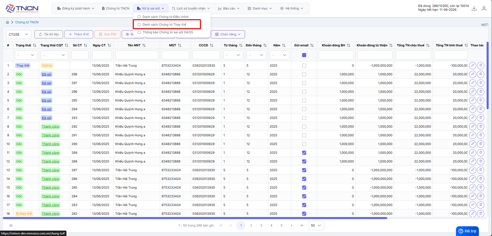
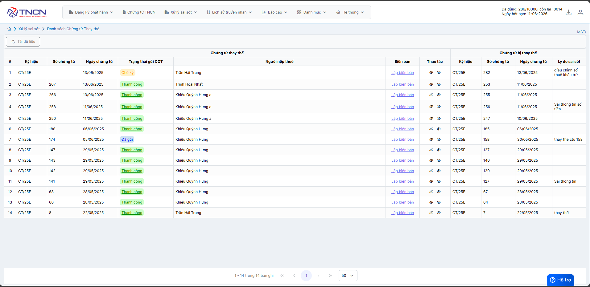
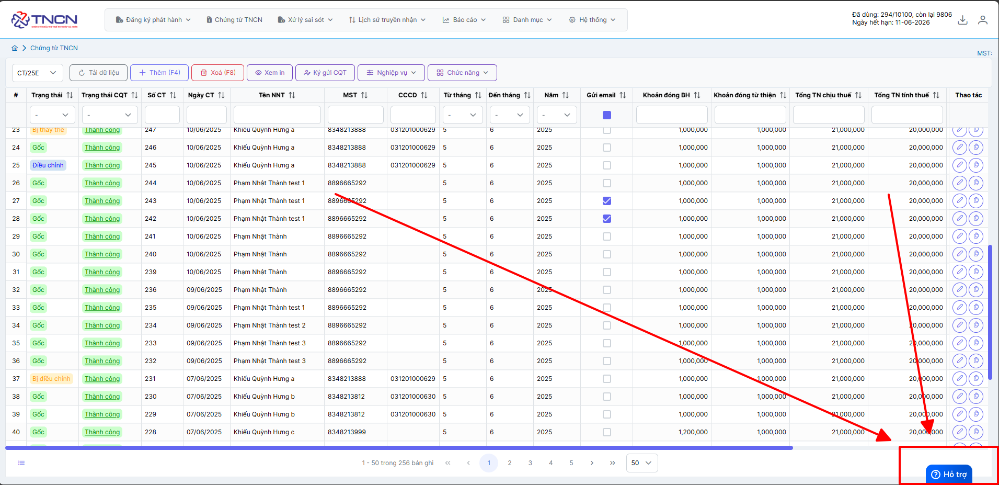

# **Thay thế chứng từ**

Dưới đây là những hướng dẫn thao tác cơ bản trên phần mềm chứng từ điện tử M-Invoice ở phiên bản 2.0 vô cùng mạch lạc và dễ hiểu.

## **Hướng dẫn thay thế chứng từ có sai sót**

???+ Note "Ghi chú"

    Trong quá trình phát hành chứng từ không tránh khỏi những sai sót. Sau đây, M-Invoice hướng dẫn NSD thực hiện xử lý chứng từ đã lập có sai sót như sau:
    Chỉ được phép sử dụng nghiệp vụ thay thế chứng từ với các điều kiện sau:

    1. chứng từ cần thay thế đã được gửi CQT thành công
    2. chứng từ cần thay thế ở Trạng thái Gốc (Mới) hoặc Thay thế

???+ Warning "Lưu ý"

    Nếu đã lựa chọn nghiệp vụ thay thế thì không được điều chỉnh.

**Thao tác cài đặt và thực hiện như sau**

### **Bước 1: Chọn chứng từ cần thay thế -> nghiệp vụ -> thay thế chứng từ**

### **Bước 2: Điền lý do sai sót và điền lại thông tin chứng từ cần thay thế**

**Bấm lưu**

### **Bước 3 : Kiểm tra thông tin -> ký gửi CQT**

Như vậy quý khách đã thay thế thành công chứng từ

**Xem danh sách các chứng từ đã được lập**

Hiện tại thuế chưa có thông tin lập thay thế cần kèm biên bản -> trường hợp thuế có thông tin Minvoice sẽ cập nhật thông tin và hướng dẫn biên bản tại đây

???+ info "Xin chân thành cảm ơn quý khách hàng đã tin dùng sản phẩm của M-Invoice"

    Có bất kỳ vướng mắc nào trong quá trình sử dụng hãy liên hệ với M-Invoice tại mục Hỗ trợ kỹ thuật góc phải bên dưới màn hình hoặc gọi tổng đài kỹ thuật của M-Invoice (1900.955.557 Nhánh 1)

Last updated on <strong>Jun 13, 2025</strong> by <strong>NHATTH</strong>

