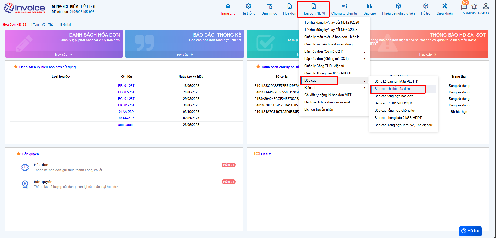
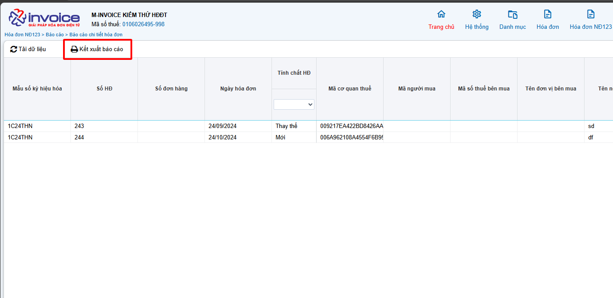

# **Báo cáo chi tiết hoá đơn theo NĐ123**

## **Hướng dẫn xem và tải báo cáo chi tiết hóa đơn NĐ123**

???+ Warning "Lưu ý"

    Để tải được excel báo cáo chi tiết hoá đơn, các bạn phải cài đặt plugin ký số Minvoice

### **Bước 1: Truy cập vào phần Hóa đơn HĐ123 >> Báo cáo >> Báo cáo chi tiết hóa đơn**

### **Bước 2: Chọn các điều kiện để lọc báo cáo**

### **Bước 3 : Kết xuất báo cáo**

???+ Warning "Lưu ý"

    Nếu đã cài plugin thì phải cập nhật lên phiên bản mới [Hướng dẫn](../../assets/images/invoice1/1.0_capNhatPhanMem.png "Hãy bấm vào để xem rõ hơn")

!!! info "Xin chân thành cảm ơn Quý khách hàng đã tin dùng sản phẩm của M-Invoice"

    Có bất kỳ vướng mắc nào trong quá trình sử dụng hãy liên hệ với M-Invoice tại mục Hỗ trợ kỹ thuật góc phải bên dưới màn hình hoặc gọi tổng đài kỹ thuật của M-Invoice (1900.955.557 Nhánh 1)

Last updated on <strong>Jun 5, 2025</strong> by <strong>nhatth</strong>

