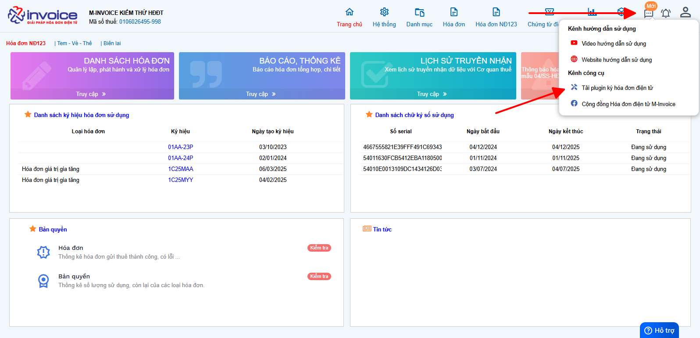
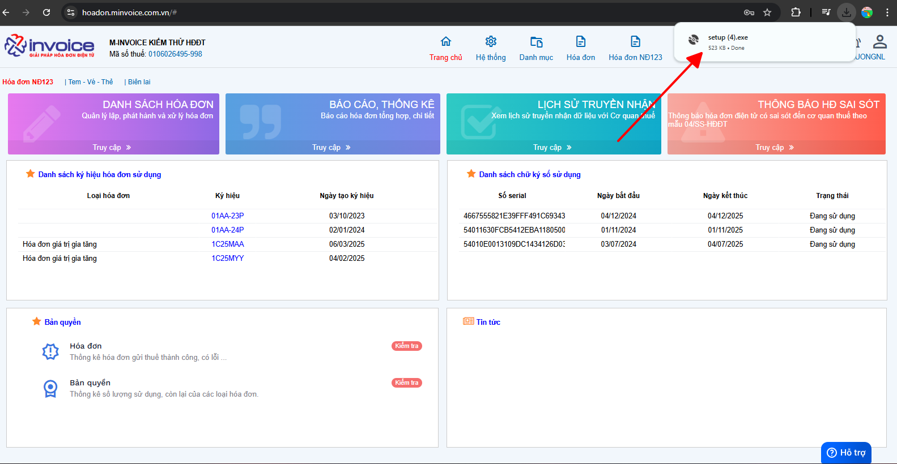
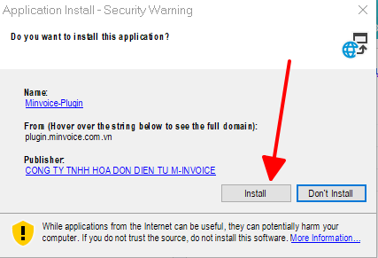
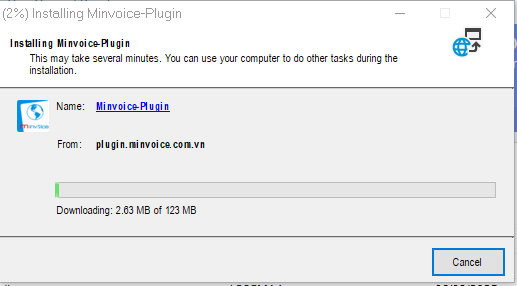

# **Cài Đặt plugin**

## **Hướng dẫn cài đặt plugin hóa đơn điện tử M-Invoice**

### **Bước 1: Anh chị chọn vào hình sau và chọn "Tải plugin ký hóa đơn điện tử"**

### **Bước 2: Click chọn vào phần mềm có tên "Set up" vừa được tải về**

Nếu anh chị không thấy file "Set up" hiển thị như hình, hãy truy cập vào thư mục "Download" trên máy tính và click chọn.

### **Bước 3: Sau khi click vào file cài đặt, cửa sổ cài đặt sẽ hiện lên, anh chị bấm install để tiến hành cài đặt.**

Tiến trình chạy cài đặt sẽ được khởi động và hiển thị như hình dưới.

Sau khi quá trình này kết thúc là Plugin ký hóa đơn đã được cài đặt thành công.

Anh chị có thể click vào mục "Hóa đơn" để kiểm tra số lượng hóa đơn từng ký hiệu hoặc "Bản quyền" để kiểm tra bản quyền số lượng hóa đơn

!!! info "Xin chân thành cảm ơn Quý khách hàng đã tin dùng sản phẩm của M-Invoice"

    Có bất kỳ vướng mắc nào trong quá trình sử dụng hãy liên hệ với M-Invoice tại mục Hỗ trợ kỹ thuật góc phải bên dưới màn hình hoặc gọi tổng đài kỹ thuật của M-Invoice (1900.955.557 Nhánh 1)

Last updated on <strong>Jun 5, 2025</strong> by <strong>nhatth</strong>

