# **Đăng ký thay đổi tờ khai theo NĐ70**

  
<strong>🚨 Quan trọng:</strong>  
  Bắt buộc xác thực sinh trắc học khi đăng ký/thay đổi thông tin sử dụng hóa đơn điện tử từ <strong>Nghị định 70/2025/NĐ-CP</strong>

  
Từ <strong>ngày 01/07/2025</strong>, người nộp thuế (NNT) khi đăng ký hoặc thay đổi thông tin sử dụng hóa đơn điện tử sẽ <strong>bắt buộc phải xác thực sinh trắc học</strong> trên ứng dụng <strong>eTax Mobile</strong>.

  
<strong>🔍 Quy trình thực hiện như sau:</strong> 
  ✅ NNT gửi tờ khai đăng ký/thay đổi thông tin trên hệ thống hóa đơn điện tử. 
  ✅ Truy cập ứng dụng <strong>eTax Mobile</strong> để thực hiện xác thực sinh trắc học. 
  ✅ Sau khi xác thực thành công → Cơ quan thuế (CQT) gửi kết quả xác thực. 
  ✅ Trong 01 ngày làm việc, CQT sẽ thông báo chấp nhận/không chấp nhận hồ sơ.

  
<strong>❌ Lưu ý:</strong> 
  Nếu sau <strong>24h</strong> mà NNT <strong>không xác thực</strong> hoặc xác thực <strong>không thành công</strong>, <strong>tờ khai sẽ bị hủy</strong>.

  
<strong>👉 Để tránh gián đoạn</strong> trong quá trình sử dụng hóa đơn điện tử, NNT cần <strong>chủ động xác thực ngay sau khi gửi tờ khai!</strong>

## **Hướng dẫn đăng ký thay đổi tờ khai theo NĐ70 đáp ứng xác thực sinh trắc học của Cục Thuế**

### **Bước 1: Cắm CKS vào máy tính, kiểm tra xem plugin đã được bật chưa**

!!! note ""

    Click vào biểu tượng **HIDE** (hay dẫu mũi tên chỉ lên) (1) nếu có biểu tượng Plugin của Minvoice như thế plugin đã bật thành công

    Nếu chưa, bạn chỉ cần gõ vào ô tìm kiếm của window ( window + S) tìm kiếm **Minvoice Plugin** rồi bật  lên là được.

### **Bước 2: Thêm CKS vào phần mềm hóa đơn**

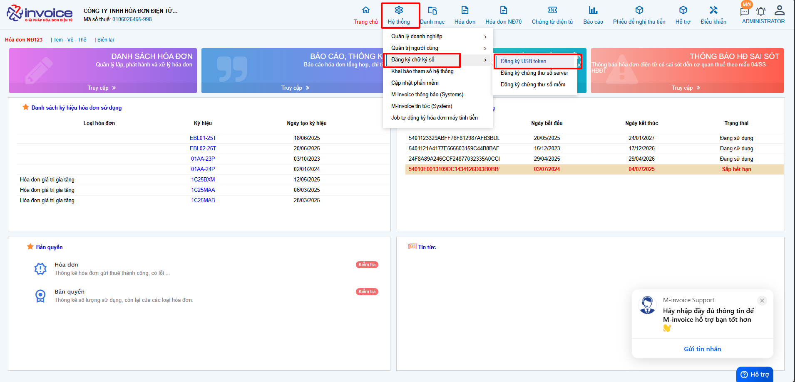

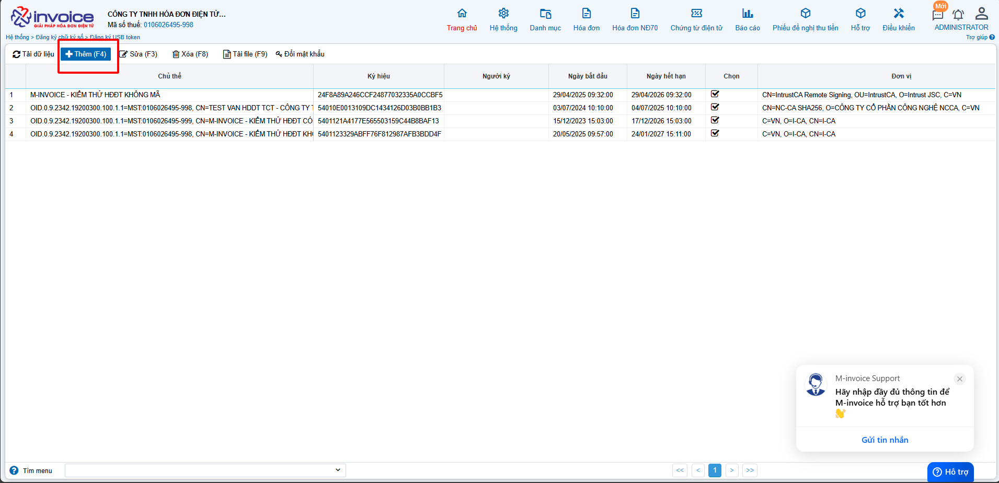

Các bạn vào **Hệ thông --> Đăng ký chữ ký số --> Thêm chứng thư số**

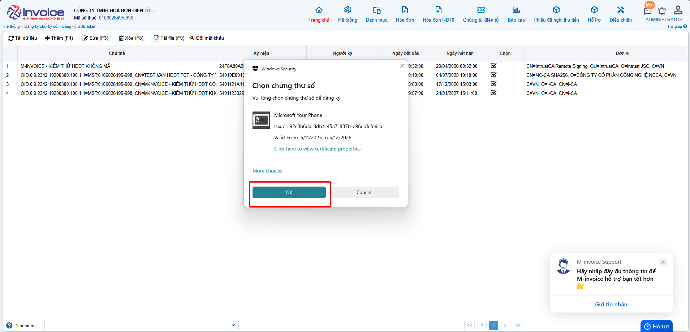

Click vào loại **CKS** phù hợp nhất với mình

Ở thanh Taskbar sẽ hiển thị lên biểu tượng của công cụ **Plugin Minvoice** các bạn chọn vào đó để thêm **CKS** mới của mình

### **Bước 3 : Làm tờ khai 01**

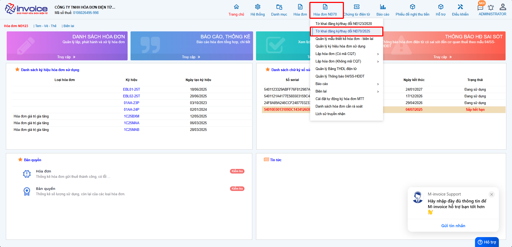

Các bạn vào phần **Đăng ký phát hành >> Tờ khai đăng ký/thay đổi NĐ70/2025 >> Thêm (F4)**

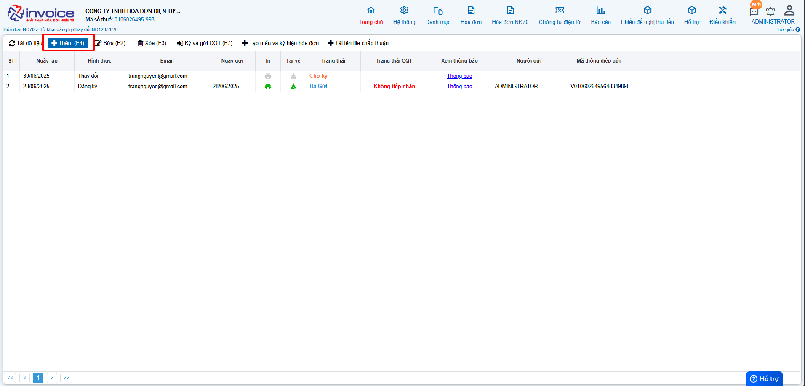

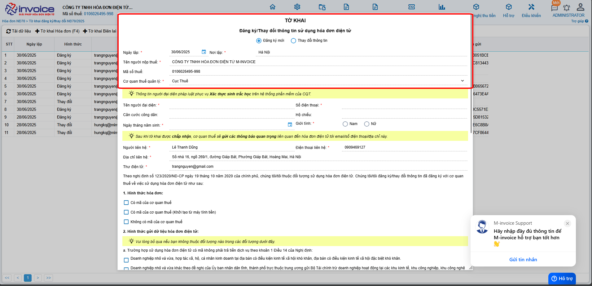

!!! note ""

    Ở phần **Đăng ký/Thay đổi thông tin sử dụng hóa đơn điện tử**

    + Chọn **Đăng ký mới** nếu bạn chưa từng sử dụng hóa đơn theo nghị định 123 (Hóa đơn có mã của CQT)

    + Chọn **Thay đổi** thông tin nếu bạn muốn thay đổi địa chỉ, tên doanh nghiệp, hay thêm CKS mới vào phần mềm

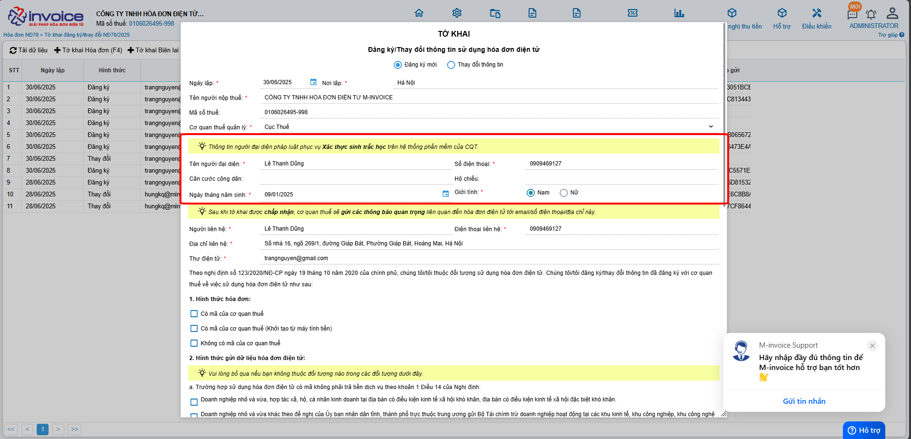

???+ note "Thông tin người đại diện pháp luật"

    Ở phần này các bạn điền đẩy đủ các phần như sau

    **Tên người đại diện**: tên giám đốc

    **Đia chỉ liên hệ** : địa chỉ công ty

    **Số điện thoại** : số điện thoại

    **Căn cước công dân**

    **Hộ chiếu**

**QUY TRÌNH XỬ LÝ TỜ KHAI ĐĂNG KÝ THEO NĐ70**

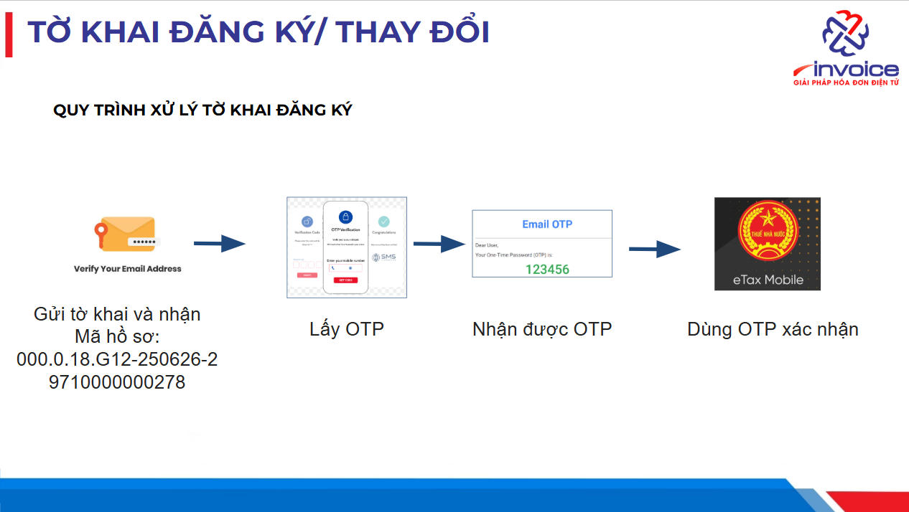

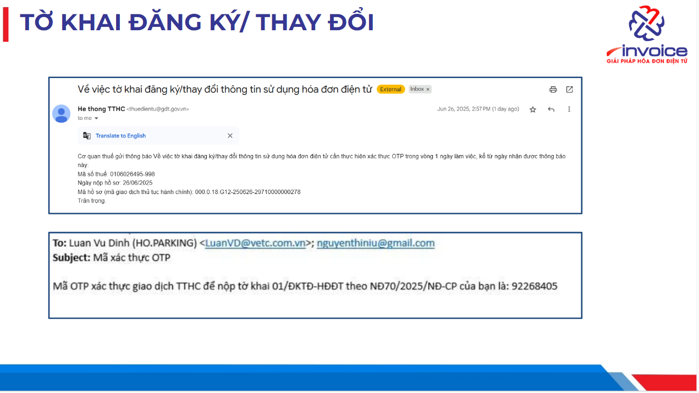

  
<strong>🚨 Theo Khoản 11, Điều 1 Nghị định 70/2025/NĐ‑CP:</strong> 
  Kể từ ngày <strong>01/07/2025</strong>, khi đăng ký hoặc thay đổi sử dụng hóa đơn điện tử (<em>Mẫu 01/ĐKTĐ‑HĐĐT</em>), người nộp thuế <strong>bắt buộc phải xác thực sinh trắc học</strong> qua ứng dụng <strong>eTax Mobile</strong>. 
  <strong>Nếu không xác thực trong vòng 24 giờ</strong>, <strong>tờ khai sẽ bị hủy</strong> trên hệ thống thuế điện tử.

  
<strong>🔐 OTP</strong> được sử dụng để <strong>xác thực tài khoản eTax</strong> đã đăng ký với Tổng cục Thuế, giúp <strong>đảm bảo an toàn, bảo mật</strong> trước khi thực hiện xác thực sinh trắc học.

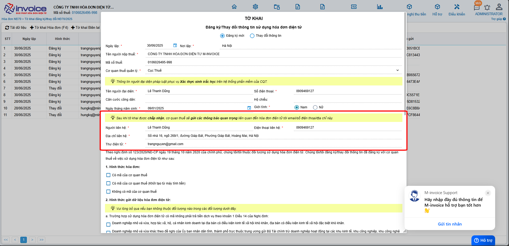

???+ note "Thông tin người nhận các thông báo quan trọng liên quan đến hóa đơn điện tử (trường sẽ là thông tin của kế toán, kế toán trưởng)"

    Ở phần này các bạn điền đẩy đủ các phần như sau

    **Người liên hệ**: tên kế toán, ...

    **Đia chỉ liên hệ** : địa chỉ nhận thông báo nếu có

    **điện thoại liên hệ** : số điện thoại nhận thông báo

    **Email liên hệ**: mail nhận thông báo từ thuế

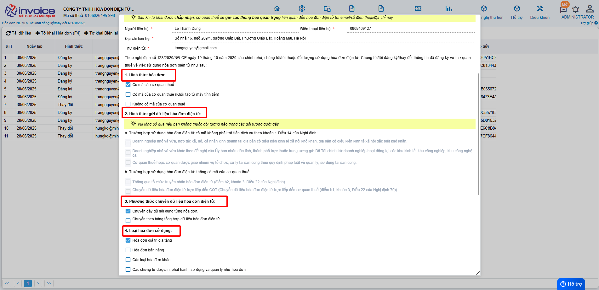

1,2,3,4,Các bạn tích chọn vào các loại hóa đơn phù hợp với hình thức doanh nghiệp mình sử dụng

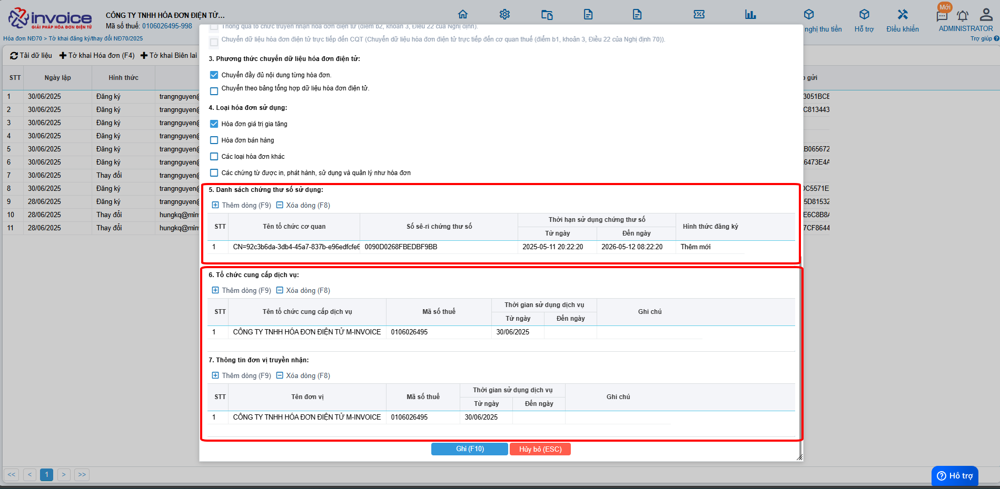

5, chọn **Thêm** để thêm cks hay để Add CKS mới thay đổi vào tờ khai **nếu có rồi thì k cần làm bước này**

6, Thông tin tổ chức chức cung cấp dịch vụ và truyền nhận (sẽ mặc định là: CÔNG TY TNHH HÓA ĐƠN ĐIỆN TỬ M-INVOICE)

7, Sau khi add xong CKS, quý khách nhấn Lưu để **lưu** lại dữ liệu tờ khai 01 này

### **Bước 4 : Sau khi hoàn thành, các bạn chọn tờ khai mình vừa lập chọn Ký và gửi CQT**

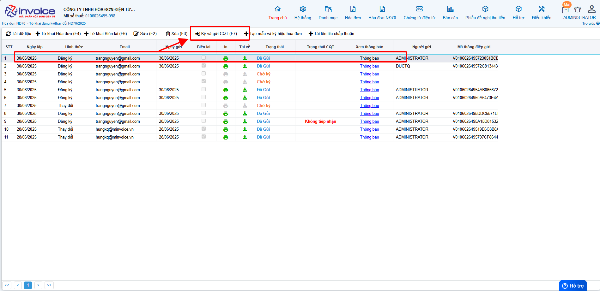

Như vậy đã hoàn tất quá trình đăng ký hay thay đổi thông tin hóa đơn sử dụng.

???+ Danger "Chú ý"

    **Các bạn vui lòng chờ đến khi CQT chấp nhận tờ khai thì mới có thể lập được hóa đơn**

???+ info "Xin chân thành cảm ơn quý khách hàng đã tin dùng sản phẩm của M-Invoice"

    Có bất kỳ vướng mắc nào trong quá trình sử dụng hãy liên hệ với M-Invoice tại mục Hỗ trợ kỹ thuật góc phải bên dưới màn hình hoặc gọi tổng đài kỹ thuật của M-Invoice (1900.955.557 Nhánh 1)

Last updated on <strong>Jun 5, 2025</strong> by <strong>nhatth</strong>

