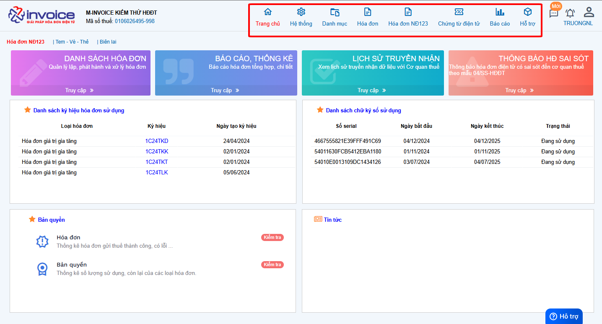
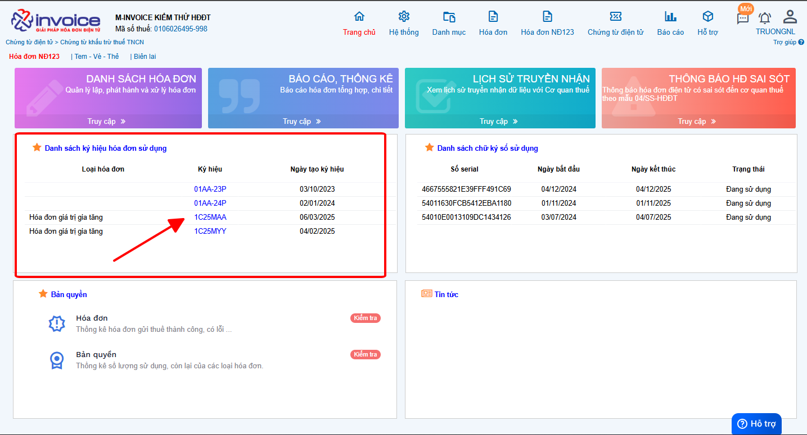
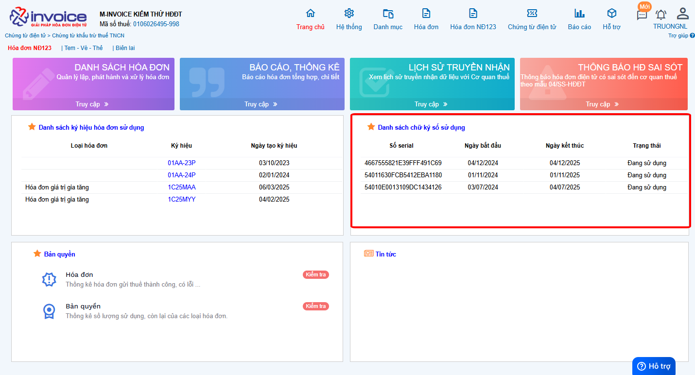
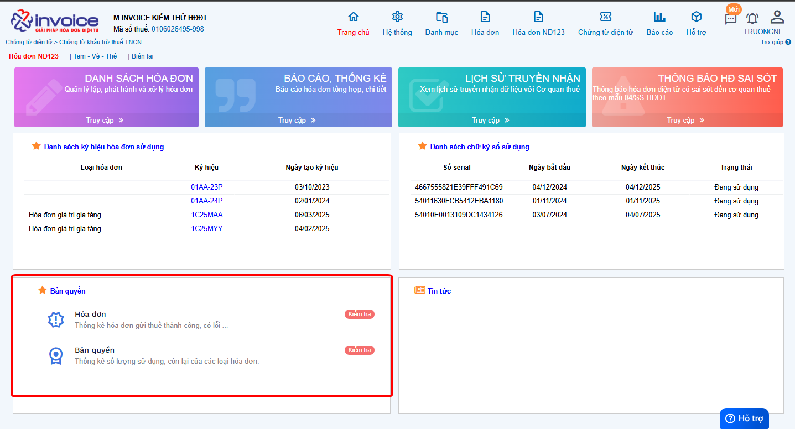

# **Trang chủ phần mềm**

## **Giới thiệu trang chủ phần mềm hóa đơn điện tử M-Invoice**

### **Các module chức năng của phần mềm**

### **Danh sách ký hiệu hóa đơn sử dụng**

Anh chị có thể truy cập nhanh vào ký hiệu bằng cách click vào.

### **Danh sách chữ ký số sử dụng với đầy đủ các thông tin và trạng thái.**

### **Bản quyền**

Anh chị có thể click vào mục "Hóa đơn" để kiểm tra số lượng hóa đơn từng ký hiệu hoặc "Bản quyền" để kiểm tra bản quyền số lượng hóa đơn

!!! info "Xin chân thành cảm ơn Quý khách hàng đã tin dùng sản phẩm của M-Invoice"

    Có bất kỳ vướng mắc nào trong quá trình sử dụng hãy liên hệ với M-Invoice tại mục Hỗ trợ kỹ thuật góc phải bên dưới màn hình hoặc gọi tổng đài kỹ thuật của M-Invoice (1900.955.557 Nhánh 1)

Last updated on <strong>Jun 5, 2025</strong> by <strong>nhatth</strong>

