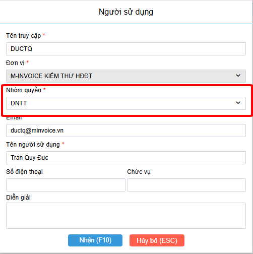

# **Hướng dẫn sử dụng phiếu đề nghị thu tiền**

### **1. Xác định mục tiêu người sử dụng**

- Tại màn hình Menu Phiếu đề nghị thu tiền có các lựa chọn:

1. Danh sách DNTT hóa đơn: để thao tác thêm sửa xóa phiếu DNTT dành cho hóa đơn.
2. Danh sách DNTT biên lai: để thao tác thêm sửa xóa phiếu DNTT dành cho biên lai.
3. Báo cáo chi tiết DNTT hóa đơn: để thao tác kết xuất báo cáo các phiếu DNTT hóa đơn dưới dạng excel.
4. Báo cáo chi tiết DNTT biên lai: để thao tác kết xuất báo cáo các phiếu DNTT biên lai dưới dạng excel.

### **2. Phân quyền sử dụng**

##### **2.1 Mục đích**

Khi cần tạo nhóm quyền riêng biệt cho người dùng chỉ thao tác sử dụng phiếu DNTT, hoặc chỉ sử dụng hóa đơn,...

##### **2.2 Thao tác**

**B1: Truy cập Hệ thống > Quản trị người dùng > Nhóm quyền.**

**B2: Thêm mới hoặc sửa một nhóm quyền bất kỳ, click chức năng Phân quyền.**

**B3: Người dùng tích chọn vào những Menu chức năng mà nhóm quyền này có thể thao tác.**

**B4: Gán nhóm quyền cho người dùng bằng cách truy cập Hệ thống > Quản trị người dùng > Người sử dụng, sau đó sửa người dùng cần gán nhóm quyền và chọn nhóm quyền mới cho người dùng đó**

### **3. MENU Danh sách DNTT hóa đơn / biên lai**

##### **3.1 Mục đích**

- Cho phép người dùng tạo phiếu DNTT.
- Cho phép người dùng in bản giấy DNTT để chuyển cho người dân.
- Cho phép người dùng xuất hóa đơn từ phiếu DNTT đối với phiếu DNTT hóa đơn.

##### **3.2 Chức năng Tải dữ liệu**

- Cho phép người dùng làm mới màn hình danh sách.

##### **3.3 Chức năng Thêm**

- Cho phép người dùng tạo mới phiếu DNTT
- Màn hình tạo mới tương tự màn hình hóa đơn, để người dùng không bị lạ lẫm khi đang thao tác quen với hóa đơn.

- Riêng phiếu DNTT biên lai thì có thêm phần tính toán Tiền thanh toán = 0.15% Giá trị nhà, đất.

##### **3.4 Chức năng Sửa**

- Cho phép người dùng sửa phiếu DNTT.
- Chỉ sửa được phiếu ở trạng thái Chờ thanh toán và Chưa xuất hóa đơn.

##### **3.5 Chức năng Sao chép**

- Cho phép người dùng sao chép dữ liệu từ một phiếu DNTT đã tạo thành phiếu mới với thông tin đã điền sẵn.

##### **3.6 Chức năng Tạo hóa đơn**

- Cho phép người dùng tạo hóa đơn từ phiếu DNTT hóa đơn và hiển thị thông tin ký hiệu, số hóa đơn tương ứng với phiếu DNTT.

- DNTT biên lai không có chức năng này.

##### **3.7 Chức năng xem in**

- Bản thể hiện của phiếu DNTT.
- Người dùng có thể in ra để gửi, chuyển tiếp cho người khác.

##### **3.8 Chức năng Thanh toán**

- Cho phép người dùng chuyển đổi trạng thái phiếu DNTT từ Chờ TT thành Đã TT.
- 

- Đối với trường hợp thanh toán bằng QR Code thì hệ thống sẽ tự động cập nhật trạng thái Chờ TT thành TT QR.

##### **3.9 Chức năng Gỡ thanh toán**

##### **3.10 Chức năng Kết xuất excel**

- Cho phép người dùng kết xuất excel màn hình danh sách về máy để phục vụ đối chiếu hoặc tổng hợp dữ liệu.

### **4. MENU Báo cáo chi tiết DNTT hóa đơn / biên lai**

- Cho phép người dùng lọc dữ liệu Từ ngày - Đến ngày và kết xuất excel theo định dạng có sẵn.

!!! info "Xin chân thành cảm ơn Quý khách hàng đã tin dùng sản phẩm của M-Invoice"

    Có bất kỳ vướng mắc nào trong quá trình sử dụng hãy liên hệ với M-Invoice tại mục Hỗ trợ kỹ thuật góc phải bên dưới màn hình hoặc gọi tổng đài kỹ thuật của M-Invoice (1900.955.557 Nhánh 1)

Last updated on <strong>Aug 21, 2025</strong> by <strong>NHATTH</strong>

