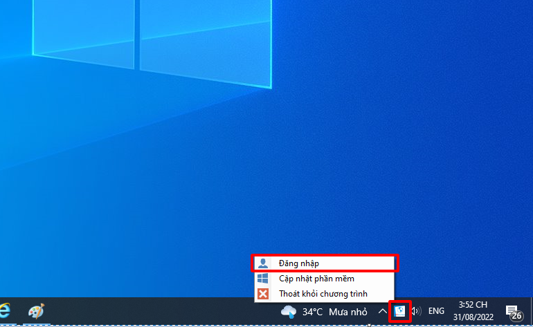
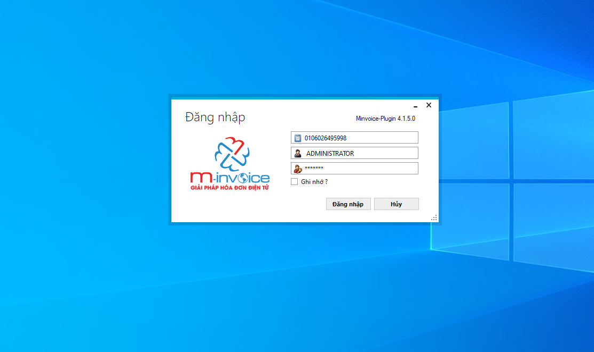
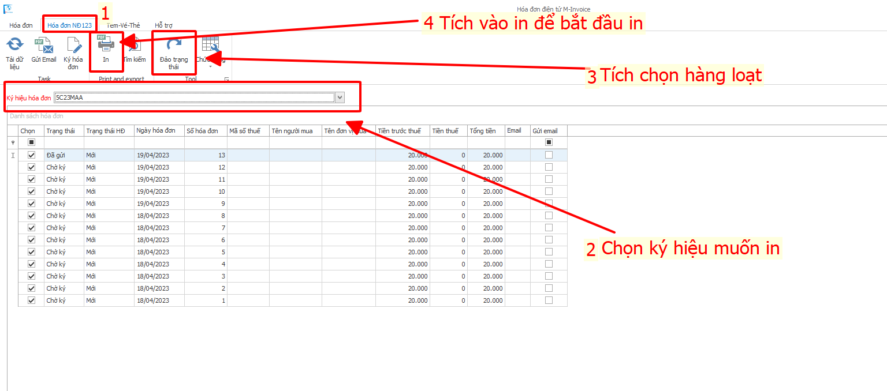
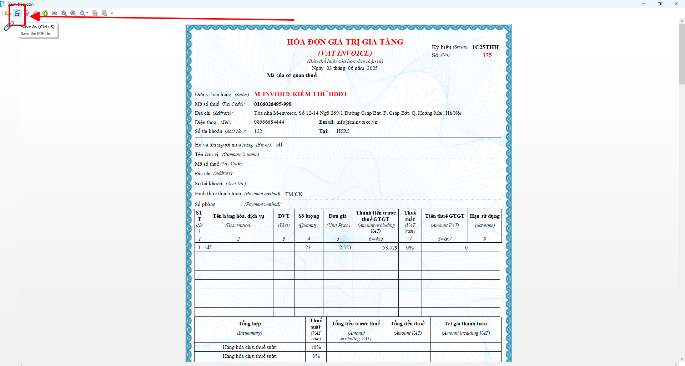
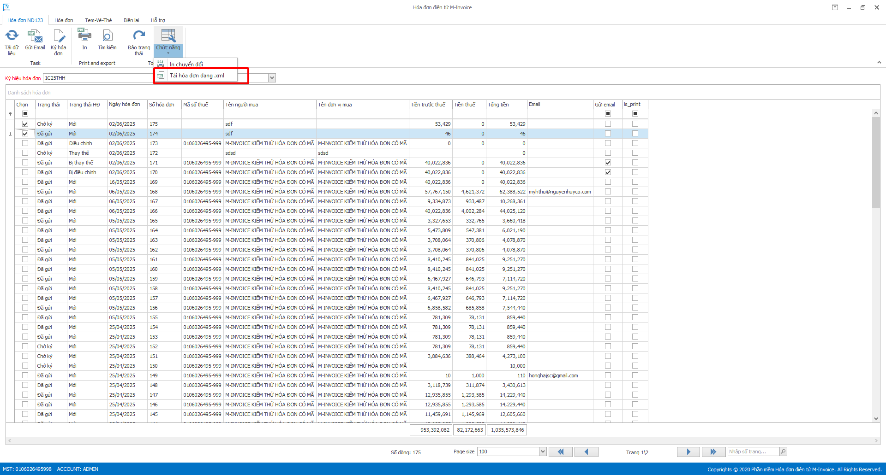
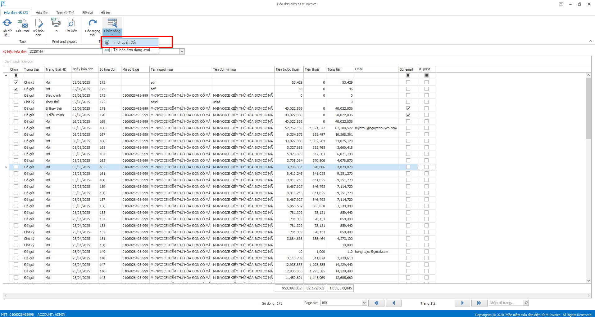

# **Hướng dẫn xem in hàng loạt bằng M-invoice Plugin**

## Lưu ý : M-invoice Plugin phải từ phiên bản 4.1.7.0 trở lên

Trong quá trình sử dụng M-invoice, quý khác có thể muốn tải hàng loạt hóa đơn ra file PDF và XML, hoá đơn chuyển đổi sau đây M-invoice sẽ hương dẫn NSD tải hàng loạt bằng plugin

<iframe style="width: 43rem; height: 380px"
    src="https://www.youtube.com/embed/nhch9QVlTlM" 
    frameborder="0" allowfullscreen>
</iframe>

=== "Cách 1: Tải nhiều hoá đơn PDF"

    ### **Bước 1: Chọn vào biểu tượng Plugin ở phải dưới màn hình, click chuột phải chọn đăng nhập**

    

    ### **Bước 2: Màn hình sẽ hiển thị cửa sổ đăng nhập, quý khách nhập mã số thuế, tài khoản và mật khẩu (Như trên bản web) để đăng nhập vào**

    

    ### **Bước 3 : Sau khi đăng nhập (1) Chọn vào phần hóa đơn nghị định 123. (2) Chọn vào phần ký hiệu hóa đơn để chọn ký hiệu muốn xem in. (3) Chọn phần đảo trạng thái để chọn hàng loạt hóa đơn(4) Chọn in để bắt đầu in hàng loạt**

    

    

    **Quý khách có thể bấm theo ảnh trên để tải PDF về**

    ### **Bước 4: Như vậy quý khách đã xem in và tải thành công PDF**

=== "Cách 2: Tải nhiều XML"

    ### **Bước 1: Chọn vào biểu tượng Plugin ở phải dưới màn hình, click chuột phải chọn đăng nhập**

    

    ### **Bước 2: Màn hình sẽ hiển thị cửa sổ đăng nhập, quý khách nhập mã số thuế, tài khoản và mật khẩu (Như trên bản web) để đăng nhập vào**

    

    ### **Bước 3 : Sau khi đăng nhập (1) Chọn vào phần hóa đơn nghị định 123. (2) Chọn vào phần ký hiệu hóa đơn để chọn ký hiệu muốn tải xml. (3) Chọn phần đảo trạng thái để chọn hàng loạt hóa đơn(4) Chọn chức năng -> tải xml để bắt đầu in hàng loạt**

    

    ### **Bước 4: Như vậy quý khách đã tải thành công xml**

=== "Cách 3: Tải chuyển đổi hàng loạt"

    ### **Bước 1: Chọn vào biểu tượng Plugin ở phải dưới màn hình, click chuột phải chọn đăng nhập**

    

    ### **Bước 2: Màn hình sẽ hiển thị cửa sổ đăng nhập, quý khách nhập mã số thuế, tài khoản và mật khẩu (Như trên bản web) để đăng nhập vào**

    

    ### **Bước 3 : Sau khi đăng nhập (1) Chọn vào phần hóa đơn nghị định 123. (2) Chọn vào phần ký hiệu hóa đơn để chọn ký hiệu muốn tải xml. (3) Chọn phần đảo trạng thái để chọn hàng loạt hóa đơn(4) Chọn chức năng -> tải xml để bắt đầu in hàng loạt**

    

    

    **Quý khách có thể bấm theo ảnh trên để tải PDF về**

    ### **Bước 4: Như vậy quý khách đã tải thành công hoá đơn chuyển đổi**

!!! info "Xin chân thành cảm ơn Quý khách hàng đã tin dùng sản phẩm của M-Invoice"

    Có bất kỳ vướng mắc nào trong quá trình sử dụng hãy liên hệ với M-Invoice tại mục Hỗ trợ kỹ thuật góc phải bên dưới màn hình hoặc gọi tổng đài kỹ thuật của M-Invoice (1900.955.557 Nhánh 1)

Last updated on <strong>Jun 5, 2025</strong> by <strong>nhatth</strong>

