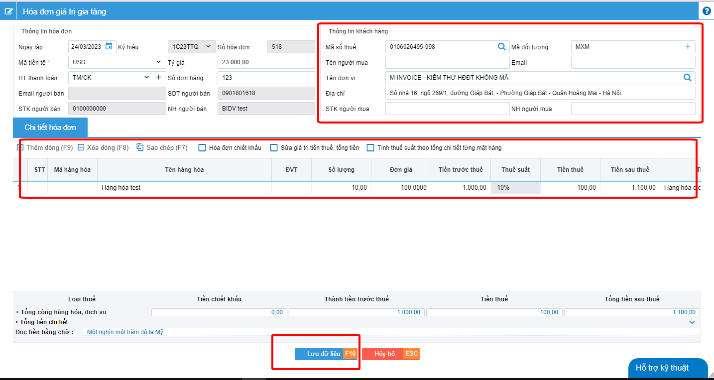

# **Hướng dẫn nhận excel chi tiết hóa đơn**

Tính năng này được sử dụng khi 1 hóa đơn có nhiều dòng hàng, mà NSD không muốn gõ tay từng dòng hàng trên PM mà muốn nhận thông qua file excel

???+ Warning "Lưu ý"

    Bạn có thể nhận excel chi tiết vào được cả các hóa đơn gốc, thay thế, điều chỉnh ở trạng thái chờ ký, và toàn bộ
    dữ liệu trước đó sẽ thay thế hoàn toàn bằng giá trị trong file excel

<iframe style="width: 43rem; height: 380px" 
    src="https://www.youtube.com/embed/gw_dvwOy5XU" 
    frameborder="0" allowfullscreen>
</iframe>

### **Bước 1: Tạo 1 hóa đơn chờ ký nhập đầy đủ thông tin của người mua, và 1 dòng hàng bất kỳ**

### **Bước 2: Chọn hóa đơn vừa tạo >> Chức năng >> Nhận excel chi tiết hóa đơn**

### **Bước 3 : Tải file mẫu hóa đơn về máy, sau đó nhận đầy đủ thông tin vào file excel sau đó lưu lại**

Các bạn chỉ cần kiểm tra lại thông tin, sau đó điền vào phần lý do
Khi nhập lý do xong hãy nhấn phím tab để pm lưu lại được mục lý do, sau đó nhấn Ghi(F10)

### **Bước 4 : Lưu lại file excel sau đó tải ngược lại trên phân mềm**

### **Bước 5 : Tải lại phần mềm, như thế bạn đã tạo thành công file excel lên phần mềm**

!!! info "Xin chân thành cảm ơn Quý khách hàng đã tin dùng sản phẩm của M-Invoice"

    Có bất kỳ vướng mắc nào trong quá trình sử dụng hãy liên hệ với M-Invoice tại mục Hỗ trợ kỹ thuật góc phải bên dưới màn hình hoặc gọi tổng đài kỹ thuật của M-Invoice (1900.955.557 Nhánh 1)

Last updated on <strong>Jun 5, 2025</strong> by <strong>nhatth</strong>

