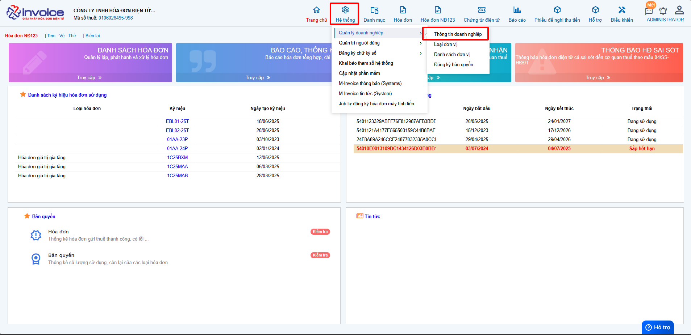
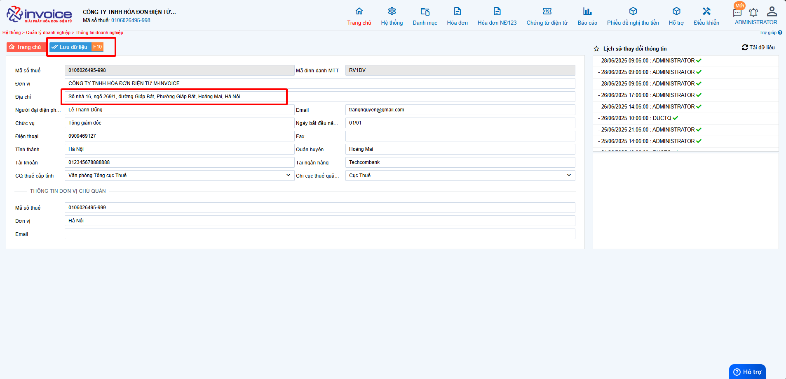
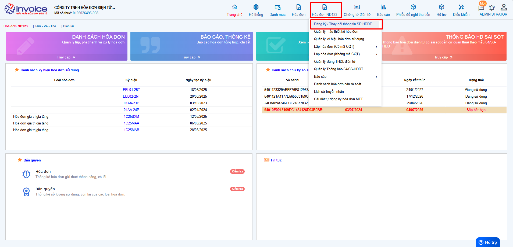
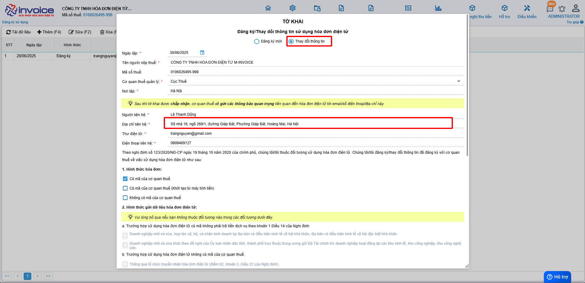

# **Thay đổi thông tin doanh nghiệp**

  
<strong>✅ Chức năng này dùng để làm gì?</strong> 
  Chức năng thay đổi thông tin doanh nghiệp (địa chỉ, tên,...) doanh nghiệp giúp cập nhật thông tin mới trên hệ thống quản lý, đảm bảo tính pháp lý và đồng bộ với dữ liệu của cơ quan nhà nước.

  
<strong>✅ Vì sao cần dùng chức năng này?</strong> 
  Vì địa chỉ trụ sở hay tên doanh nghiệp là thông tin pháp lý quan trọng. Nếu không cập nhật kịp thời, doanh nghiệp có thể bị xử phạt, thông tin trên hóa đơn – hợp đồng bị sai lệch, ảnh hưởng đến giao dịch và uy tín doanh nghiệp.

## **Hướng dẫn thay đổi thông tin doanh nghiệp**

???+ Warning "Lưu ý"

    Trường hợp thay đổi địa chỉ, tên doanh nghiệp, cơ quản thuế quản lý thì cần phải nộp tờ khai cho CQT

**Thao tác cài đặt và thực hiện như sau**

=== "Thay đổi địa chỉ"

    ### **Bước 1: Truy cập hệ thống -> thông tin doanh nghiệp**

    

    Bạn vào phần **Hệ thông --> Quản lý doanh nghiệp --> Thông tin doanh nghiệp**

    

    Điền địa chỉ đúng rồi bấm **Lưu**

    ### **Bước 2: Làm tờ khai 01 thay đổi thông tin với cơ quan thuế (Hóa đơn NĐ123 --> Đăng ký/thay đổi thông tin SD HDDT)**

    
Hướng dẫn video làm tờ khai

    <iframe style="width: 43rem; height: 380px" src="https://www.youtube.com/embed/GslGyYLCIDk" title="YouTube video player" frameborder="0" allow="accelerometer; autoplay; clipboard-write; encrypted-media; gyroscope; picture-in-picture; web-share" referrerpolicy="strict-origin-when-cross-origin" allowfullscreen></iframe>

    **Hướng dẫn sử dụng bằng hình ảnh nếu Quý khách không xem được video**

    

    Quý khách truy cập vào **Hóa đơn NĐ123 --> Đăng ký/thay đổi thông tin SD HDDT**

    ???+ Warning "Lưu ý"

        Với những quý khách đã có tờ khai đăng ký trước đó, thì hình thức sẽ phải chọn là Thay đổi

    

    

    **Kiểm tra địa chỉ xem đã chính xác hay chưa**

    

    

    ???+ danger "Cảnh báo"

        Quý khách chọn đúng hình thức hóa đơn của đơn vị mình đang sử dụng và kiểm tra chữ ký số đơn vị đang sử dụng đã có trong tờ khai hay chưa

        Sau đó ấn **Lưu**

    

    !!! note ""

        Sau đó Quý khách chỉ cần ký và gửi tờ khai thay đổi với cơ quan thuế

        **Tờ khai đăng ký/ thay đổi sẽ thường được bên thuế chấp nhận sau 1 ngày - 5 ngày làm việc**

???+ info "Xin chân thành cảm ơn quý khách hàng đã tin dùng sản phẩm của M-Invoice"

    Có bất kỳ vướng mắc nào trong quá trình sử dụng hãy liên hệ với M-Invoice tại mục Hỗ trợ kỹ thuật góc phải bên dưới màn hình hoặc gọi tổng đài kỹ thuật của M-Invoice (1900.955.557 Nhánh 1)

Last updated on <strong>Jun 30, 2025</strong> by <strong>nhatth</strong>

