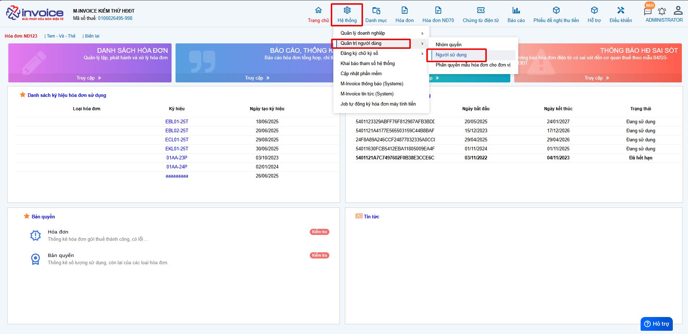
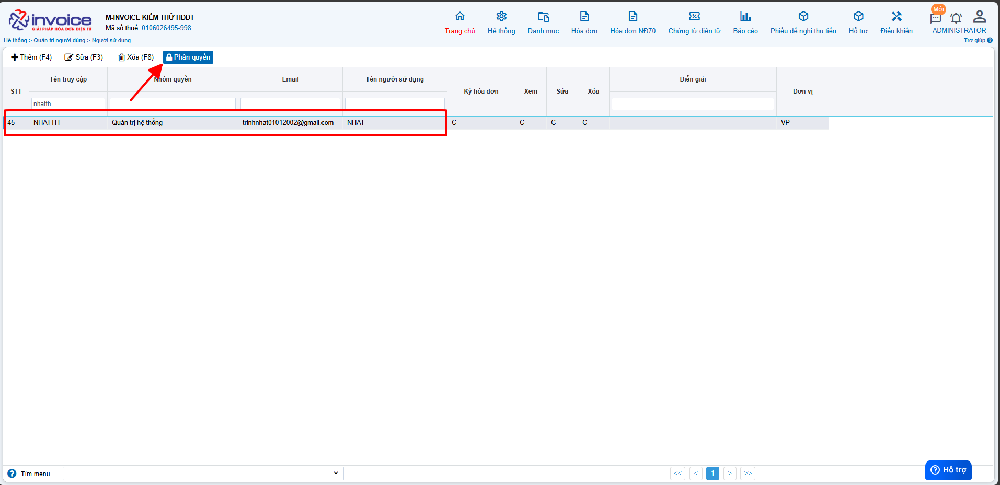
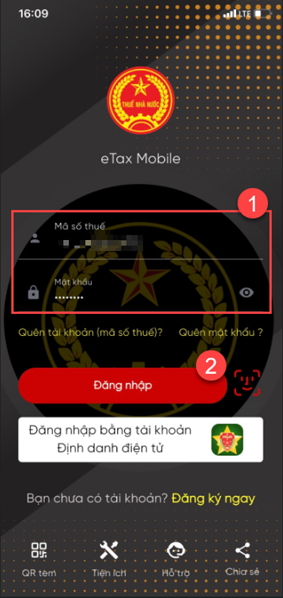
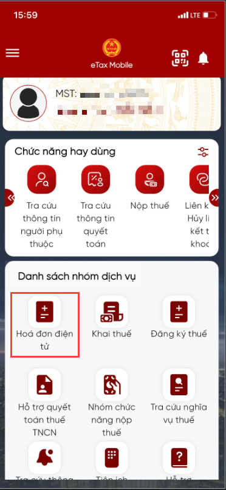
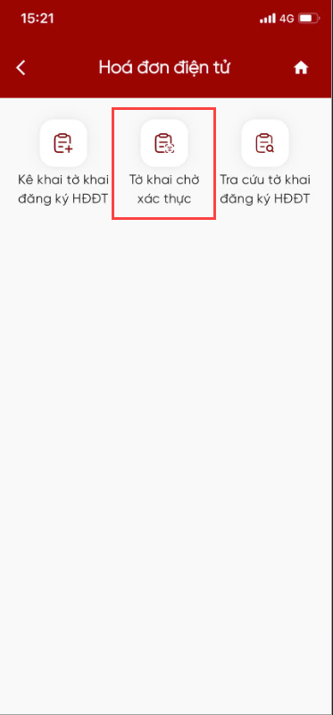
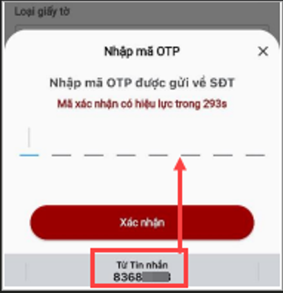
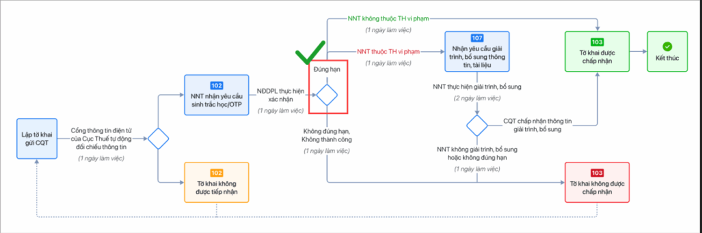
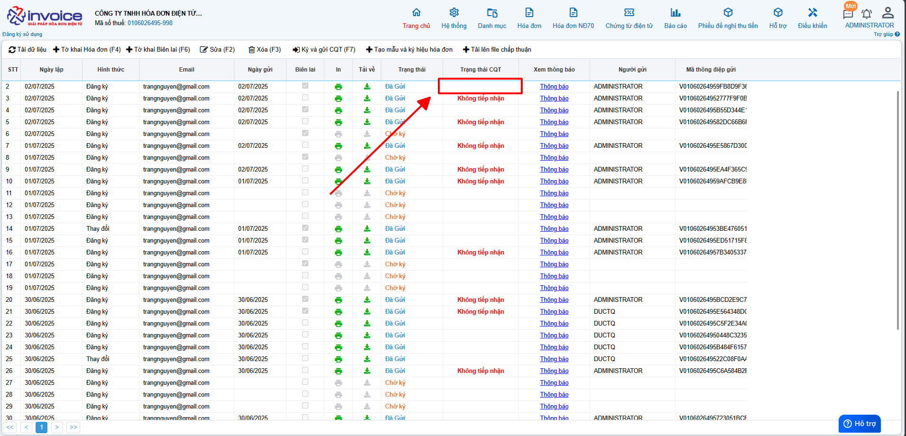

# **Thay đổi CKS hoặc thêm CKS mới vào phần mềm theo NĐ70**

  
<strong>🚨 Quan trọng:</strong>  
  Bắt buộc xác thực sinh trắc học khi đăng ký/thay đổi thông tin sử dụng hóa đơn điện tử từ <strong>Nghị định 70/2025/NĐ-CP</strong>

  
Từ <strong>ngày 01/07/2025</strong>, người nộp thuế (NNT) khi đăng ký hoặc thay đổi thông tin sử dụng hóa đơn điện tử sẽ <strong>bắt buộc phải xác thực sinh trắc học</strong> trên ứng dụng <strong>eTax Mobile</strong>.

  
<strong>🔍 Quy trình thực hiện như sau:</strong> 
  ✅ NNT gửi tờ khai đăng ký/thay đổi thông tin trên hệ thống hóa đơn điện tử. 
  ✅ Truy cập ứng dụng <strong>eTax Mobile</strong> để thực hiện xác thực sinh trắc học. 
  ✅ Sau khi xác thực thành công → Cơ quan thuế (CQT) gửi kết quả xác thực. 
  ✅ Trong 01 ngày làm việc, CQT sẽ thông báo chấp nhận/không chấp nhận hồ sơ.

  
<strong>❌ Lưu ý:</strong> 
  Nếu sau <strong>24h</strong> mà NNT <strong>không xác thực</strong> hoặc xác thực <strong>không thành công</strong>, <strong>tờ khai sẽ bị hủy</strong>.

  
<strong>👉 Để tránh gián đoạn</strong> trong quá trình sử dụng hóa đơn điện tử, NNT cần <strong>chủ động xác thực ngay sau khi gửi tờ khai!</strong>

## **Hướng dẫn Thay đổi CKS hoặc thêm CKS mới vào phần mềm và nộp tờ khai theo NĐ70 đáp ứng xác thực sinh trắc học của Cục Thuế**

### **Bước 1: Cắm CKS vào máy tính, kiểm tra xem plugin đã được bật chưa (nếu đang ký được hóa đơn thì bỏ qua bước này)**

!!! note ""

    Click vào biểu tượng **HIDE** (hay dẫu mũi tên chỉ lên) (1) nếu có biểu tượng Plugin của Minvoice như thế plugin đã bật thành công

    Nếu chưa, bạn chỉ cần gõ vào ô tìm kiếm của window ( window + S) tìm kiếm **Minvoice Plugin** rồi bật  lên là được.

### **Bước 2: Thêm CKS vào phần mềm hóa đơn**

Các bạn vào **Hệ thông --> Đăng ký chữ ký số --> Thêm chứng thư số**

Click vào loại **CKS** phù hợp nhất với mình

Ở thanh Taskbar sẽ hiển thị lên biểu tượng của công cụ **Plugin Minvoice** các bạn chọn vào đó để thêm **CKS** mới của mình

### **Bước 3 : Phân quyền chữ ký số**

**Chỗ này chọn đúng user mà Anh/Chị đang đăng nhập để phân quyền, hoặc phân quyền hết các user hiện có nếu muốn user nó ký được hóa đơn**

### **Bước 4 : Làm tờ khai 01**

Các bạn vào phần **Đăng ký phát hành >> Tờ khai đăng ký/thay đổi NĐ70/2025 >> Thêm (F4)**

!!! note ""

    Ở phần **Đăng ký/Thay đổi thông tin sử dụng hóa đơn điện tử**

    + Chọn **Đăng ký mới** nếu bạn chưa từng sử dụng hóa đơn theo nghị định 123 (Hóa đơn có mã của CQT)

    + Chọn **Thay đổi** thông tin nếu bạn muốn thay đổi địa chỉ, tên doanh nghiệp, hay thêm CKS mới vào phần mềm

???+ note "Thông tin người đại diện pháp luật"

    Ở phần này các bạn điền đẩy đủ các phần như sau

    **Tên người đại diện**: tên giám đốc

    **Đia chỉ liên hệ** : địa chỉ công ty

    **Số điện thoại** : số điện thoại

    **Căn cước công dân**

    **Hộ chiếu**

???+ note "Thông tin người nhận các thông báo quan trọng liên quan đến hóa đơn điện tử (trường sẽ là thông tin của kế toán, kế toán trưởng)"

    Ở phần này các bạn điền đẩy đủ các phần như sau

    **Người liên hệ**: tên kế toán, ...

    **Đia chỉ liên hệ** : địa chỉ nhận thông báo nếu có

    **điện thoại liên hệ** : số điện thoại nhận thông báo

    **Email liên hệ**: mail nhận thông báo từ thuế

1,2,3,4,Các bạn tích chọn vào các loại hóa đơn phù hợp với hình thức doanh nghiệp mình sử dụng

5, chọn **Thêm** để thêm cks hay để Add CKS mới thay đổi vào tờ khai **nếu có rồi thì k cần làm bước này**

6, Thông tin tổ chức chức cung cấp dịch vụ và truyền nhận (sẽ mặc định là: CÔNG TY TNHH HÓA ĐƠN ĐIỆN TỬ M-INVOICE)

7, Sau khi add xong CKS, quý khách nhấn Lưu để **lưu** lại dữ liệu tờ khai 01 này

### **Bước 5 : Sau khi hoàn thành, các bạn chọn tờ khai mình vừa lập chọn Ký và gửi CQT**

### **Bước 6 : Xác thực OTP tờ khai đăng ký/thay đổi thông tin sử dụng hóa đơn điện tử theo yêu cầu của Cơ quan thuế**

**QUY TRÌNH XỬ LÝ TỜ KHAI ĐĂNG KÝ THEO NĐ70**

  <strong style="font-size: 16px; color: #1a237e;">📌 Tóm tắt trình tự thực hiện đăng ký sử dụng hóa đơn</strong>

  <ol style="padding-left: 20px; margin-top: 10px;">
    <li style="margin-bottom: 10px;">
      <strong>Gửi tờ khai đăng ký sử dụng hóa đơn mẫu 01/ĐKSD-HDDT</strong> 
      (qua tổ chức dịch vụ hóa đơn điện tử) 
      <em>Lưu ý:</em> Kê khai <strong>chính xác thông tin người đại diện pháp luật</strong> so với thông tin đã đăng ký kinh doanh.
    </li>

    <li style="margin-bottom: 10px;">
      <strong>Nhận thông tin tiếp nhận đăng ký sử dụng hóa đơn</strong> 
      Bao gồm:
      <ul style="margin: 6px 0 6px 20px;">
        <li>Mã hồ sơ</li>
        <li>Mã giao dịch thủ tục hành chính</li>
      </ul>
      Hiện đang áp dụng phương thức OTP cho người đại diện pháp luật là người Việt Nam. 
      Sẽ mở rộng xác thực <strong>sinh trắc học</strong> và xác thực cho <strong>người nước ngoài</strong> theo lộ trình của <strong>Bộ Công an</strong>.
    </li>

    <li style="margin-bottom: 10px;">
      <strong>Thông báo từ hệ thống</strong> 
      Hệ thống sẽ gửi email và hiển thị thông báo trên ứng dụng <strong>etaxmobile</strong> của người đại diện pháp luật.
    </li>

    <li>
      <strong>Xác thực OTP trên etaxmobile</strong> 
      Đăng nhập bằng tài khoản <strong>định danh điện tử cá nhân</strong> (qua <strong>VNeID</strong>). 
      Nhấn vào thông báo trong ứng dụng để thực hiện xác thực OTP.
    </li>

  </ol>

???+ note "Nội dung"

    Hướng dẫn thực hiện xác thực OTP tờ khai đăng ký/thay đổi thông tin sử dụng hóa đơn điện tử theo yêu cầu của Cơ quan thuế trên app eTax mobile.

  <strong style="font-size: 16px; color: #1e3a8a;">📌 Trình tự bắt buộc để được sử dụng hoá đơn điện tử</strong>

  <ol style="padding-left: 20px; margin-top: 12px;">
    <li style="margin-bottom: 10px;">
      <strong>Bước 1:</strong> Giám đốc phải có <strong>tài khoản định danh điện tử VNeID cấp 2</strong>.
    </li>

    <li style="margin-bottom: 10px;">
      <strong>Bước 2:</strong> Doanh nghiệp phải được <strong>định danh thành công trên ứng dụng VNeID</strong>. 
      👉 <em>Lưu ý:</em> Việc định danh này <strong>có thể ủy quyền</strong>.
    </li>

    <li style="margin-bottom: 10px;">
      <strong>Bước 3:</strong> Giám đốc phải có <strong>tài khoản đăng nhập ứng dụng eTaxMobile</strong>.
    </li>

    <li>
      <strong>Bước 4:</strong> Sau khi <strong>gửi tờ khai đăng ký sử dụng</strong> hoặc <strong>thay đổi thông tin</strong> trên phần mềm hóa đơn điện tử: 
      🔐 <strong>Giám đốc phải trực tiếp</strong> đăng nhập eTaxMobile để duyệt và gửi tờ khai đến cơ quan thuế. 
      ❌ <em style="color: #c62828;">Việc này không thể ủy quyền.</em>
    </li>

  </ol>

  

    <strong>🔎 Lưu ý:</strong>  
    Những <strong>công ty mới thành lập</strong> bắt buộc phải làm định danh thì mới được sử dụng hóa đơn. 
    Các <strong>công ty đang sử dụng hóa đơn điện tử</strong> cũng cần thực hiện lại các bước trên nếu:  
    - Chữ ký số hết hạn  
    - Thay đổi tên hoặc địa chỉ doanh nghiệp  
  

  
<strong>✅ Kết luận:</strong> 100% Giám đốc cần chuẩn bị sẵn 2 ứng dụng:

  <ul style="margin-top: 6px; padding-left: 20px;">
    <li><strong>VNeID</strong> – để định danh điện tử</li>
    <li><strong>eTaxMobile</strong> – để xác nhận tờ khai với cơ quan thuế</li>
  </ul>
  
➡️ Giúp quá trình đăng ký hóa đơn diễn ra <strong>nhanh chóng và thuận tiện</strong>.

**Hướng dẫn thực hiện**

### **1. Cơ quan thuế gửi email thông báo việc tờ khai đăng ký/thay đổi thông tin sử dụng hóa đơn điện tử cần xác thực OTP trong vòng 01 ngày làm việc.**

### **2. Đăng nhập app etax mobile**

{: style="height:650px"}

### **3. Chọn mục Hóa đơn điện tử.**

{: style="height:650px"}

### **4. Nhấn vào mục Tờ khai chờ xác thực.**

{: style="height:650px"}

### **5. Thực hiện xác thực.**

{: style="height:650px"}

**Sau khi thực hiện xong bước xác thực OTP, tức tờ khai đã được xử lý đến mục tích xanh sau đây trên quy trình tờ khai. Đơn vị chờ Cơ quan thuế phản hồi các thông điệp tiếp theo.**

{: style="width:780px"}

### **6. Quay về phần mềm hóa đơn điện tử M-invoice để kiểm tra tờ khai tại cột Phản hồi CQT trên danh sách tờ khai.**

???+ Danger "Chú ý"

    **Các bạn vui lòng chờ đến khi CQT chấp nhận tờ khai thì mới có thể lập được hóa đơn**

???+ info "Xin chân thành cảm ơn quý khách hàng đã tin dùng sản phẩm của M-Invoice"

    Có bất kỳ vướng mắc nào trong quá trình sử dụng hãy liên hệ với M-Invoice tại mục Hỗ trợ kỹ thuật góc phải bên dưới màn hình hoặc gọi tổng đài kỹ thuật của M-Invoice (1900.955.557 Nhánh 1)

Last updated on <strong>Jul 3, 2025</strong> by <strong>nhatth</strong>

