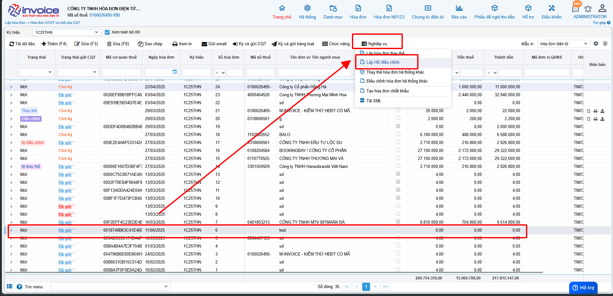
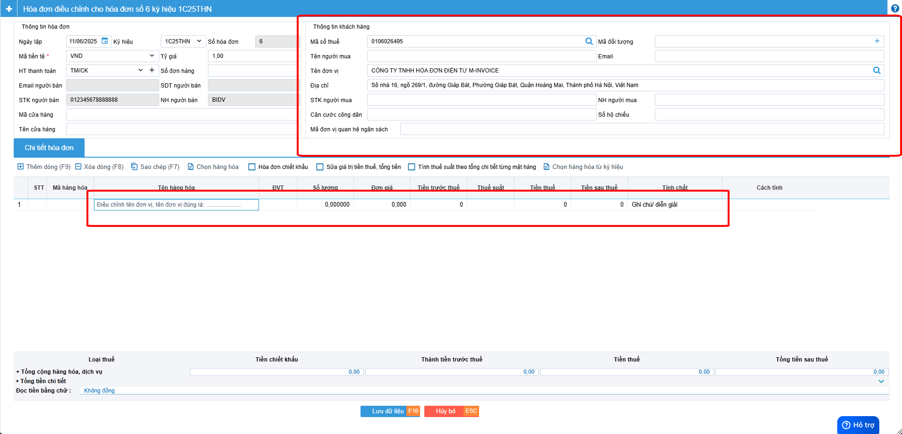
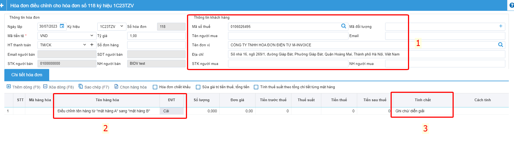
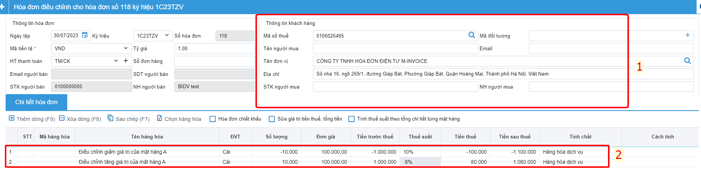
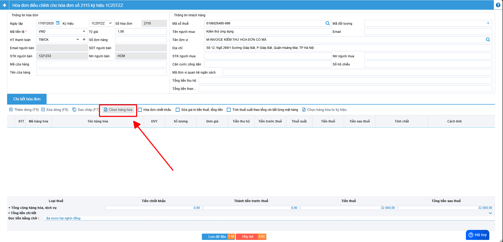
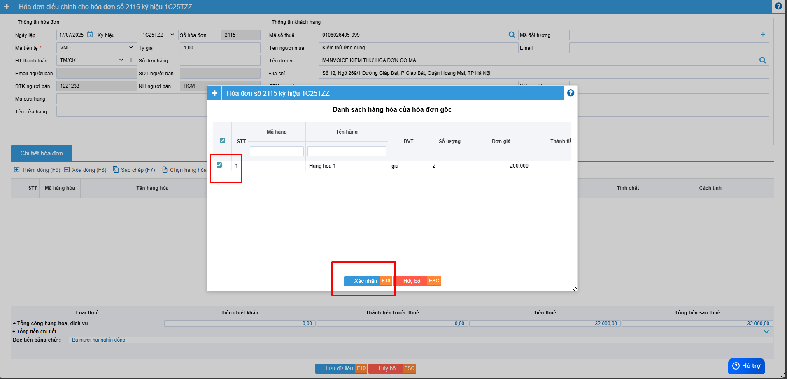
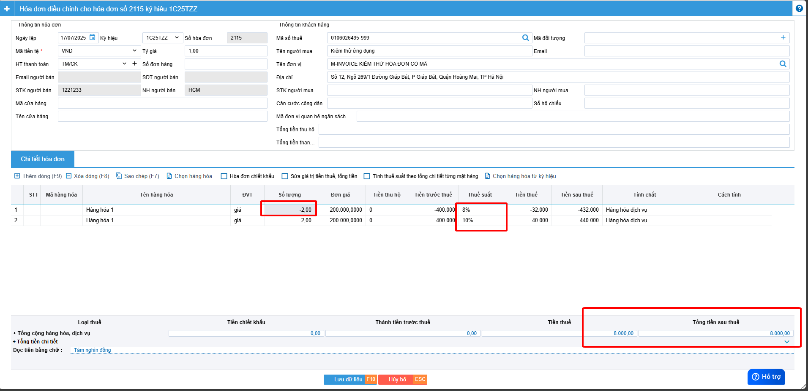
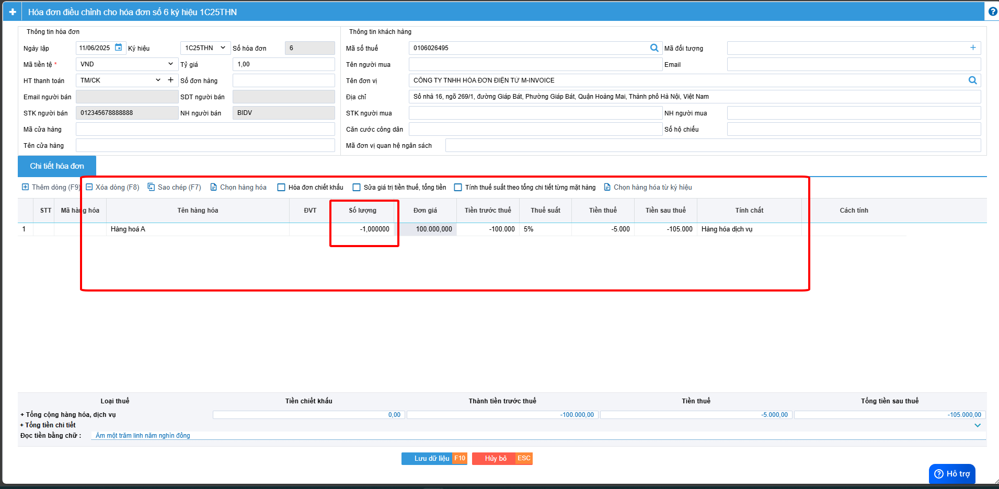

# **Điều chỉnh hoá đơn**

???+ Note "Ghi chú"

    📘 **CĂN CỨ TẠI NGHỊ ĐỊNH 70/2025/NĐ-CP**, SỬA ĐỔI **NGHỊ ĐỊNH 123/2020/NĐ-CP**, QUY ĐỊNH VỀ VIỆC LẬP **HÓA ĐƠN, CHỨNG TỪ** NHƯ SAU:

    ---

    🧾 **Khi người bán phát hiện hóa đơn điện tử đã lập sai** *(bao gồm:)*

    – Hóa đơn điện tử **đã được cấp mã của cơ quan thuế**;

    – Hóa đơn điện tử **không có mã nhưng đã gửi dữ liệu đến cơ quan thuế**;

    → Thì xử lý theo các trường hợp:

    ---

    1. Sai sót nhỏ – **Không làm thay đổi nội dung nghĩa vụ thuế:**

    ✅ **Sai tên người mua**
    → Không cần lập lại hóa đơn.
    → Gửi **Mẫu 04/SS-HĐĐT** cho **Cơ quan thuế** và **thông báo cho bên mua**.

    ✅ **Sai địa chỉ người mua**
    → Không cần lập lại hóa đơn.
    → Gửi **Mẫu 04/SS-HĐĐT** cho **Cơ quan thuế** và **thông báo cho bên mua**.

    ✅ **Sai cả tên và địa chỉ nhưng đúng mã số thuế**
    → Không cần lập lại hóa đơn.
    → Gửi **Mẫu 04/SS-HĐĐT** cho **Cơ quan thuế** và **thông báo cho bên mua**.

    🖱️ **Click vào đây để xem hướng dẫn lập thông báo 04/SS:**
    📄 [Thông báo 04/SS](lap-04ss.md#attribute-lists){ data-preview }

    ---

    ⚠️ 2. Sai sót lớn – **Làm thay đổi nghĩa vụ thuế hoặc thông tin trọng yếu:**

    ❌ **Sai mã số thuế người mua**
    → Phải lập **hóa đơn thay thế**, kèm **biên bản thỏa thuận giữa hai bên**.

    ❌ **Sai thuế suất, số tiền, tiền thuế, đơn giá, thành tiền**
    → Phải lập **hóa đơn điều chỉnh** hoặc **hóa đơn thay thế**, kèm **biên bản thỏa thuận**.

    ❌ **Sai mặt hàng, quy cách, số lượng, đơn vị tính**
    → Phải lập **hóa đơn điều chỉnh** hoặc **hóa đơn thay thế**, kèm **biên bản thỏa thuận**.

    ❌ **Sai mã hàng hóa, mã vạch, thông tin kỹ thuật**
    → Phải lập **hóa đơn điều chỉnh** hoặc **hóa đơn thay thế**, kèm **biên bản thỏa thuận**.

    - 📝 **Anh chị có thể làm điều chỉnh theo hướng dẫn dưới nội dung này ⬇️**

    ---

    🛑 **GHI NHỚ TỪ 01/06/2025**:

    🚫 **Bỏ nghiệp vụ "Hủy hóa đơn".**

    📌 **Trường hợp hóa đơn đã phát hành nhưng giao dịch bị hủy bỏ, hay bị sai thông tin cần hủy bỏ để lập hóa đơn mới**

    - 📝 **Anh chị làm điều chỉnh giảm về 0 (tương đương hủy) theo hướng dẫn sau**

    🖱️ **Click vào đây để xem hướng dẫn:**
    📄 [Hướng dẫn điều chỉnh giảm về 0](dieu-chinh-giam-ve-0.md#attribute-lists){ data-preview }

    ---

## **Hướng dẫn điều chỉnh hóa đơn có sai sót**

???+ Warning "Lưu ý"

    Điều chỉnh hoá đơn(Áp dụng HĐ trong kỳ (nhưng đã kê khai)hoặc qua kỳ kê khai) và chỉ được phép sử dụng nghiệp vụ điều chỉnh hóa đơn với các điều kiện sau:

    1. Hóa đơn cần điều chỉnh đã được gửi CQT thành công hoặc hóa đơn đã có mã CQT cấp
    2. Hóa đơn cần điều chỉnh ở Trạng thái Gốc (Mới) hoặc bị điều chỉnh

    Nếu đã lựa chọn nghiệp vụ điều chỉnh thì không được thay thế hóa đơn điều chỉnh. Từ NGHỊ ĐỊNH 70/2025/NĐ-CP nghiệp vụ này không phải lập kèm 04/SS

Bạn chọn hóa đơn cần điều chỉnh >> Nghiệp vụ >> Lập hóa đơn điều chỉnh

??? Abstract "Điều chỉnh khi sai tên công ty, địa chỉ người mua không bị sai phần tiền - Bấm vào đây để xem hướng dẫn"

    ### Điều chỉnh khi sai tên công ty, địa chỉ người mua không bị sai phần tiền

    

    Bước 1: Điền lại thông tin đúng ở phần thông tin khách hàng

    Bước 2: Ở phần nội dung hàng hóa, tại mục tên hàng hóa sẽ điền nội dung cần điều chỉnh

    VD: Khi sai địa chỉ công ty
    Điều chỉnh địa chỉ của hóa đơn 118 ký hiệu 1C23TZV thành :"Số nhà 16, ngõ 269/1, đường Giáp Bát, Phường Giáp Bát, Quận Hoàng Mai, Thành phố Hà Nội, Việt Nam"

    Bước 3: Vì không sai phần tiền nên phần số lượng, đơn giá, tiền thuế , thuế suất sẽ để trống hoặc bằng không

    Ở mục tính chất sẽ chọn tính chất là : Ghi chú/ diễn giải

??? Abstract "Điều chỉnh phần tên hàng hóa, đơn vị tính không ảnh hưởng đến phần tiền thanh toán - Bấm vào đây để xem hướng dẫn"

    ### Điều chỉnh phần tên hàng hóa, đơn vị tính không ảnh hưởng đến phần tiền thanh toán

    

    Bước 1: Điền lại thông tin đúng ở phần thông tin khách hàng

    Bước 2: Ở phần nội dung hàng hóa, tại mục tên hàng hóa sẽ ghi lại tên hàng hóa đoặc đơn vị tính cho đúng

    VD: điều chỉnh tên hàng hóa
    Điều chỉnh tên hàng từ "mặt hàng A" sang "mặt hàng B"

    VD: điều chỉnh tên đơn vị tính

    Điều chỉnh đơn vị tính của mặt hàng A từ "Cái" sang "Chiếc"

    Bước 3: Vì không sai phần tiền nên phần số lượng, đơn giá, tiền thuế , thuế suất sẽ để trống hoặc bằng không

    Ở mục tính chất sẽ chọn tính chất là : Ghi chú/ diễn giải

??? Abstract "Điều chỉnh giảm thuế suất - Bấm vào đây để xem hướng dẫn"

    ### Điều chỉnh giảm thuế suất

    Bước 1: Điền lại thông tin đúng ở phần thông tin khách hàng

    

    Bước 2: Tại nội dung dòng 1, bạn sẽ viết giảm toàn bộ tiền (Nhập âm) toàn bộ dòng hàng hàng hóa bị sai sót

    VD : Nếu mặt hàng A, số lượng 10, đơn giá 100.000 thuế suất 10%, bạn đang muốn điều chỉnh xuống thuế suất 8%

    Dòng hàng hóa 1: GIảm tiền của mặt hàng sai về bằng 0
    Ở phần nội dung : Điều chỉnh giảm giá trị của mặt hàng A

    Số lượng : -10

    Đơn giá : 100.000
    Thuế suất : 10%

    Dòng hàng hóa 2 : Tăng lại tiền của mặt hàng sai về đúng giá trị

    Ở phần nội dung : Điều chỉnh tăng giá trị của mặt hàng A

    Số lượng : 10

    Đơn giá : 100.000

    Thuế suất : 8%

??? Abstract "Điều chỉnh tăng thuế suất - Bấm vào đây để xem hướng dẫn"

    ### Điều chỉnh tăng thuế suất

    Bước 1: Bạn chọn hóa đơn cần điều chỉnh >> Nghiệp vụ >> Lập hóa đơn điều chỉnh

    

    **Anh chị có thể chọn lại hàng hóa cũ đỡ mất công nhập lại**

    

    

    Bước 2: Ghi âm hoàn toàn dòng sai thuế suất và ghi lại đúng dòng đó và chọn đúng thuế suất đúng

    

??? Abstract "Điều chỉnh số lượng, đơn giá, thành tiền - Bấm vào đây để xem hướng dẫn"

    ### Điều chỉnh số lượng, đơn giá, thành tiền

    Bước 1: Điền lại thông tin đúng ở phần thông tin khách hàng

    

    Bước 2: Điều chỉnh

    VD : Trường hợp theo ảnh trên sẽ điều chỉnh số lượng của hóa đơn có ảnh hưởng đến thành tiền, điều chỉnh số lượng trừ đi 1

    Điền -1 và đơn giá để trừ đi cả thành tiền

## Hướng dẫn lập biên bản hóa đơn điều chỉnh

???+ Note "Căn cứ"

    Theo Nghị định 70/2025/NĐ-CP, việc lập Biên bản là bắt buộc trong các trường hợp làm nghiệp vụ điêu chỉnh/thay thế.

    Người sử dụng có thể sử dụng thao tác này để lập biên bản khi làm nghiệp vụ thay thế hay điều chỉnh hóa đơn

!!! warning "Lưu ý"

    Chỉ lập được khi hóa đơn ở trạng thái thay thế hoặc điều chỉnh

### **Bước 1: Chọn hóa đơn vừa được làm thay thế hoặc điều chỉnh**

### **Bước 2: Kiểm tra thông tin người bán, người mua, điền lý do thay thế hoặc lý do điều chỉnh**

### **Bước 3 : Lưu hoặc ký biên bản thay thế, điều chỉnh**

Bâm lưu hoặc lưu và ký

???+ Danger "Lưu ý"

    Để ký được biên bản máy tính phải được cài đặt plugin ký số, nếu đã cài đặt thì bỏ qua bước này

    🖱️ **Click vào đây để cài đặt:**
    📄 [Hướng dẫn tải plugin](../huong-dan/cai-dat-plugin.md#attribute-lists){ data-preview }

**Anh chị chọn chữ ký số đúng và chọn OK**

**Biên bản sau khi được ký thành công**

### **Bước 4 : Xem và in biên bản**

Bấm nút in ở trình duyệt hoặc bấm ctrl + P để in hoặc chọn SAVE để tải về gửi cho khách hàng hoặc lưu trữ

### **Bước 5 : Sau khi gửi cho khách hàng ký anh chị có thể up mẫu biên bản 2 bên đã ký lên phần mềm**

**Chọn hình ảnh theo hướng dẫn trên --> chọn file cần up load --> Bấm nhận**

**Như vậy anh chị đã upload lên thành công**

!!! info "Xin chân thành cảm ơn Quý khách hàng đã tin dùng sản phẩm của M-Invoice"

    Có bất kỳ vướng mắc nào trong quá trình sử dụng hãy liên hệ với M-Invoice tại mục Hỗ trợ kỹ thuật góc phải bên dưới màn hình hoặc gọi tổng đài kỹ thuật của M-Invoice (1900.955.557 Nhánh 1)

Last updated on <strong>Jun 17, 2025</strong> by <strong>nhatth</strong>

