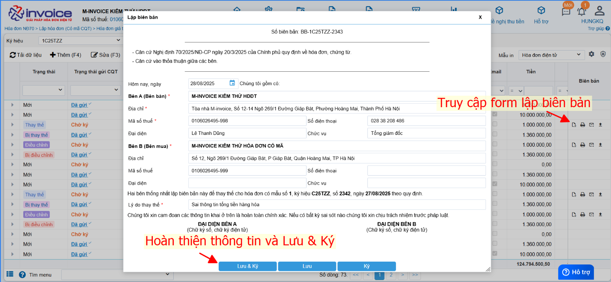
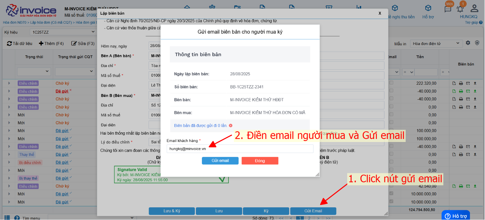
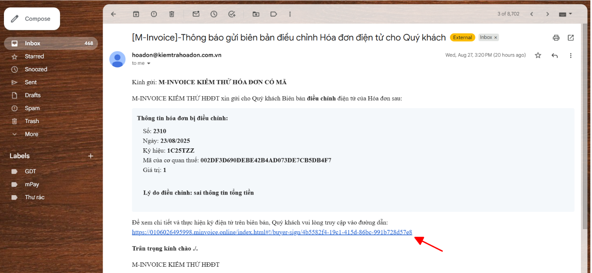
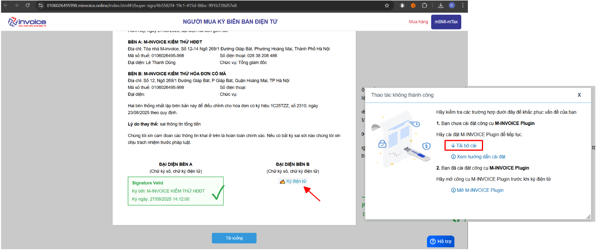
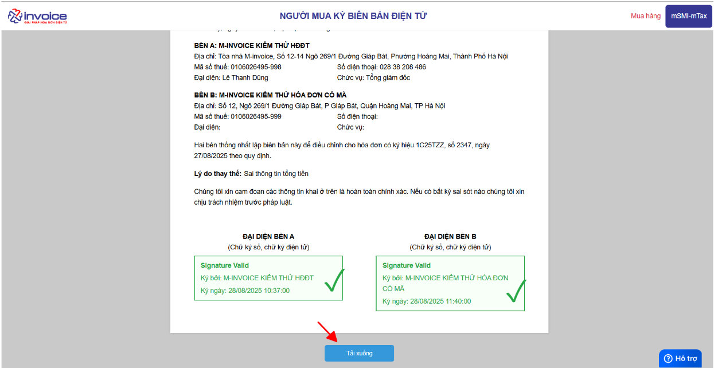

# **Hướng dẫn thao tác ký biên bản người mua**

???+ Note "Mục đích"

    Chức năng hỗ trợ gửi biên bản điện tử tới người mua qua email và cho phép người mua ký xác nhận trực tuyến, giúp quá trình xác nhận chứng từ diễn ra

    nhanh chóng, minh bạch và tiết kiệm thời gian.

### **Bước 1: Lập và ký biên bản**

Xem chi tiết [tại đây](../xu-ly-sai-sot/lap-bien-ban-hoa-don.md#attribute-lists){ data-preview }

### **Bước 2: Gửi email cho Người mua**

**Sau khi ký bên bán, phần mềm hiển thị nút Gửi email**

### **Bước 3 : Người mua ký**

**Người mua truy cập email vào click vào đường link ký biên bản**

**Click Ký biên bản (Nếu chưa cài plugin phần mềm sẽ thông báo để Người mua tải về cài bản 4.2.9 trở lên. Hiện tại chỉ hỗ trợ ký USB)**

📄 [Hướng dẫn cài plugin chi tiết](../huong-dan/cai-dat-plugin.md#attribute-lists){ data-preview }

### **Bước 4 : Tải biên bản sau khi ký về máy**

**Click Tải xuống và lưu file PDF trả về**

!!! info "Xin chân thành cảm ơn Quý khách hàng đã tin dùng sản phẩm của M-Invoice"

    Có bất kỳ vướng mắc nào trong quá trình sử dụng hãy liên hệ với M-Invoice tại mục Hỗ trợ kỹ thuật góc phải bên dưới màn hình hoặc gọi tổng đài kỹ thuật của M-Invoice (1900.955.557 Nhánh 1)

Last updated on <strong>Aug 28, 2025</strong> by <strong>NHATTH</strong>

