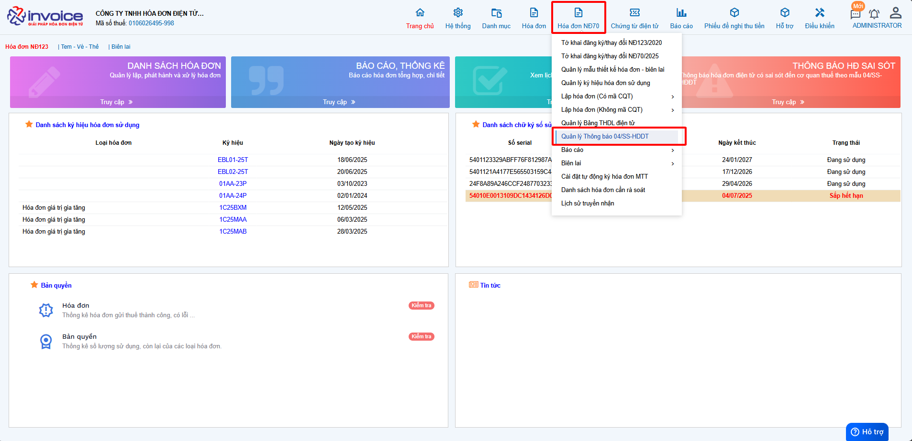
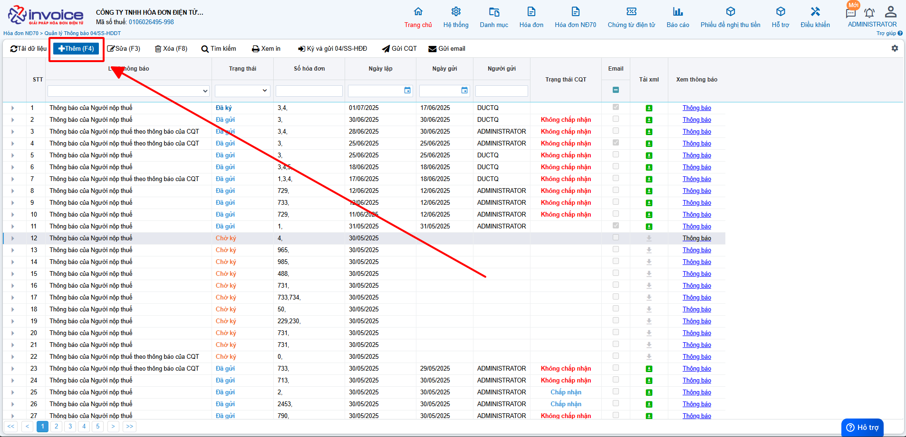
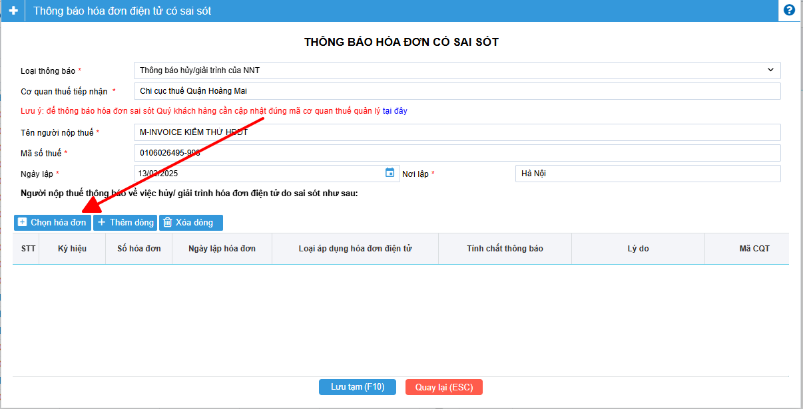
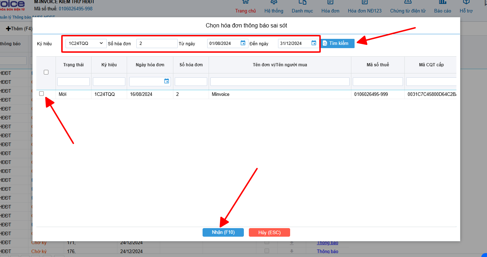
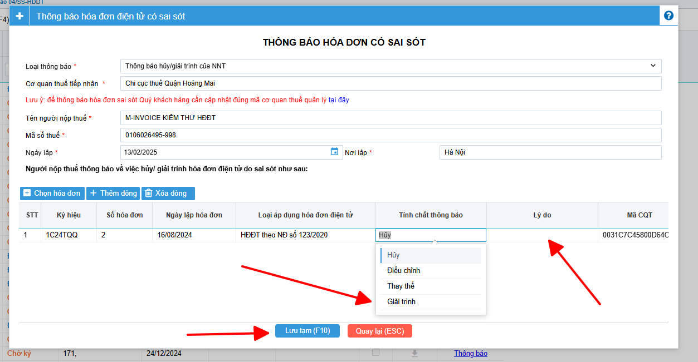
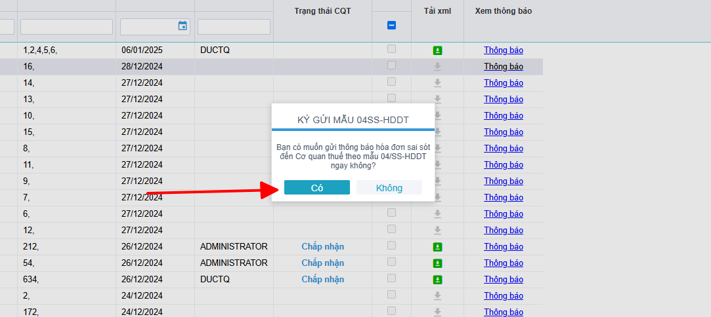

# **Thông báo 04/SS-HDDT sai sót theo NĐ70**

???+ Note "Ghi chú"

    📘 **CĂN CỨ TẠI NGHỊ ĐỊNH 70/2025/NĐ-CP**, SỬA ĐỔI **NGHỊ ĐỊNH 123/2020/NĐ-CP**, QUY ĐỊNH VỀ VIỆC LẬP **HÓA ĐƠN, CHỨNG TỪ** NHƯ SAU:

    ---

    🧾 **Khi người bán phát hiện hóa đơn điện tử đã lập sai** *(bao gồm:)*

    – Hóa đơn điện tử **đã được cấp mã của cơ quan thuế**;

    – Hóa đơn điện tử **không có mã nhưng đã gửi dữ liệu đến cơ quan thuế**;

    → Thì xử lý theo các trường hợp:

    ---

    1. Sai sót nhỏ – **Không làm thay đổi nội dung nghĩa vụ thuế:**

    ✅ **Sai tên người mua**
    → Không cần lập lại hóa đơn.
    → Gửi **Mẫu 04/SS-HĐĐT** cho **Cơ quan thuế** và **thông báo cho bên mua**.

    ✅ **Sai địa chỉ người mua**
    → Không cần lập lại hóa đơn.
    → Gửi **Mẫu 04/SS-HĐĐT** cho **Cơ quan thuế** và **thông báo cho bên mua**.

    ✅ **Sai cả tên và địa chỉ nhưng đúng mã số thuế**
    → Không cần lập lại hóa đơn.
    → Gửi **Mẫu 04/SS-HĐĐT** cho **Cơ quan thuế** và **thông báo cho bên mua**.\

    - 📝 **Anh chị có thể làm thông báo 04/SS theo hướng dẫn dưới nội dung này ⬇️**

    ---

    ⚠️ 2. Sai sót lớn – **Làm thay đổi nghĩa vụ thuế hoặc thông tin trọng yếu:**

    ❌ **Sai mã số thuế người mua**
    → Phải lập **hóa đơn thay thế**, kèm **biên bản thỏa thuận giữa hai bên**.

    ❌ **Sai thuế suất, số tiền, tiền thuế, đơn giá, thành tiền**
    → Phải lập **hóa đơn điều chỉnh** hoặc **hóa đơn thay thế**, kèm **biên bản thỏa thuận**.

    ❌ **Sai mặt hàng, quy cách, số lượng, đơn vị tính**
    → Phải lập **hóa đơn điều chỉnh** hoặc **hóa đơn thay thế**, kèm **biên bản thỏa thuận**.

    ❌ **Sai mã hàng hóa, mã vạch, thông tin kỹ thuật**
    → Phải lập **hóa đơn điều chỉnh** hoặc **hóa đơn thay thế**, kèm **biên bản thỏa thuận**.

    🖱️ **Click vào đây để xem hướng dẫn điều chỉnh:**
    📄 [Điều chỉnh hóa đơn](dieu-chinh.md#attribute-lists){ data-preview }

    🖱️ **Click vào đây để xem hướng dẫn thay thế:**
    📄 [Thay thế hóa đơn](thay-the.md#attribute-lists){ data-preview }

    ---

    🛑 **GHI NHỚ TỪ 01/06/2025**:

    🚫 **Bỏ nghiệp vụ "Hủy hóa đơn".**

    📌 **Trường hợp hóa đơn đã phát hành nhưng giao dịch bị hủy bỏ, hay bị sai thông tin cần hủy bỏ để lập hóa đơn mới**

    - 📝 **Anh chị làm điều chỉnh giảm về 0 (tương đương hủy) theo hướng dẫn sau**

    🖱️ **Click vào đây để xem hướng dẫn:**
    📄 [Hướng dẫn điều chỉnh giảm về 0](dieu-chinh-giam-ve-0.md#attribute-lists){ data-preview }

    ---

**Thao tác cài đặt và thực hiện như sau**

### **Bước 1: Anh chị truy cập vào Hóa đơn NĐ 123 >> Quản lý thông báo 04/ss**

Anh chị bấm thêm để hiển thị form thêm 04/ss

### **Bước 2: Trên form anh chị chọn vào button chọn hóa đơn**

Sau khi click vào chọn hóa đơn, giao diện lọc hóa đơn cần làm giải trình sẽ hiển thị:

- Anh chị lọc các điều kiện liên quan tới hóa đơn mình cần và bấm vào tìm kiếm.
- Sau khi đã tìm được hóa đơn cần lập, anh chị tích vào ô trống đầu dòng để chọn và bấm lưu.

### **Bước 3 : Sau khi nhấn Lưu phần mềm sẽ tự động sinh ra 1 form để lập mẫu 04ss**

Các bạn chỉ cần kiểm tra lại thông tin, điền vào phần lý do
Khi nhập lý do xong, nhấn Ghi(F10) để lưu

### **Bước 4 : Ký gửi 04ss thông báo sai sót đến CQT**

Sau khi bấm lưu, phần mềm sẽ thông báo ký gửi 04ss lên CQT, anh chị bấm đồng ý

!!! info "Xin chân thành cảm ơn Quý khách hàng đã tin dùng sản phẩm của M-Invoice"

    Có bất kỳ vướng mắc nào trong quá trình sử dụng hãy liên hệ với M-Invoice tại mục Hỗ trợ kỹ thuật góc phải bên dưới màn hình hoặc gọi tổng đài kỹ thuật của M-Invoice (1900.955.557 Nhánh 1)

Last updated on <strong>Jun 30, 2025</strong> by <strong>nhatth</strong>

