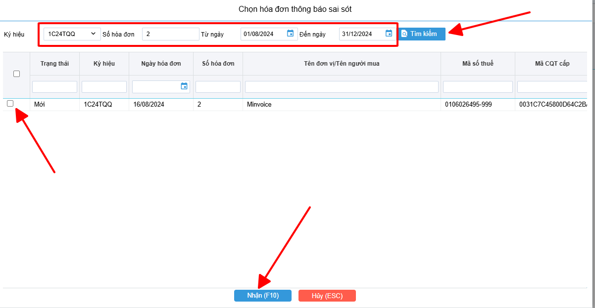

# **Thông báo 04/SS-HDDT sai sót theo NĐ70**

  
<strong>📘 Căn cứ tại Khoản 13 Điá»u 1 Nghị định 70/2025/NĐ-CP</strong> sửa đổi Điá»u 19 Nghị định 123/2020/NĐ-CP, quy định vá» việc lập <strong>Mẫu 04/SS-HĐĐT</strong> như sau:

  
<strong>🧾 Khi người bán phát hiện hóa đơn điện tử đã lập sai</strong> (bao gồm: 
  – Hóa đơn điện tử đã được cấp mã của cơ quan thuế; 
  – Hóa đơn điện tử không có mã nhưng đã gửi dữ liệu đến cơ quan thuế), thì xử lý theo các trường hợp:

  
<strong>🔹 Trường hợp 1:</strong> Sai <u>tên</u>, <u>địa chỉ</u> người mua nhưng <strong>không sai mã số thuế</strong> và các nội dung khác không sai: 
  → Người bán <strong>thông báo cho người mua</strong> vá» sai sót. 
  → <strong>Không phải lập lại hóa đơn.</strong> 
  → Người bán thực hiện <strong>thông báo với cơ quan thuế</strong> theo <u>Mẫu số 04/SS-HĐĐT</u> theo hướng dẫn dưới đây.

  
<strong>🔹 Trường hợp 2:</strong> Sai các nội dung quan trá»ng như: 
  – <strong>Mã số thuế</strong> của người mua; 
  – <strong>Số tiá»n</strong> ghi trên hóa đơn; 
  – <strong>Thuế suất</strong>, <strong>tiá»n thuế</strong>; 
  – <strong>Hàng hóa</strong> ghi sai quy cách, chất lượng,... 
  → Người bán được phép <strong>lựa chá»n</strong> giữa 2 cách xử lý: 
  ✅ <strong>Lập hóa đơn điá»u chỉnh</strong> hoặc 
  ✅ <strong>Lập hóa đơn thay thế</strong> theo đúng quy định hiện hành.

**Thao tác cài đặt và thực hiện như sau**

<iframe style="width: 43rem; height: 380px"
    src="https://www.youtube.com/embed/THGtf-CWDAM" 
    frameborder="0" allowfullscreen>
</iframe>

**Hướng dẫn sử dụng bằng hình ảnh nếu Quý khách không xem được video**

### **Bước 1: Anh chị truy cập vào Hóa đơn NĐ 123 >> Quản lý thông báo 04/ss**

Anh chị bấm thêm để hiển thị form thêm 04/ss

### **Bước 2: Trên form anh chị chọn vào button chọn hóa đơn**

Sau khi click vào chọn hóa đơn, giao diện lọc hóa đơn cần làm giải trình sẽ hiển thị:

- Anh chị lọc các điều kiện liên quan tới hóa đơn mình cần và bấm vào tìm kiếm.
- Sau khi đã tìm được hóa đơn cần lập, anh chị tích vào ô trống đầu dòng để chọn và bấm lưu.

### **Bước 3 : Sau khi nhấn Lưu phần mềm sẽ tự động sinh ra 1 form để lập mẫu 04ss**

Các bạn chỉ cần kiểm tra lại thông tin, điền vào phần lý do
Khi nhập lý do xong, nhấn Ghi(F10) để lưu

### **Bước 4 : Ký gửi 04ss thông báo sai sót đến CQT**

Sau khi bấm lưu, phần mềm sẽ thông báo ký gửi 04ss lên CQT, anh chị bấm đồng ý

!!! info "Xin chân thành cảm ơn Quý khách hàng đã tin dùng sản phẩm của M-Invoice"

    Có bất kỳ vướng mắc nào trong quá trình sử dụng hãy liên hệ với M-Invoice tại mục Hỗ trợ kỹ thuật góc phải bên dưới màn hình hoặc gọi tổng đài kỹ thuật của M-Invoice (1900.955.557 Nhánh 1)

Last updated on <strong>Jun 30, 2025</strong> by <strong>nhatth</strong>

