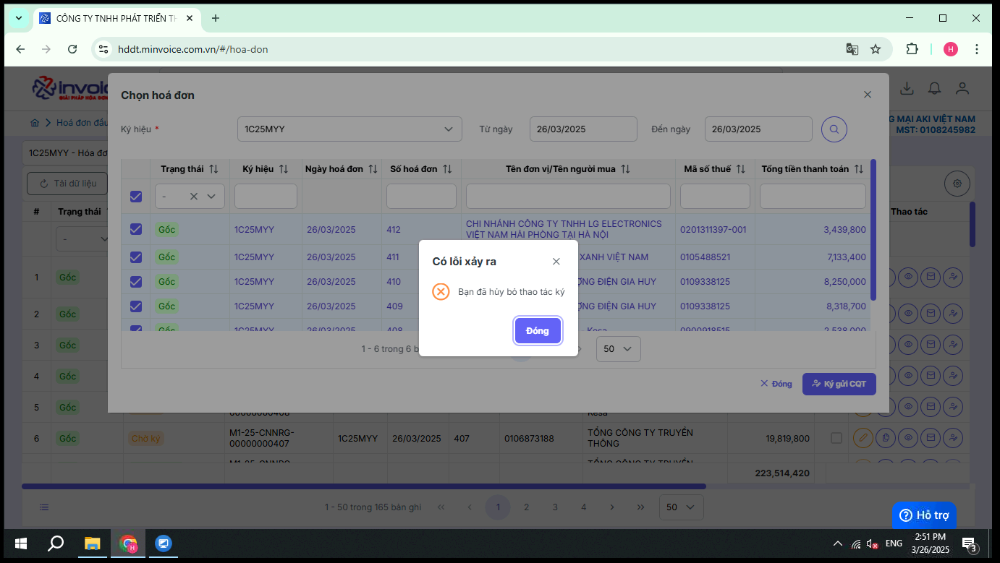
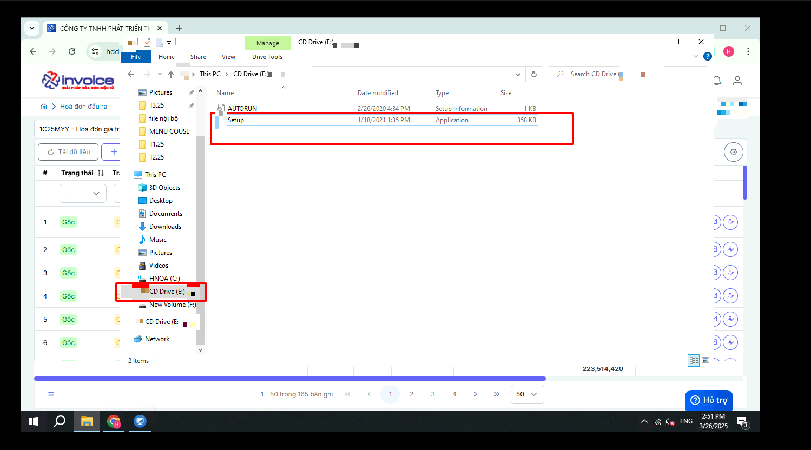

# **Lỗi "Bạn đã huỷ bỏ thao tác ký"**

## **Hướng dẫn sửa lỗi "Bạn đã huỷ bỏ thao tác ký"**

???+ note "Ghi chú"

    Lỗi này thường xảy ra khi quý khách chưa cài phần mềm chữ ký số hãy kiểm tra theo cách dưới đây và cài đặt

### Bước 1: Kiểm tra xem phần mềm cks đã cài đặt trên máy mình chưa bằng cách sau

**Nếu không thấy icon của cks hiện là chưa cài đặt**

### Bước 2: Cài đặt phần mềm cks

**Bấm windows + E để vào Explorer bấm vào biểu tượng phần mềm cks -> click Setup để cài đặt**

???+ Warning "Lưu ý"

    Trường hợp nếu không có thì quý khách vui lòng rút USB ra và cắm lại hoặc có thể quý khách chưa cắm usb cks vào máy tính

???+ info "Xin chân thành cảm ơn quý khách hàng đã tin dùng sản phẩm của M-Invoice"

    Có bất kỳ vướng mắc nào trong quá trình sử dụng hãy liên hệ với M-Invoice tại mục Hỗ trợ kỹ thuật góc phải bên dưới màn hình hoặc gọi tổng đài kỹ thuật của M-Invoice (1900.955.557 Nhánh 1)

Last updated on <strong>Aug 06, 2025</strong> by <strong>NHATTH</strong>

