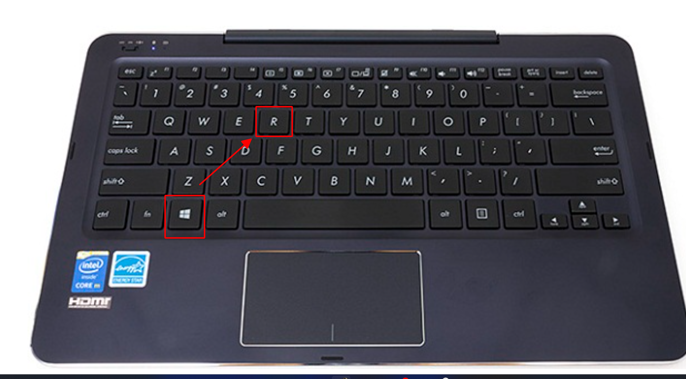

# **Lỗi "Vui lòng nâng cấp phiên bản Plugin ký"**

## **Hướng dẫn sửa lỗi "Vui lòng nâng cấp phiên bản Plugin ký"**

### **Bước 1: Gỡ bỏ phiên bản hiện tại**

Anh chị vui lòng gỡ plugin ra cài lại để có thể ký được

Bấm 'WINDOWS + R' gõ lệnh 'appwiz.cpl'

Chọn đến minvoice plugin 2.0 kích đúp để gỡ bỏ

### **Bước 2: Nhấn vào biểu tượng cài đặt trên trang chủ giao diện**

### **Bước 3: Nhấn Save để tải bộ cài về**

### **Bước 4 : Mở bộ cài và cài đặt**

Chọn vào biểu tượng Plugin bên góc trái màn hình chọn **Show in folder**

Để khi cài đặt Plugin luôn khởi động khi bật máy bạn chọn **Run as adminstrator**

Bạn chon **Install** để bắt đầu cài đặt

Bạn chờ cho bộ cài Dowload và tự động cài đặt là hoàn thành

### **Bước 5 : Kiểm tra bộ cài đã được cài đặt thành công hay chưa**

Kích chuột trái vào mũi tên góc phải màn hình, nếu có biểu tượng **M-invoice Plugin Version 2.0** như thế là công cụ ký plugin đã cài đặt thành công

???+ info "Xin chân thành cảm ơn quý khách hàng đã tin dùng sản phẩm của M-Invoice"

    Có bất kỳ vướng mắc nào trong quá trình sử dụng hãy liên hệ với M-Invoice tại mục Hỗ trợ kỹ thuật góc phải bên dưới màn hình hoặc gọi tổng đài kỹ thuật của M-Invoice (1900.955.557 Nhánh 1)

Last updated on <strong>Sep 26, 2025</strong> by <strong>NHATTH</strong>

