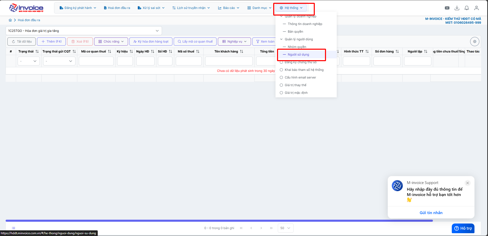
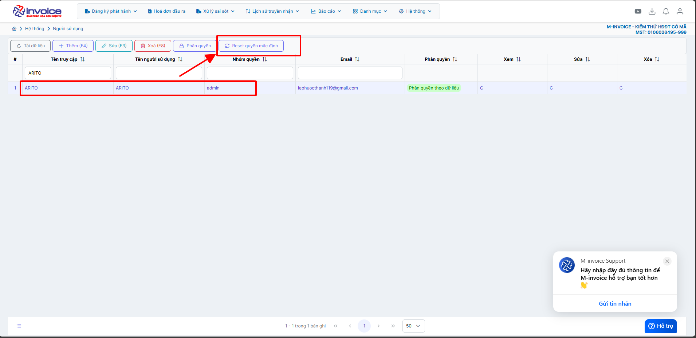

# **Lỗi "Số serialNumber chứng thư số đã tồn tại trên phần mềm"**

???+ Bug "Mô tả lỗi"

    Khi thêm chữ ký số nhưng phần mềm báo lỗi **"Số serialNumber chứng thư số đã tồn tại trên phần mềm"** là do chữ ký số đã được thêm thành công trên phần mềm tuy nhiên tài khoản đăng nhập hiện tại chưa được phân quyền chữ ký số nên sẽ không được hiện lên

## **Hướng dẫn khắc phục lỗi Số serialNumber chứng thư số đã tồn tại trên phần mềm**

### **Bước 1: Truy cập Hệ thống - Người sử dụng**

### **Bước 2: Chọn tài khoản đăng nhâp và bấm "Reset quyền mặc định"**

**Sau khi reset thành công Anh/Chị quay lại mục Hệ thống - Đăng ký chứng thư số kiểm tra xem đã hiện chữ ký số muốn thêm hay chưa**

???+ info "Xin chân thành cảm ơn quý khách hàng đã tin dùng sản phẩm của M-Invoice"

    Có bất kỳ vướng mắc nào trong quá trình sử dụng hãy liên hệ với M-Invoice tại mục Hỗ trợ kỹ thuật góc phải bên dưới màn hình hoặc gọi tổng đài kỹ thuật của M-Invoice (1900.955.557 Nhánh 1)

Last updated on <strong>Oct 5, 2025</strong> by <strong>nhatth</strong>

