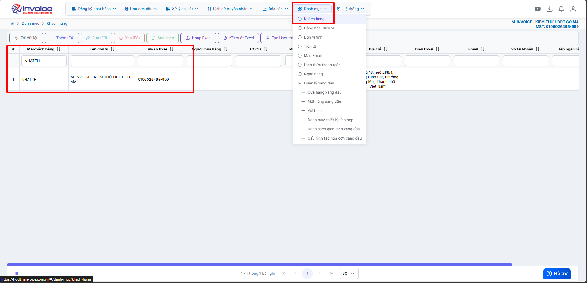
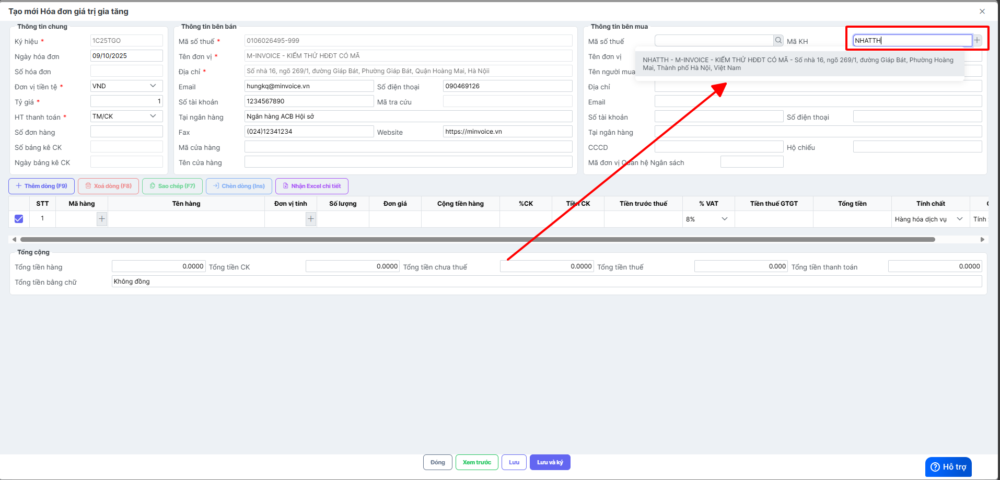
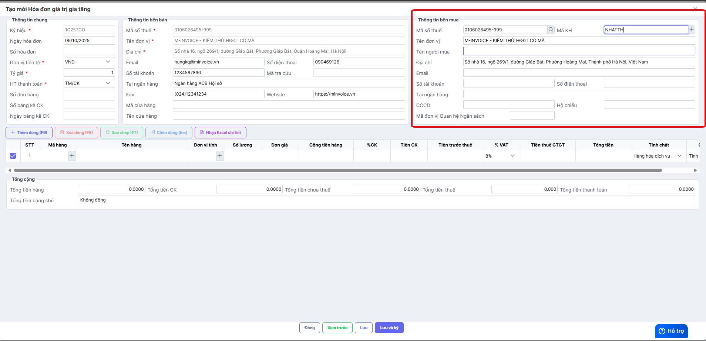

# **Lỗi "The JSON value could not be converted to System.String"**

???+ Bug "Mô tả lỗi"

    Khi lưu hóa đơn báo lỗi **"Có lỗi xảy ra The JSON value could not be converted to MInvoice.SendEmail.InvoiceEmailInfo ..."** xảy ra khi Anh/Chị lưu thông tin người mua vào "Danh mục - khách hàng" nhưng không điền Mã KH.

## **Hướng dẫn khắc phục Lỗi "The JSON value could not be converted to System.String**

### **Bước 1: Kiểm tra trong Danh mục - Khách hàng đang lưu mã KH là gì**

**Ví dụ ở trên lưu thông tin người mua có mã là NHATTH**

### **Bước 2: Nhập lại thông tin người mua ở hóa đơn**

**Điền đúng thông tin còn lại của hóa đơn và bấm lưu**

???+ info "Xin chân thành cảm ơn quý khách hàng đã tin dùng sản phẩm của M-Invoice"

    Có bất kỳ vướng mắc nào trong quá trình sử dụng hãy liên hệ với M-Invoice tại mục Hỗ trợ kỹ thuật góc phải bên dưới màn hình hoặc gọi tổng đài kỹ thuật của M-Invoice (1900.955.557 Nhánh 1)

Last updated on <strong>Oct 09, 2025</strong> by <strong>nhatth</strong>

