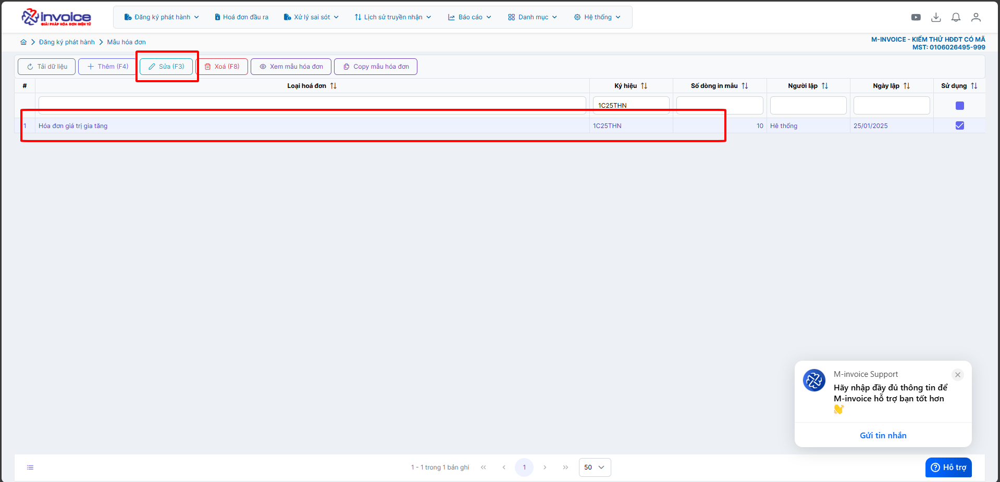
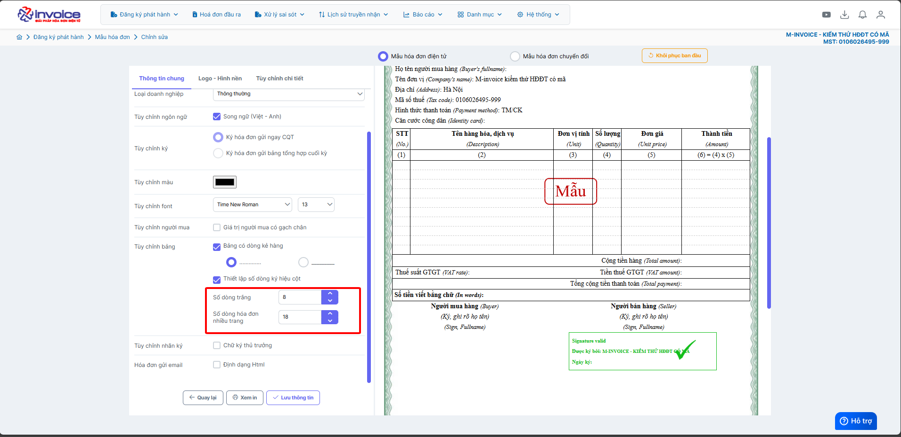
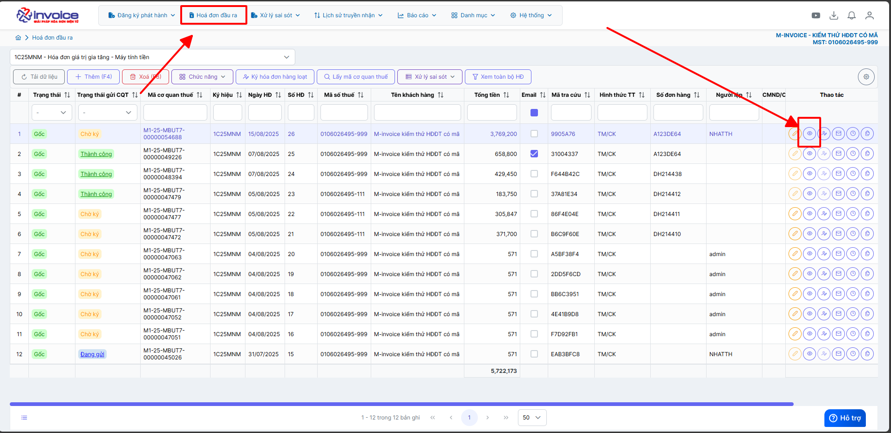
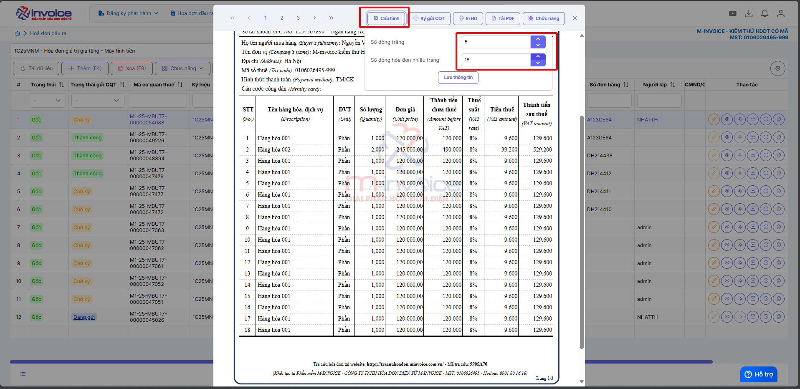
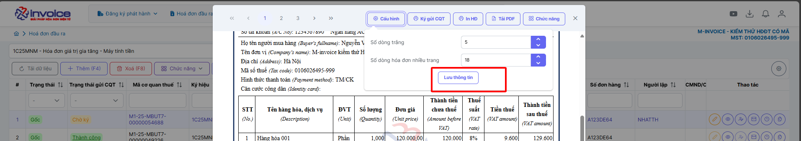

# **Sửa lỗi số dòng bị sang trang khi chưa hết trang**

???+ note "Mục đích"

    Chức năng chỉnh sửa số dòng trên hóa đơn cho phép người dùng tăng hoặc giảm số lượng dòng hiển thị cho hàng hóa, dịch vụ trên một tờ hóa đơn điện tử. Điều này giúp đảm bảo nội dung được trình bày gọn gàng, đầy đủ thông tin mà không bị tràn trang hoặc gây khó đọc.

### **Bước 1: Truy cập vào mẫu cần chỉnh Quản lý phát hành --> Mẫu hóa đơn --> Chọn mẫu cần sửa**

### **Bước 2: Điều chỉnh số dòng cho phù hợp**

**Anh/chị muốn ít trang thì để số dòng trắng 8 -> 10, hóa đơn nhiều trang 15 or 16** (áp dụng cho mẫu 1 loại thuế suất)

**Anh/chị muốn ít trang thì để số dòng trắng = 3 -> 5, hóa đơn nhiều trang 13 -> 16** (áp dụng cho mẫu nhiều loại thuế suất)

### **Bước 3: Trường hợp chỉnh theo 2 bước trên vẫn không được hãy làm theo hướng dẫn sau**

???+ note "Tại sao không áp dụng được cách trên"

    Bố cục mỗi loại hóa đơn khác nhau:

    Hóa đơn bán hàng, hóa đơn dịch vụ, hóa đơn xuất khẩu… thường có cấu trúc thông tin và số lượng dòng hàng hóa khác nhau.

    Nếu áp dụng cùng một thiết lập số dòng, một số mẫu hóa đơn có thể bị lệch bố cục, thông tin tràn sang trang mới hoặc dư khoảng trắng lớn.

**Cách chỉnh cấu hình số dòng trên từng hóa đơn (cách này sẽ làm cho dòng hóa đơn đều đẹp tuyệt đối)**

**Truy cập hóa đơn đầu ra --> chọn hóa đơn cần chỉnh**

**Tăng giảm dòng cho phù hợp và bấm lưu**

???+ info "Xin chân thành cảm ơn quý khách hàng đã tin dùng sản phẩm của M-Invoice"

    Có bất kỳ vướng mắc nào trong quá trình sử dụng hãy liên hệ với M-Invoice tại mục Hỗ trợ kỹ thuật góc phải bên dưới màn hình hoặc gọi tổng đài kỹ thuật của M-Invoice (1900.955.557 Nhánh 1)

Last updated on <strong>Aug 16, 2025</strong> by <strong>NHATTH</strong>

