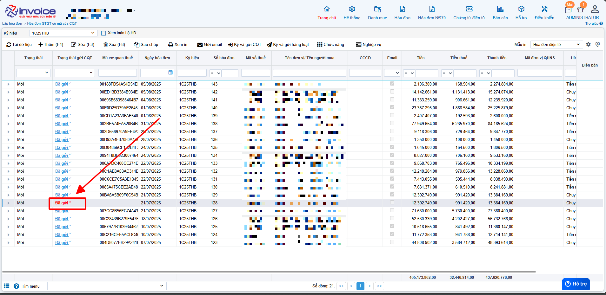
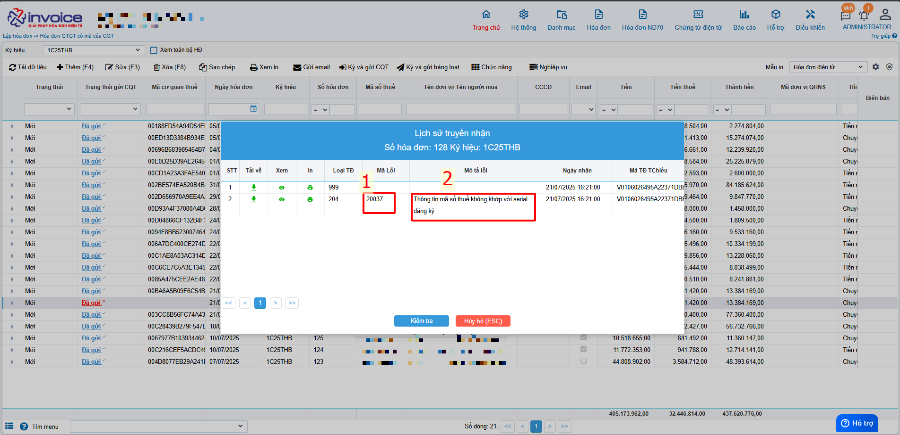
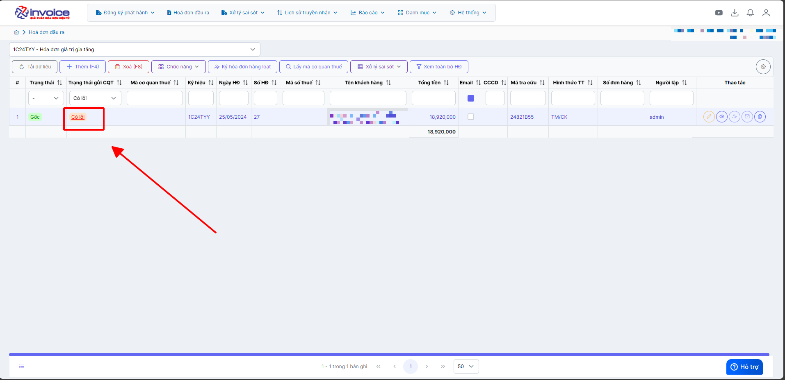
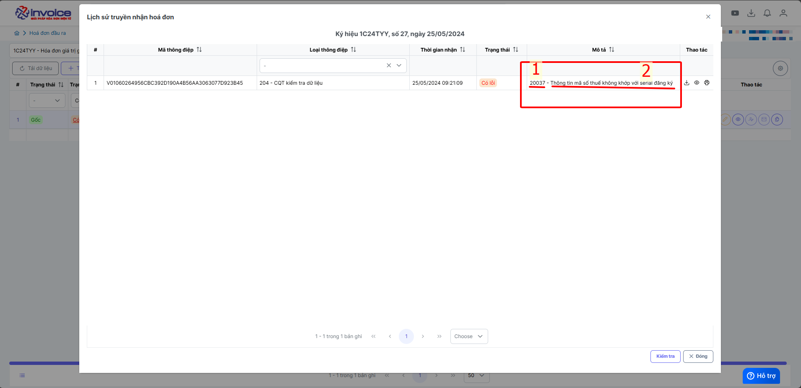

---
hide:
  - toc
---

**Chi tiết các bước hướng dẫn khắc phục các lỗi truyền nhận từ CQT**

??? info "Cách để xem mã lỗi và mô tả lỗi ở phiên bản 1.0 - Bấm vào đấy để xem"

    **Bước 1: Bấm vào chữ đã gửi màu đỏ ở hóa đơn để kiểm tra**

    

    **Bước 2: Đọc mô tả lỗi, mã lỗi**

    

    <strong>1: Mã lỗi</strong>

    <strong>2: Mô tả lỗi</strong>

    **Bước 3: Tra cứu lỗi + hướng xử lý ở dưới đây**

???+ info "Cách để xem mã lỗi và mô tả lỗi ở phiên bản 2.0"

    **Bước 1: Bấm vào chữ có lỗi màu đỏ ở hóa đơn bị lỗi**

    

    **Bước 2: Đọc mô tả lỗi, mã lỗi**

    

    <strong>1: Mã lỗi</strong>

    <strong>2: Mô tả lỗi</strong>

**Bước 3: Tra cứu lỗi + hướng xử lý ở dưới đây**

<!-- Style -->

<!-- Spinner -->

Đang tải dữ liệu, vui lòng chờ...

<!-- Tìm kiếm nâng cao -->

  <input type="text" id="globalSearch" placeholder="🔍 Tìm kiếm tất cả bảng..." oninput="applyFilter()">

<!-- Bảng -->

<!-- Scripts -->

Last updated on <strong>Aug 6, 2025</strong> by <strong>NHATTH</strong>

