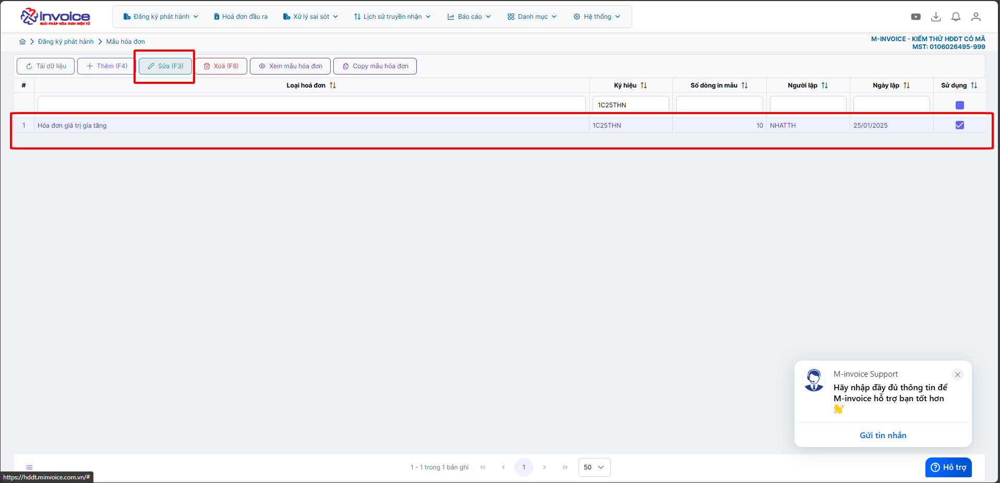
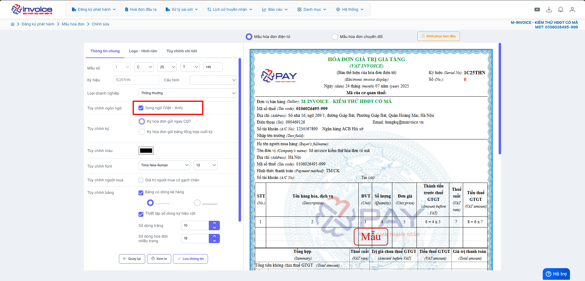

# **Hướng dẫn bật tắt chế độ song ngữ**

???+ Note "Mục đích"

    Hướng dẫn người dùng cách bật hoặc tắt chế độ song ngữ (tiếng Việt – tiếng Anh) trên mẫu hóa đơn trong phần mềm M-invoice.
    Tính năng này giúp doanh nghiệp linh hoạt trong việc phát hành hóa đơn cho khách hàng trong và ngoài nước, đảm bảo tính chuyên nghiệp, dễ hiểu

### **Bước 1: Truy cập Đăng ký phát hành -> Mẫu hóa đơn**

### **Bước 2: Chọn mâu cần sửa rồi bấm SỬA**

### **Bước 3: Ở tab thông tin chung -> kich chọn ô Song ngữ (Việt-Anh) để bật tắt**

Xem thêm các trường hợp chỉnh mẫu khác [tại đây.](../../huong-dan/chinh-sua-mau-hoa-don#attribute-lists){ data-preview }

???+ info "Xin chân thành cảm ơn quý khách hàng đã tin dùng sản phẩm của M-Invoice"

    Có bất kỳ vướng mắc nào trong quá trình sử dụng hãy liên hệ với M-Invoice tại mục Hỗ trợ kỹ thuật góc phải bên dưới màn hình hoặc gọi tổng đài kỹ thuật của M-Invoice (1900.955.557 Nhánh 1)

Last updated on <strong>Oct 08, 2025</strong> by <strong>nhatth</strong>

