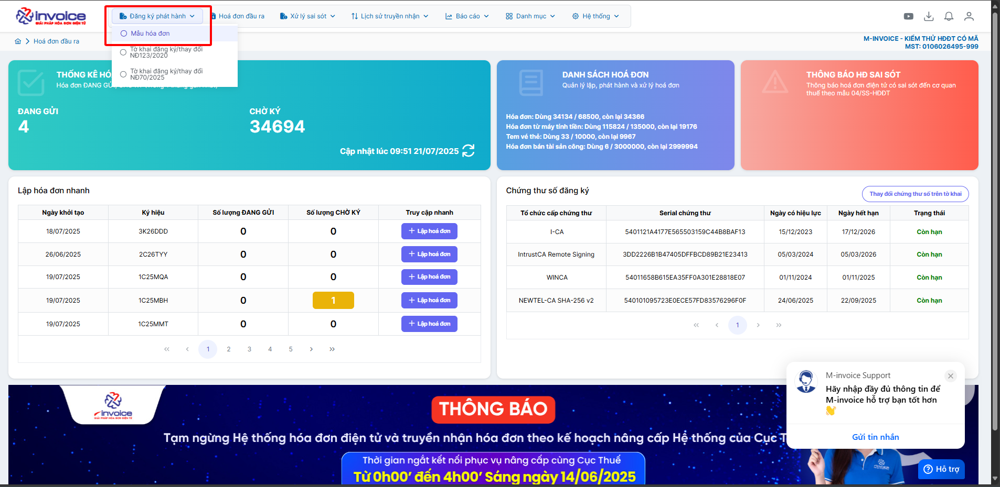
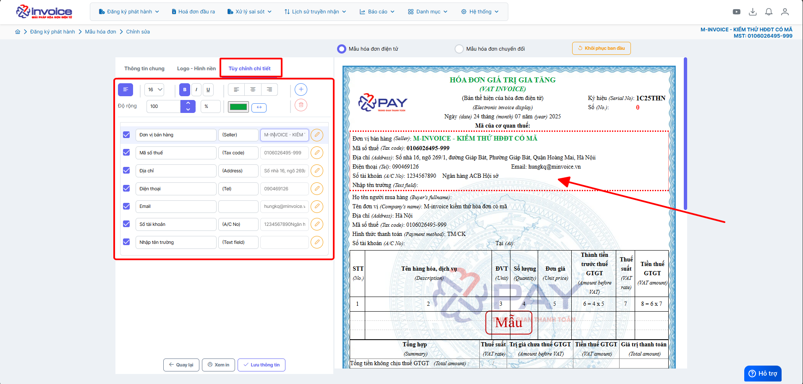

# **Hướng dẫn tùy chỉnh chữ, màu sắc và căn lề**

???+ Note "Mục đích"

    Hướng dẫn người dùng cách tùy chỉnh phông chữ, kích thước chữ, màu sắc và căn lề trên mẫu hóa đơn trong phần mềm M-invoice.
    Tính năng này giúp doanh nghiệp thiết kế mẫu hóa đơn phù hợp với nhận diện thương hiệu, đảm bảo bố cục rõ ràng, thẩm mỹ, và tạo ấn tượng chuyên nghiệp đối với khách hàng.

**Hướng dẫn bằng GIF trường hợp chỉnh font chữ và màu chữ**

**Hướng dẫn bằng hình ảnh chi tiết**

### **Bước 1: Truy cập Đăng ký phát hành -> Mẫu hóa đơn**

### **Bước 2: Chọn mâu cần sửa rồi bấm SỬA**

### **Bước 3: Bấm tab tùy chỉnh chi tiết**

???+ info "Xin chân thành cảm ơn quý khách hàng đã tin dùng sản phẩm của M-Invoice"

    Có bất kỳ vướng mắc nào trong quá trình sử dụng hãy liên hệ với M-Invoice tại mục Hỗ trợ kỹ thuật góc phải bên dưới màn hình hoặc gọi tổng đài kỹ thuật của M-Invoice (1900.955.557 Nhánh 1)

Last updated on <strong>Oct 08, 2025</strong> by <strong>nhatth</strong>

