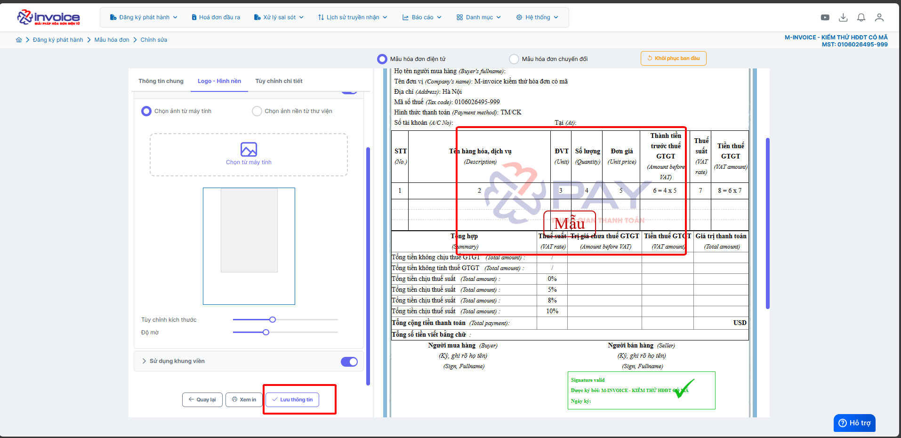

# **Hướng dẫn tải hình nền lên mẫu**

???+ Note "Mục đích"

    Hướng dẫn người dùng cách tải và thay đổi lập hình nền cho mẫu hóa đơn trong phần mềm M-invoice. Việc thêm hình nền giúp tăng tính thẩm mỹ, thể hiện phong cách và bản sắc riêng của doanh nghiệp, đồng thời nâng cao tính chuyên nghiệp của hóa đơn phát hành.

**Hướng dẫn bằng GIF nhanh**

**Hướng dẫn bằng hình ảnh chi tiết**

### **Bước 1: Truy cập Đăng ký phát hành -> Mẫu hóa đơn**

### **Bước 2: Chọn mâu cần sửa rồi bấm SỬA**

### **Bước 3: Bấm tab logo - hình nền --> Sử dụng hình nền**

**Lưu ý: kích thước logo phải có dung lượng không quá 200KB và kích thước ảnh tối đa 460 X 610**

### **Bước 4: Bấm lưu thông tin để áp dụng logo mới**

???+ info "Xin chân thành cảm ơn quý khách hàng đã tin dùng sản phẩm của M-Invoice"

    Có bất kỳ vướng mắc nào trong quá trình sử dụng hãy liên hệ với M-Invoice tại mục Hỗ trợ kỹ thuật góc phải bên dưới màn hình hoặc gọi tổng đài kỹ thuật của M-Invoice (1900.955.557 Nhánh 1)

Last updated on <strong>Oct 08, 2025</strong> by <strong>nhatth</strong>

