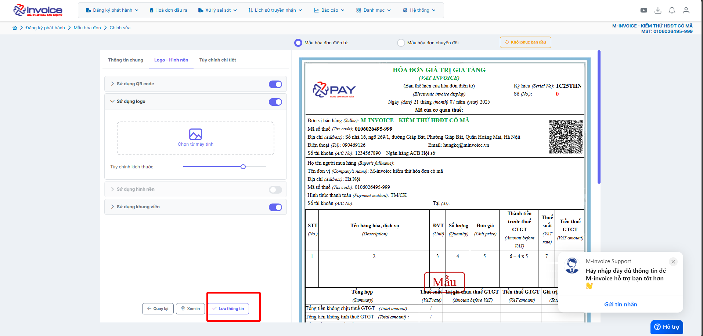

# **Hướng dẫn thêm khung viền lên mẫu hóa đơn**

???+ Note "Mục đích"

    Hướng dẫn người dùng cách thêm và điều chỉnh khung viền cho mẫu hóa đơn trong phần mềm M-invoice. Việc bổ sung khung viền giúp định dạng bố cục hóa đơn rõ ràng, tạo điểm nhấn thẩm mỹ và nâng cao tính chuyên nghiệp cho chứng từ phát hành.

**Hướng dẫn bằng GIF nhanh**

**Hướng dẫn bằng hình ảnh chi tiết**

### **Bước 1: Truy cập Đăng ký phát hành -> Mẫu hóa đơn**

### **Bước 2: Chọn mâu cần sửa rồi bấm SỬA**

### **Bước 3: Bấm tab logo - hình nền -> Sử dụng khung viền**

**Lưu ý: kích thước logo phải có dung lượng không quá 300KB và kích thước tối đa 787 X 1081**

1. Chọn để có thể thêm khung viền từ máy tính
2. Chọn các khung mẫu có sẵn trên phần mềm

### **Bước 4: Bấm lưu thông tin để áp dụng khung viền mới mới**

Xem thêm các trường hợp chỉnh mẫu khác [tại đây.](../../huong-dan/chinh-sua-mau-hoa-don#attribute-lists){ data-preview }

???+ info "Xin chân thành cảm ơn quý khách hàng đã tin dùng sản phẩm của M-Invoice"

    Có bất kỳ vướng mắc nào trong quá trình sử dụng hãy liên hệ với M-Invoice tại mục Hỗ trợ kỹ thuật góc phải bên dưới màn hình hoặc gọi tổng đài kỹ thuật của M-Invoice (1900.955.557 Nhánh 1)

Last updated on <strong>Oct 08, 2025</strong> by <strong>nhatth</strong>

