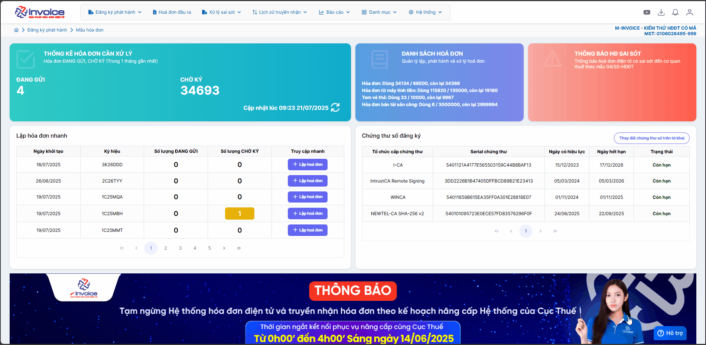
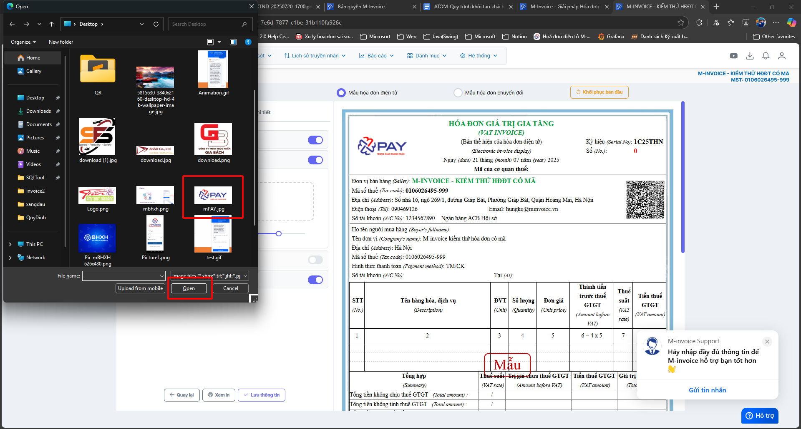

# **Hướng dẫn thêm logo trên mẫu hóa đơn**

???+ Note "Mục đích"

    Hướng dẫn người dùng cách chèn và sửa logo của doanh nghiệp trên mẫu hóa đơn điện tử trong phần mềm M-invoice. Việc thêm logo giúp tăng tính nhận diện thương hiệu, đảm bảo sự chuyên nghiệp và đồng bộ trong các hóa đơn phát hành cho khách hàng.

**Hướng dẫn bằng GIF nhanh**

**Hướng dẫn bằng hình ảnh chi tiết**

### **Bước 1: Truy cập Đăng ký phát hành -> Mẫu hóa đơn**

### **Bước 2: Chọn mâu cần sửa rồi bấm SỬA**

### **Bước 3: Bấm tab logo - hình nền --> Sử dụng logo**

**Lưu ý: kích thước logo phải có dung lượng không quá 100KB và kích thước ảnh tối đa 160 X 200**

### **Bước 4: Trường hợp logo của Anh/Chị vượt quá dụng lượng và kích thước Anh/Chị có thể làm theo hướng dẫn sau đây**

**Truy cập trang web https://imageresizer.com/**

**Chọn -> Select Images -> chọn logo cần chỉnh sửa**

1 Chọn tab "As Percetage"

2 Kéo thanh size sao cho phần **3** về kích thước nhỏ hơn 160 X 200

3 Điền dung lượng tối đa Size là 99

**Chọn Export tải về và up lại logo như các bước hướng dẫn trên**

### **Bước 5: Bấm lưu thông tin để áp dụng logo mới**

Xem thêm các trường hợp chỉnh mẫu khác [tại đây.](../../huong-dan/chinh-sua-mau-hoa-don#attribute-lists){ data-preview }

???+ info "Xin chân thành cảm ơn quý khách hàng đã tin dùng sản phẩm của M-Invoice"

    Có bất kỳ vướng mắc nào trong quá trình sử dụng hãy liên hệ với M-Invoice tại mục Hỗ trợ kỹ thuật góc phải bên dưới màn hình hoặc gọi tổng đài kỹ thuật của M-Invoice (1900.955.557 Nhánh 1)

Last updated on <strong>Oct 17, 2025</strong> by <strong>nhatth</strong>

