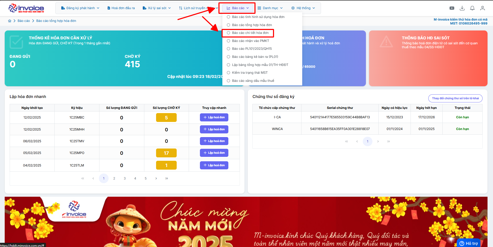
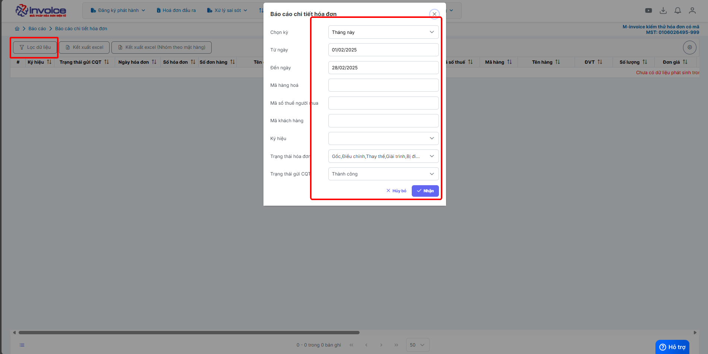
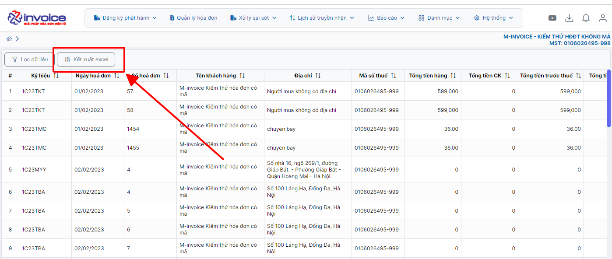

# **Báo cáo chi tiết hóa đơn**

???+ note "Mục đích"

    Báo cáo chi tiết được lập nhằm cung cấp thông tin cụ thể và đầy đủ nhất về hóa đơn, thay vì chỉ đưa ra số liệu tổng hợp.
    Đặc điểm chính là báo cáo sẽ hiển thị rõ danh sách từng mặt hàng, kèm theo các thông tin quan trọng như:

    - Tên hàng hóa/dịch vụ

    - Số lượng

    - Đơn giá

    - Thành tiền

    - Thuế suất, thuế GTGT

    Giúp người dùng dễ dàng theo dõi, đối chiếu, kiểm tra sai sót, phục vụ cho việc quản lý chi tiết theo từng hóa đơn

## **Hướng dẫn xem báo cáo chi tiết hóa đơn**

### **Bước 1: Ở giao diện trang chủ chọn Báo cáo --> Báo cáo chi tiết hóa đơn**

### **Bước 2: Chọn điều kiện lọc**

Nhấn nhận để hệ thống tải báo cáo theo điều kiện lọc

### **Bước 3 : Chọn tải file Excel để kết xuất báo cáo về**

???+ info "Xin chân thành cảm ơn quý khách hàng đã tin dùng sản phẩm của M-Invoice"

    Có bất kỳ vướng mắc nào trong quá trình sử dụng hãy liên hệ với M-Invoice tại mục Hỗ trợ kỹ thuật góc phải bên dưới màn hình hoặc gọi tổng đài kỹ thuật của M-Invoice (1900.955.557 Nhánh 1)

Last updated on <strong>Jun 5, 2025</strong> by <strong>nhatth</strong>

