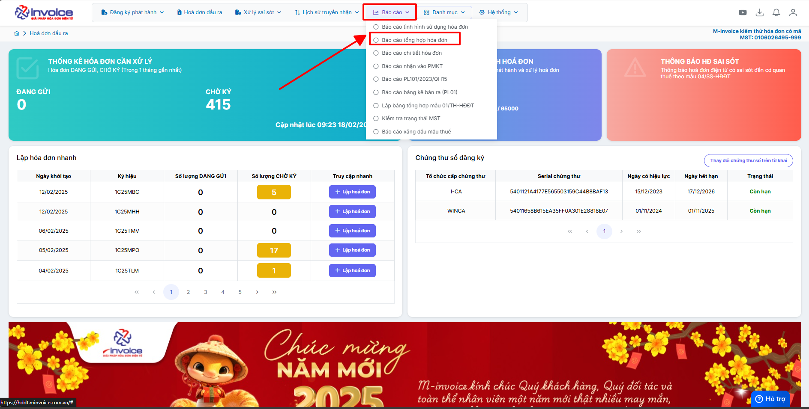
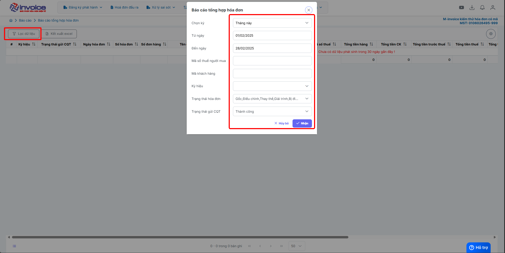
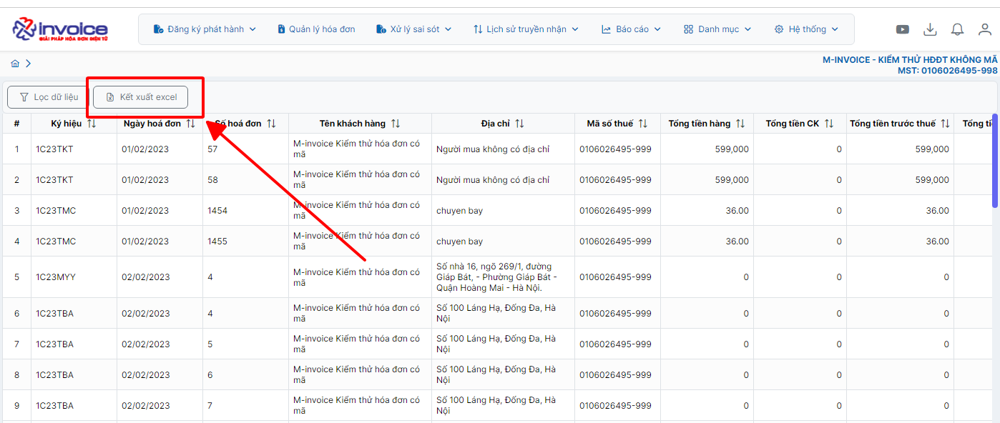

# **Báo cáo tổng hợp hóa đơn**

???+ note "Mục đích"

    Báo cáo tổng hợp được lập nhằm tổng hợp toàn bộ dữ liệu từ nhiều hàng hóa ở 1 hóa đơn thành các con số tổng quan, giúp người dùng nhanh chóng nắm được tình hình chung mà không cần xem từng dòng chi tiết hàng hóa.

    Cụ thể:

    **Hiển thị các số liệu cộng gộp quan trọng như:**

    - Tổng tiền hàng

    - Tổng tiền chiết khấu (CK)

    - Tổng tiền trước thuế

    - Tổng tiền thuế

    - Tổng tiền thanh toán

## **Hướng dẫn xem báo cáo tổng hợp hóa đơn**

### **Bước 1: Ở giao diện trang chủ chọn Báo cáo --> Báo cáo tổng hợp hóa đơn**

### **Bước 2: Chọn điều kiện lọc**

Nhấn nhận để hệ thống tải báo cáo theo điều kiện lọc

### **Bước 3 : Chọn tải file Excel để kết xuất báo cáo về**

???+ info "Xin chân thành cảm ơn quý khách hàng đã tin dùng sản phẩm của M-Invoice"

    Có bất kỳ vướng mắc nào trong quá trình sử dụng hãy liên hệ với M-Invoice tại mục Hỗ trợ kỹ thuật góc phải bên dưới màn hình hoặc gọi tổng đài kỹ thuật của M-Invoice (1900.955.557 Nhánh 1)

Last updated on <strong>Jun 5, 2025</strong> by <strong>nhatth</strong>

