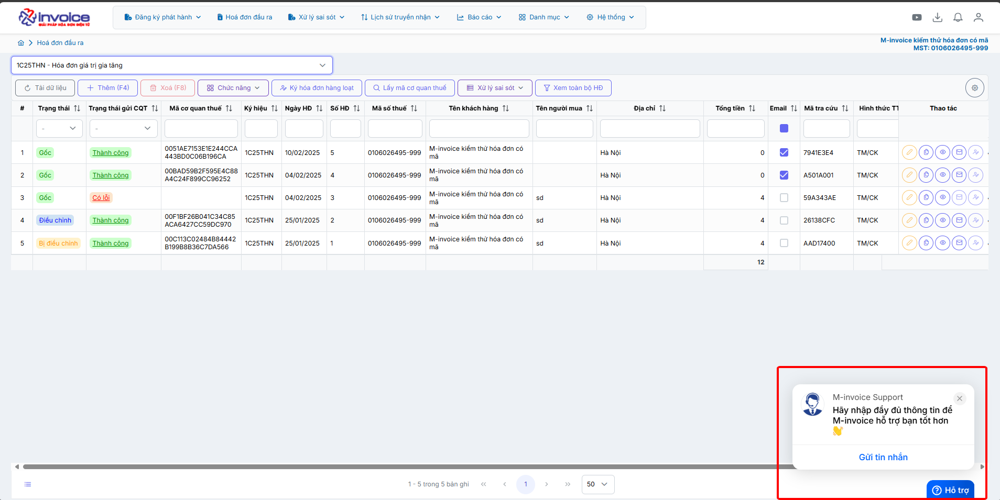

# **Danh mục đơn vị tính**

Dưới đây là những hướng dẫn thao tác cơ bản trên phần mềm hóa đơn điện tử M-Invoice ở phiên bản 2.0 vô cùng mạch lạc và dễ hiểu.

## **Thêm mới đơn vị tính**

Sử dụng để thêm đơn vị tính mới ngoài đơn vị tính có trên phần mềm

???+ Note "Ghi chú"

    Trong quá trình lập hoá đơn, có nhiều đơn vị tính không có trên phần mềm. Để giảm thao tác nhập lại khi nhập đơn vị tính, M-Invoice hướng dẫn NSD thực hiện thao tác thêm đơn vị tính mới vào phần mềm:

### **Trên giao diện trang chủ truy cập Danh mục --> đơn vị tính**

=== "Cách 1: Nhập thủ công"

    Bạn nhấn nút **Thêm(F4)** để bắt đầu thêm đơn vị tính
    Nhập đầy đủ thông tin như **Mã đơn vị tính, tên đơn vị tính ....**
    Khi nhập xong bạn nhấn Lưu để lưu đơn vị tính này vào

    

    
    Như vậy là bạn đã hoàn thành thêm mới đơn vị tính

=== "Cách 2: Nhập từ file excel"

    Trên giao diện Danh mục đươn vị tính bạn chọn **Nhập Excel**, sau đó nhấn **Tải file mẫu**

    

    

    Nhập đầy đủ thông tin bạn muốn tải lên vào file mẫu sau đó lưu lại (Những mục có dấu * là bắt buộc)

    

    Quay trở lại phần mềm nhấn Choose File để chọn file vừa lưu, sau đó nhấn Nhận File

    Như vậy là bạn đã tải file excel lên thành công

???+ info "Xin chân thành cảm ơn quý khách hàng đã tin dùng sản phẩm của M-Invoice"

    Có bất kỳ vướng mắc nào trong quá trình sử dụng hãy liên hệ với M-Invoice tại mục Hỗ trợ kỹ thuật góc phải bên dưới màn hình hoặc gọi tổng đài kỹ thuật của M-Invoice (1900.955.557 Nhánh 1)

Last updated on <strong>Jun 5, 2025</strong> by <strong>nhatth</strong>

