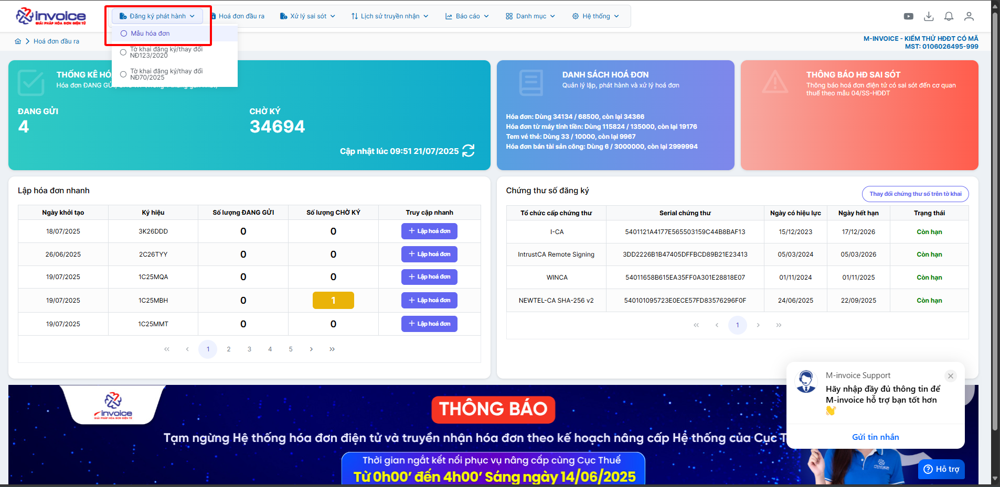
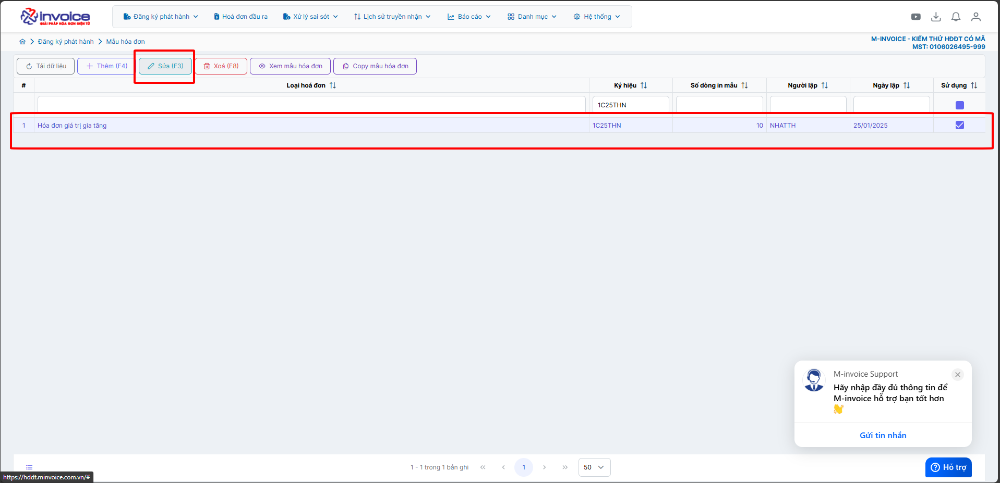
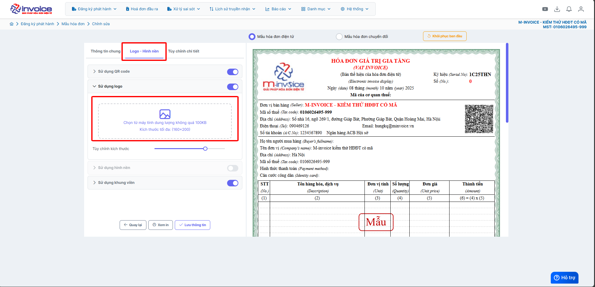
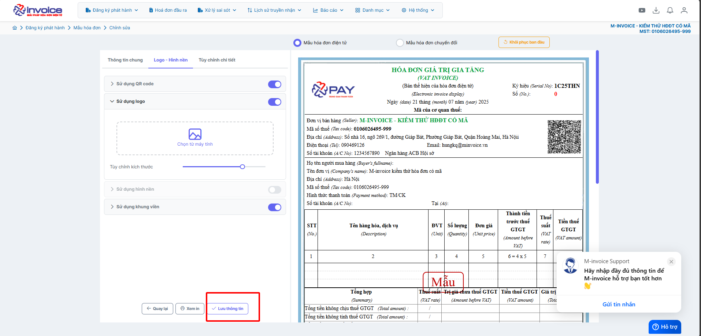
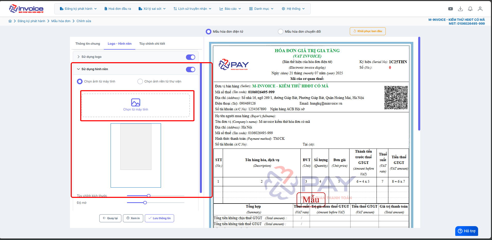
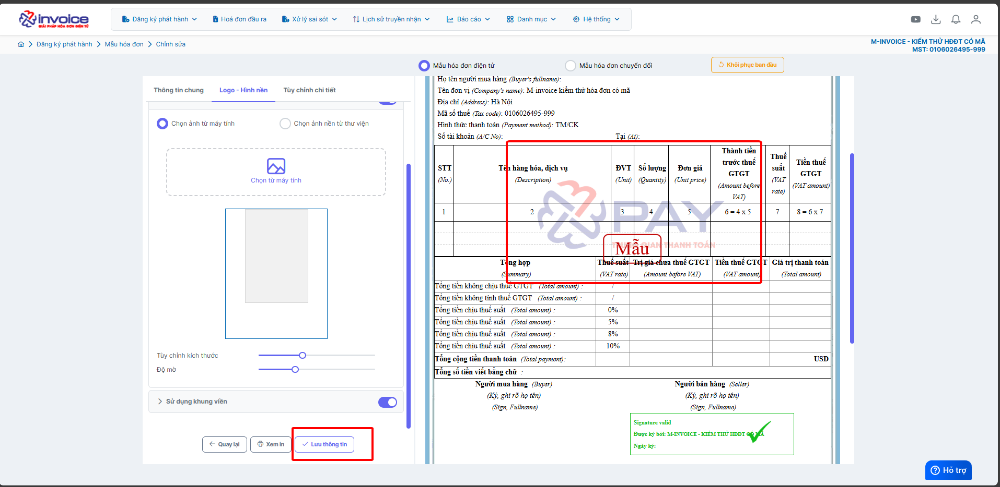
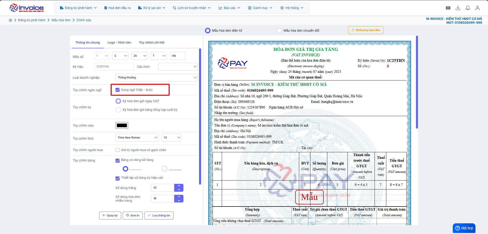
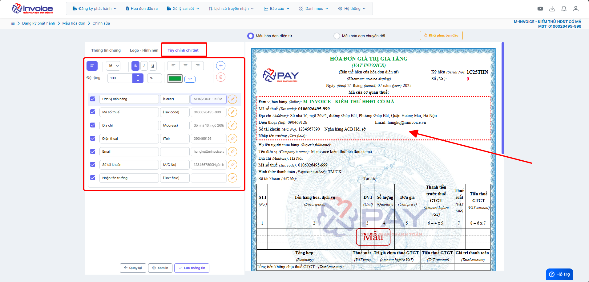

# **Chỉnh sửa mẫu hóa đơn**

## **Hướng dẫn chỉnh sửa mẫu hóa đơn**

???+ Note "🧩 Chức năng chỉnh mẫu hóa đơn"

    ✨ Chức năng **Chỉnh Mẫu Hóa Đơn**

    Chức năng **chỉnh mẫu hóa đơn** trên **phần mềm hóa đơn điện tử** giúp người dùng linh hoạt thiết kế và cá nhân hóa mẫu hóa đơn theo thương hiệu và nghiệp vụ riêng. Tính năng hỗ trợ đầy đủ các công cụ tùy chỉnh mạnh mẽ như sau:

    ---

    🎨 **Tùy chỉnh giao diện và bố cục**

    - 🖼️ **Tải lên Logo**
    Cho phép tải lên **hình ảnh logo** doanh nghiệp để hiển thị tại vị trí mong muốn trên hóa đơn.

    - 🌄 **Tải hình nền**
    Hỗ trợ **tải ảnh nền riêng**, tạo phong cách hóa đơn đặc trưng theo thương hiệu.

    - 🧱 **Sử dụng khung viền**
    Tăng tính thẩm mỹ và chuyên nghiệp bằng cách **bao viền khung** cho hóa đơn.

    - 🔳 **Chèn mã QR Code**
    Tự động hiển thị **QR Code** tra cứu hóa đơn — tiện lợi, nhanh chóng, chuẩn theo quy định.

    ---

    🛠️ **Tùy chỉnh chi tiết nội dung hóa đơn**

    - ➕ **Thêm trường thông tin tùy chọn**
    Cho phép bổ sung các trường như: **Thêm số tài khoản thứ 2**, v.v. (đây là trường hợp gắn thẳng trên mẫu) --> trường hợp muốn nhập từ phần mềm để hiện lên mẫu thì cần liên hệ kỹ thuật để xử lý (ví dụ thêm tên nhân viên tạo hóa đơn, hay ghi chú hóa đơn đó)

    - 🎨 **Tùy chỉnh chữ và màu sắc**
    - Chỉnh **màu chữ**
    - Chỉnh **font chữ**, **kích thước chữ**
    - Căn lề: **trái / phải / giữa**
    - Kiểu chữ: **đậm, nghiêng, gạch chân**

    - 📐 **Điều chỉnh độ rộng cột & căn lề ô**
    - Tùy chỉnh độ rộng các cột phù hợp với nội dung hiển thị
    - Căn chỉnh nội dung trong ô: **trái - phải - giữa**

    - 🌐 **Hỗ trợ song ngữ**
    Hiển thị nội dung hóa đơn theo **2 ngôn ngữ** (Ví dụ: Tiếng Việt – Tiếng Anh), thuận tiện cho doanh nghiệp có giao dịch quốc tế.

    ---

    > 💡 **Gợi ý sử dụng:**
    > Với giao diện chỉnh sửa **trực quan – dễ sử dụng**, người dùng có thể tạo ra những mẫu hóa đơn **chuyên nghiệp, hợp chuẩn, đậm chất thương hiệu** chỉ trong vài phút thao tác.

???+ Warning "Lưu ý"

    Những mẫu đặc thù yêu cầu cấu hình và vẽ mẫu theo yêu cầu hay liên hệ kỹ thuật để được xử lý

??? Abstract "Tải logo lên mẫu - Bấm vào đây để xem hướng dẫn"

    #### Tải logo lên mẫu

    **Hướng dẫn bằng GIF nhanh**

    

    **Hướng dẫn bằng hình ảnh chi tiết**

    

    

    

    

    

??? Abstract "Tải hình nền lên mẫu - Bấm vào đây để xem hướng dẫn"

    #### Tải hình nền lên mẫu

    **Hướng dẫn bằng GIF nhanh**

    

    **Hướng dẫn bằng hình ảnh chi tiết**

    

    

    

    

    

??? Abstract "Sử dụng khung viền mẫu hóa đơn - Bấm vào đây để xem hướng dẫn"

    #### Sử dụng khung viền mẫu hóa đơn

    **Hướng dẫn bằng GIF nhanh**

    

??? Abstract "Bật tắt chế độ song ngữ - Bấm vào đây để xem hướng dẫn"

    #### Bật tắt chế độ song ngữ

    

    

    

??? Abstract "Chỉnh font chữ, kích thước chữ - Căn lề: trái / phải / giữa - Kiểu chữ: đậm, nghiêng, gạch chân - 📐 Điều chỉnh độ rộng cột & căn lề ô - Bấm vào đây để xem hướng dẫn"

    #### 🎨 Tùy chỉnh chữ và màu sắc

    **Hướng dẫn bằng GIF trường hợp chỉnh font chữ và màu chữ**

    

    **Hướng dẫn bằng hình ảnh chi tiết**

    

    

    

???+ info "Xin chân thành cảm ơn quý khách hàng đã tin dùng sản phẩm của M-Invoice"

    Có bất kỳ vướng mắc nào trong quá trình sử dụng hãy liên hệ với M-Invoice tại mục Hỗ trợ kỹ thuật góc phải bên dưới màn hình hoặc gọi tổng đài kỹ thuật của M-Invoice (1900.955.557 Nhánh 1)

Last updated on <strong>Jul 24, 2025</strong> by <strong>nhatth</strong>

