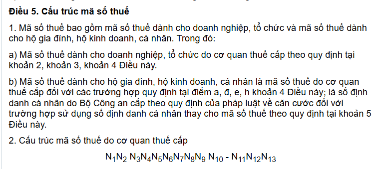
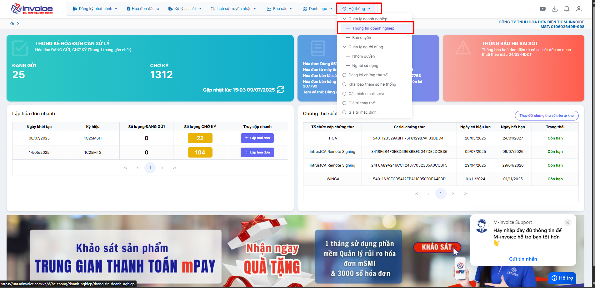
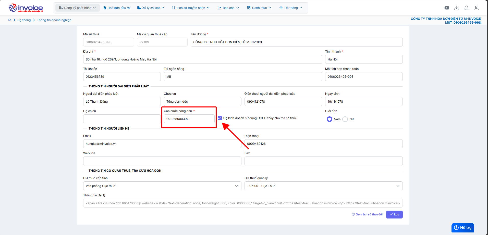

# **Hướng dẫn hộ kinh doanh chuyển đổi số định danh cá nhân thay thế mã số thuế**

  <h3 style="margin-top: 0; color: #2d3fa6;">📢 Thông báo quan trọng từ M-Invoice</h3>
  

    Theo <strong>Thông tư 86/2024/TT-BTC</strong>, <strong>từ ngày 1/7/2025</strong>,
    <strong>số định danh cá nhân sẽ thay thế mã số thuế</strong> trong các giao dịch thuế đối với cá nhân, hộ gia đình, hộ kinh doanh.
  

  

    Hãy cùng tìm hiểu <strong>hướng dẫn chi tiết</strong> qua bài viết tổng hợp của <strong>M-Invoice</strong> dưới đây.
  

## **Hướng dẫn hộ kinh doanh chuyển đổi số định danh cá nhân thay thế mã số thuế**

### **Thông tư 86/2024/TT-BTC: Hộ kinh doanh sử dụng số định danh cá nhân thay mã số thuế từ 1/7/2025**

Bộ trưởng Bộ Tài chính ban hành Thông tư 86/2024/TT-BTC ngày 23/12/2024 quy định về đăng ký thuế. Trong đó, điểm b khoản 1 và khoản 5 Điều 5 Thông tư 86/2024/TT-BTC quy định về **cấu trúc mã số thuế dành cho hộ gia đình, hộ kinh doanh, cá nhân** như sau:

Như vậy, theo quy định mới, từ ngày **01/07/2025**, tất cả **mã số thuế của hộ kinh doanh, cá nhân sẽ chuyển sang dùng số định danh cá nhân (CCCD)**.

???+ Warning "Ai sẽ bị ảnh hưởng từ quy định mới?"

    – Hộ kinh doanh, cá nhân kinh doanh (bao gồm cả kinh doanh nhỏ lẻ, online, cá nhân nộp thuế TNCN).

    – Người phụ thuộc (được đăng ký giảm trừ gia cảnh).

    – Cá nhân có phát sinh thu nhập chịu thuế (cho thuê nhà, đầu tư, cổ tức,…).

    – Tổ chức, doanh nghiệp đang có giao dịch với các đối tượng trên

### **Hướng dẫn hộ kinh doanh cập nhật số định danh thay thế mã số thuế trên M-invoice**

### **Bước 1: Truy cập hệ thống - thông tin doanh nghiệp trên phần mềm**

### **Bước 2: Khai báo CCCD trong thông tin doanh nghiệp và tích vào sử dụng thay cho MST**

???+ Danger "Lưu ý"

    Có một số mã số thuế CQT chưa đồng bộ được CCCD với Mã số thuế nên việc ký gửi vẫn báo lỗi: `20036 - Thông tin mã số thuế người bán không khớp trong chữ ký số`

???+ info "Xin chân thành cảm ơn quý khách hàng đã tin dùng sản phẩm của M-Invoice"

    Có bất kỳ vướng mắc nào trong quá trình sử dụng hãy liên hệ với M-Invoice tại mục Hỗ trợ kỹ thuật góc phải bên dưới màn hình hoặc gọi tổng đài kỹ thuật của M-Invoice (1900.955.557 Nhánh 1)

Last updated on <strong>July 9, 2025</strong> by <strong>nhatth</strong>

