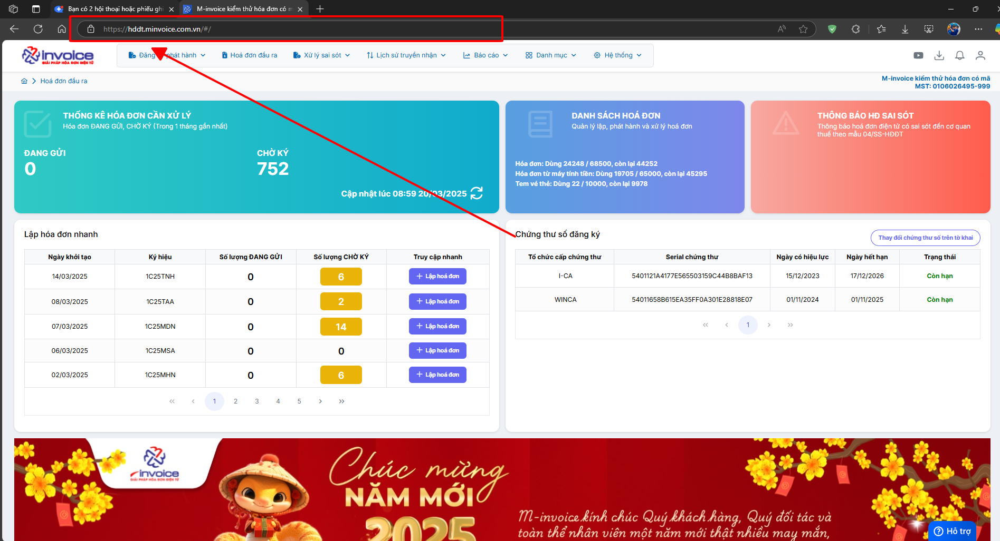
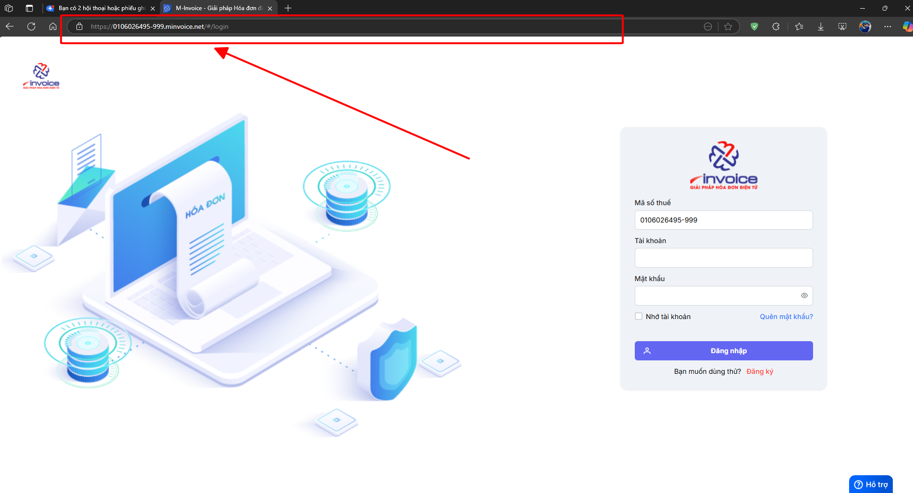
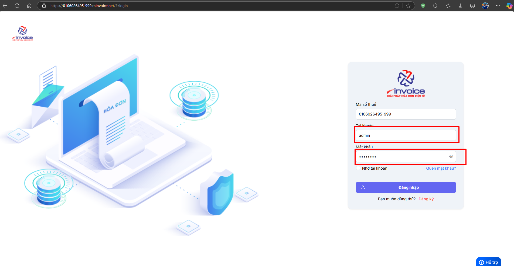
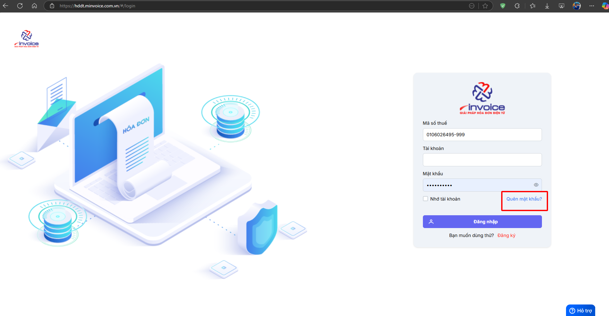
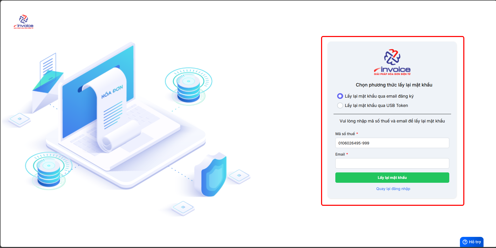

# **Đăng nhập M-invoice 2.0**

Dưới đây là những hướng dẫn thao tác cơ bản trên phần mềm hóa đơn điện tử M-Invoice ở phiên bản 2.0 vô cùng mạch lạc và dễ hiểu.

## **Hướng dẫn đăng nhập M-invoice 2.0**

**Thao tác cài đặt và thực hiện như sau**

### **Bước 1: Truy cập trình duyệt**

Quý khách truy cập vào trình duyệt đang dùng:

ví dụ:

- Google Chrome
  :fontawesome-brands-chrome:
- Microsoft Edge
  :fontawesome-brands-edge:
- Cốc Cốc, ...

**Có 2 đường link mà quý khách có thể truy cập:**

1.  [hddt.minvoice.com.vn](https://hddt.minvoice.com.vn/){:target="\_blank"}

2.  Mã_số_thuế.minvoice.net

Mã_số_thuế: là mã số thuế của công ty
**VD: 0106026495.minvoice.net**

### **Bước 2: Điền thông tin tài khoản để đăng nhập**

**Trường hợp quý khách quên mật khẩu thì có thể bấm vào QUÊN MẬT KHẨU để có thể lấy lại bằng 2 cách: email và chữ ký số**

???+ info "Xin chân thành cảm ơn quý khách hàng đã tin dùng sản phẩm của M-Invoice"

    Có bất kỳ vướng mắc nào trong quá trình sử dụng hãy liên hệ với M-Invoice tại mục Hỗ trợ kỹ thuật góc phải bên dưới màn hình hoặc gọi tổng đài kỹ thuật của M-Invoice (1900.955.557 Nhánh 1)

Last updated on <strong>Jun 5, 2025</strong> by <strong>nhatth</strong>

