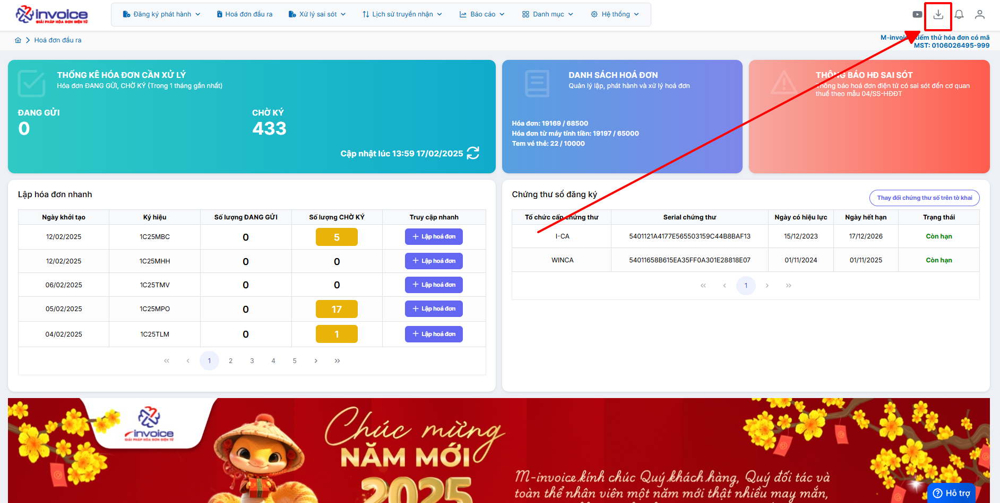
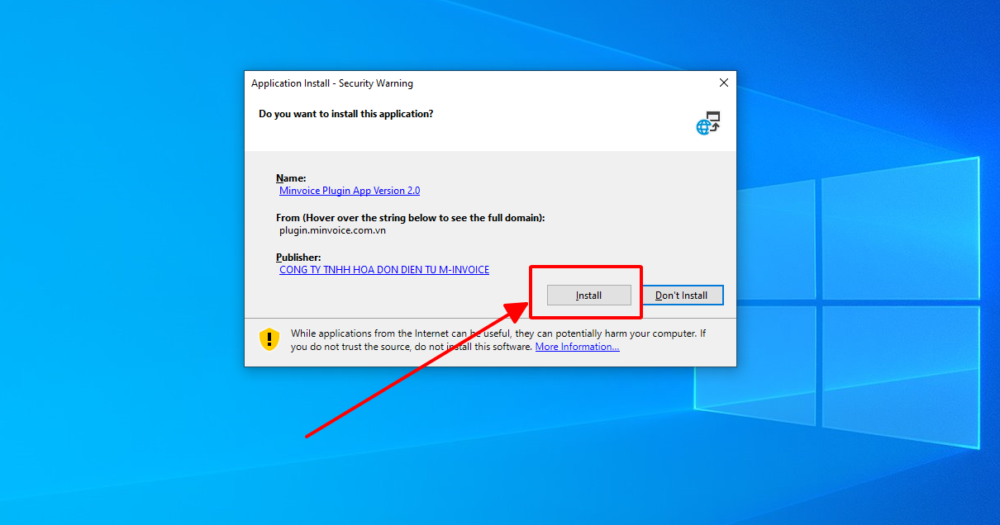

# **Đăng nhập M-invoice 2.0**

Dưới đây là những hướng dẫn thao tác cơ bản trên phần mềm hóa đơn điện tử M-Invoice ở phiên bản 2.0 vô cùng mạch lạc và dễ hiểu.

## **Hướng dẫn đăng nhập M-invoice 2.0**

**Thao tác cài đặt và thực hiện như sau**

### **Bước 1: Truy cập trình duyệt**

Quý khách truy cập vào trình duyệt đang dùng:

ví dụ:

- Google Chrome
  :fontawesome-brands-chrome:
- Microsoft Edge
  :fontawesome-brands-edge:
- Cốc Cốc, ...

**Có 2 đường link mà quý khách có thể truy cập:**

1.  [hddt.minvoice.com.vn](https://hddt.minvoice.com.vn/){:target="\_blank"}

2.  Mã_số_thuế.minvoice.net

Mã_số_thuế: là mã số thuế của công ty
**VD: 0106026495.minvoice.net**

### **Bước 2: Điền thông tin tài khoản để đăng nhập**

**Trường hợp quý khách quên mật khẩu thì có thể bấm vào QUÊN MẬT KHẨU để có thể lấy lại bằng 2 cách: email và chữ ký số**

### **Bước 3: Sau khi đăng nhập xong kiểm tra các thông tin sau**

#### **1. Thông tin doanh nghiệp**

**Kiểm tra các thông tin của doanh nghiệp của mình xem đã đúng hay chưa**

#### **2. Kí hiệu + mẫu hóa đơn.**

**Bấm sửa để có thể sửa mẫu hóa đơn**

#### **3. Kiểm tra bản quyền**

**Kiểm tra số lượng đã dùng**

#### **4. Đổi mật khẩu (nếu cần)**

#### **5. Cài đặt công cụ ký hóa đơn**

???+ Note "Ghi chú"

    Quý khách cần cài đặt công cụ cho các trường hợp sau đây

    - Lần đầu tiền sử dụng hóa đơn điện tử

    - Thực hiện ký hóa đơn bằng USB trên các thiêt bị khác

    - Sau khi cài đặt lại windows máy tính

**Bước 1: Nhấn vào biểu tượng cài đặt trên trang chủ giao diện**

**Bước 2: Nhấn Save để tải bộ cài về**

**Bước 3 : Mở bộ cài và cài đặt**

Chọn vào biểu tượng Plugin bên góc trái màn hình chọn **Show in folder**

Để khi cài đặt Plugin luôn khởi động khi bật máy bạn chọn **Run as adminstrator**

Bạn chon **Install** để bắt đầu cài đặt

Bạn chờ cho bộ cài Dowload và tự động cài đặt là hoàn thành

**Bước 4 : Kiểm tra bộ cài đã được cài đặt thành công hay chưa**

Kích chuột trái vào mũi tên góc phải màn hình, nếu có biểu tượng **M-invoice Plugin Version 2.0** như thế là công cụ ký plugin đã cài đặt thành công

???+ info "Xin chân thành cảm ơn quý khách hàng đã tin dùng sản phẩm của M-Invoice"

    Có bất kỳ vướng mắc nào trong quá trình sử dụng hãy liên hệ với M-Invoice tại mục Hỗ trợ kỹ thuật góc phải bên dưới màn hình hoặc gọi tổng đài kỹ thuật của M-Invoice (1900.955.557 Nhánh 1)

Last updated on <strong>Aug 05, 2025</strong> by <strong>nhatth</strong>

