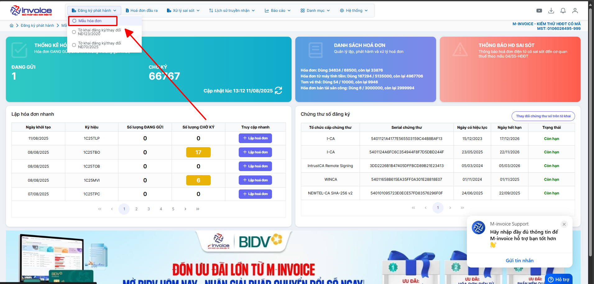
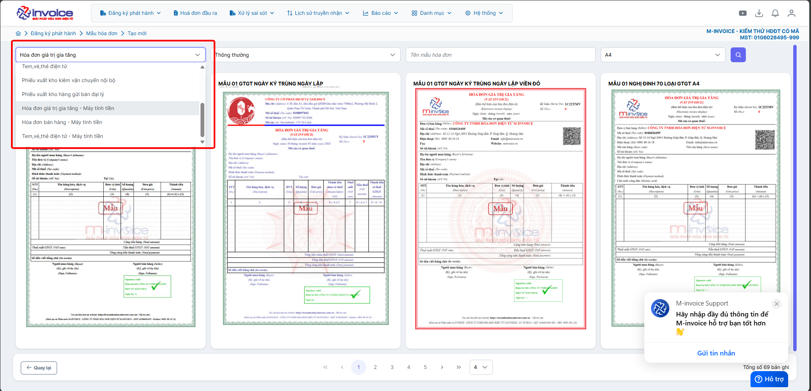
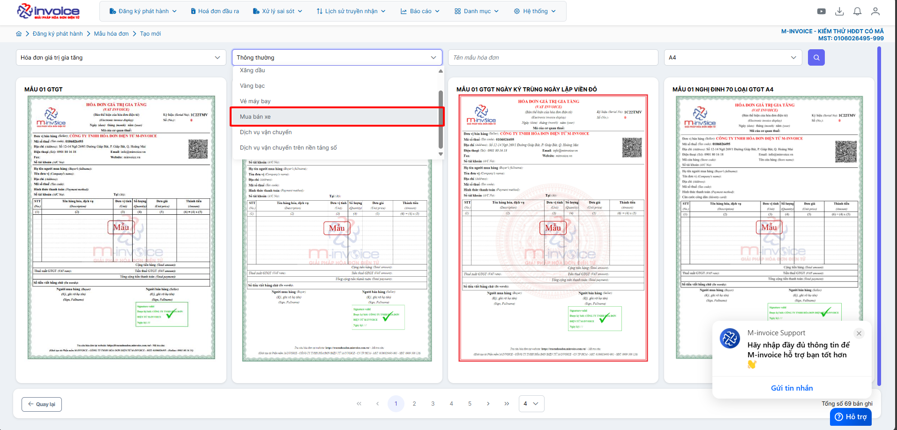
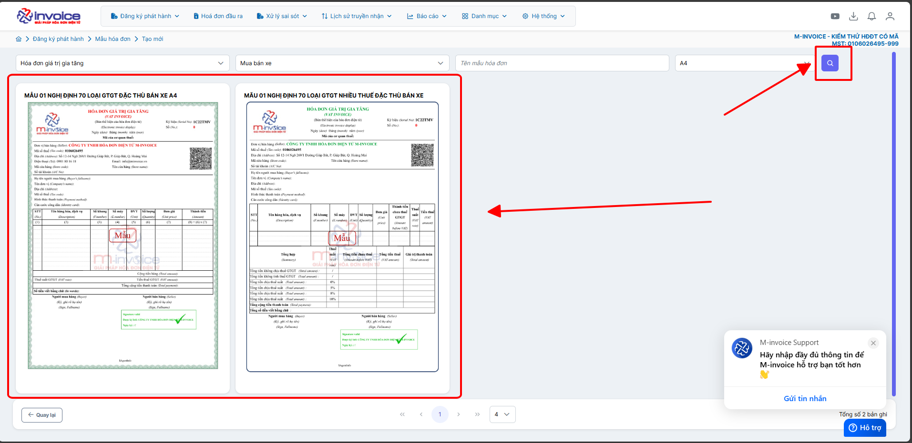

# **Sử dụng hóa đơn bán xe ô tô, mô tô (số khung, số máy)**

???+ Note "Nội dung"

    >📄 **Quy định về chuẩn XML truyền nhận hóa đơn điện tử với Cơ quan Thuế**

    Để đáp ứng yêu cầu kê khai và truyền nhận dữ liệu hóa đơn điện tử, **nội dung hóa đơn cần bổ sung thông tin về *Loại hàng hóa đặc trưng***, nhằm xác định các **vật tư, hàng hóa thuộc nhóm đặc thù** cần quản lý riêng. Cụ thể:

    ---

    🚗 **Đối với hàng hóa là Xe ô tô, xe mô tô**
    - Cần **theo dõi mã quy cách**.
    - **Tên các mã quy cách** phải được đặt là:
    - `Số khung`
    - `Số máy`

    ---

    🚚 **Đối với dịch vụ vận chuyển**
    - Cần theo dõi:
    - `Biển kiểm soát phương tiện vận chuyển`
    - **Thông tin này phải được khai báo trên hóa đơn**.

    ---

    🔍 Việc bổ sung thông tin đặc trưng giúp đảm bảo **tính chính xác và đầy đủ** khi truyền nhận dữ liệu với **Cơ quan Thuế**.

## **Hướng dấn sử dụng hóa đơn bán xe ô tô, mô tô (số khung, số máy)**

**Hướng dẫn video**

<iframe style="width: 50rem; height: 480px" src="https://www.youtube.com/embed/jNbuMUzLZ2k?si=loQGt3-zotanHOdF" title="YouTube video player" frameborder="0" allow="accelerometer; autoplay; clipboard-write; encrypted-media; gyroscope; picture-in-picture; web-share" referrerpolicy="strict-origin-when-cross-origin" allowfullscreen></iframe>

### **Bước 1: Chọn Mẫu hóa đơn**

Quý anh chị chọn vào phân hệ **“Đăng ký phát hành”** -> Chọn **“Mẫu hóa đơn”** -> Chọn **“Thêm”** để tiến hành chọn mẫu hóa đơn cho loại hình phù hợp

### **Bước 2: Chọn loại hóa đơn doanh nghiệp được phép sử dụng**

Quý anh chị chọn đúng loại hóa đơn của doanh nghiệp đang được cqt cho phép sử dụng. Ví dụ doanh nghiệp thuộc loại hóa đơn giá trị gia tăng máy tính tiền thì

Quý anh chị chọn Hóa đơn giá trị gia tăng - Máy tính tiền.

### **Bước 3: Chọn loại hình doanh nghiệp**

**Đối với doanh nghiệp thuộc loại hình mua bán xe thì quý anh chị thực hiện chọn mua bán xe**

### **Bước 4: Sau khi chọn xong loại hình quý anh chị thực hiện ấn vào nút tìm kiểm góc phải màn hình rồi kích chọn mẫu hóa đơn trên màn hình**

### **Bước 5: Chọn loại doanh nghiệp là "Hóa đơn mua bán xe" -> Bấm Lưu**

???+ info "Xin chân thành cảm ơn quý khách hàng đã tin dùng sản phẩm của M-Invoice"

    Có bất kỳ vướng mắc nào trong quá trình sử dụng hãy liên hệ với M-Invoice tại mục Hỗ trợ kỹ thuật góc phải bên dưới màn hình hoặc gọi tổng đài kỹ thuật của M-Invoice (1900.955.557 Nhánh 1)

Last updated on <strong>Aug 12, 2025</strong> by <strong>NHATTH</strong>

