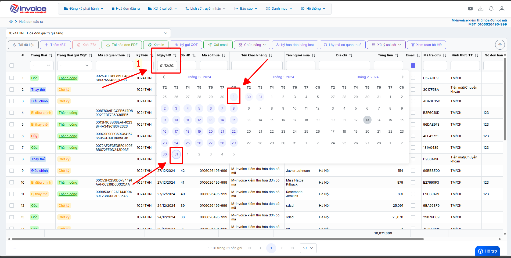
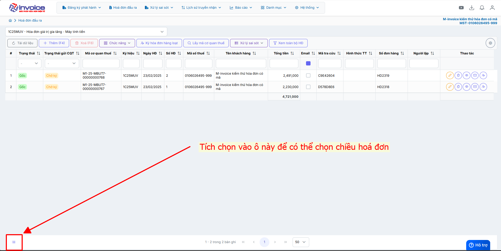
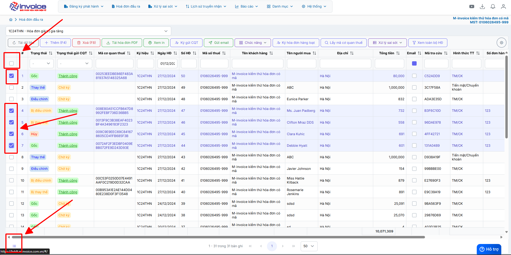
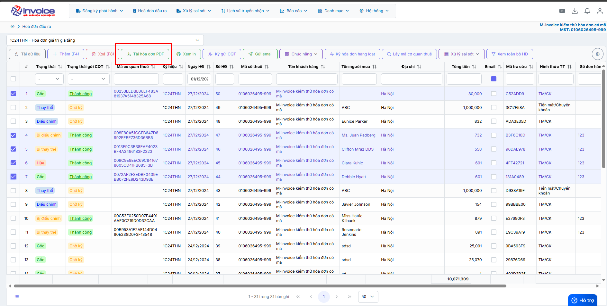
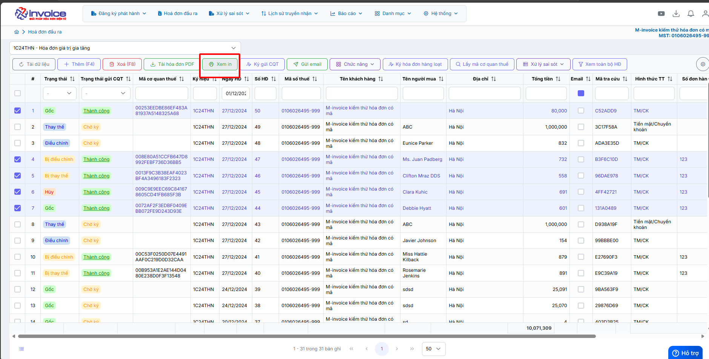
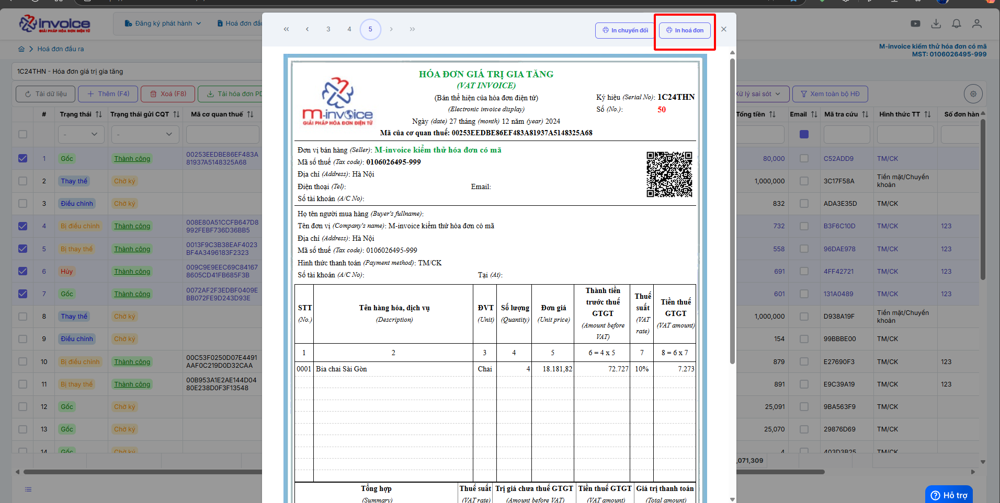
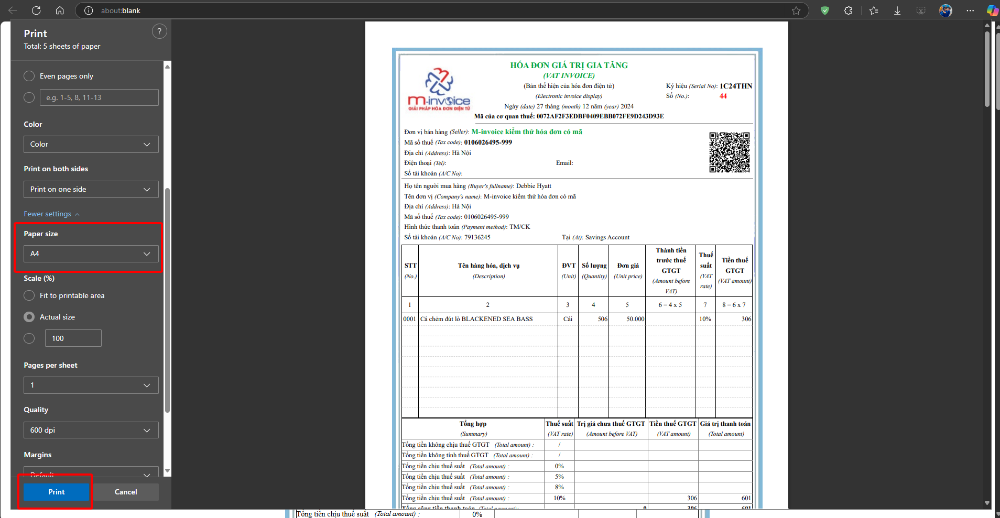
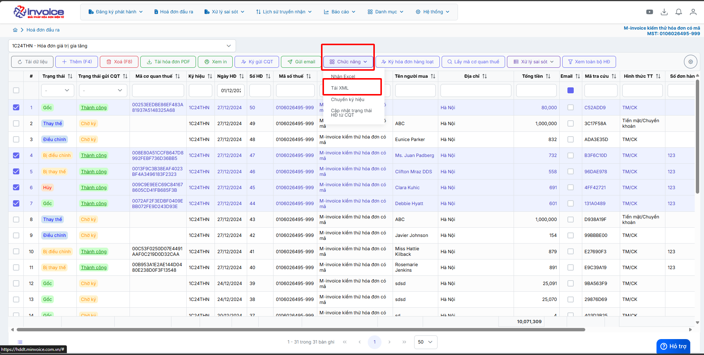

# **Tải hàng loạt hóa đơn PDF và XML**

Dưới đây là những hướng dẫn thao tác cơ bản trên phần mềm hóa đơn điện tử M-Invoice ở phiên bản 2.0 vô cùng mạch lạc và dễ hiểu.

## **Hướng dẫn In hàng loạt PDF và XML**

Trong quá trình phát hành hóa đơn người dùng sẽ có nhu cầu in hoá đơn PDF và XML. M-invoice xin giới thiệu với khách hàng và người sử dụng tính năng in hoá đơn PDF và XML

=== "Cách 1: In nhiều hoá đơn PDF"

    #### Cách 1: In nhiều hoá đơn PDF

    ???+ Note "Ghi chú"
        In bằng cách này sẽ tách file PDF và sẽ lâu hơn cách 2

        **Cách này bạn cần phải cài plugin thì mới tải được** [Hướng dẫn cài đặt plugin](plugin.md#attribute-lists){ data-preview }

        Trường hợp không in được load lâu, quý khách hàng cần cập nhật lên plugin mới nhất (Chuột phải vào biểu tượng plugin ở ảnh trên bấn cập nhật phần mềm)

    **Bước 1: Lọc những hoá đơn muốn tải (theo quý hoặc tháng)**

    

    **Bước 2: Tích chọn hoá đơn muốn tải hoặc chọn tất cả**

    

    

    **Bước 3: Bấm "tải hoá đơn PDF"**

    

    

=== "Cách 2: In nhiều hoá đơn PDF"

    #### Cách 2: In nhiều hoá đơn PDF

    ???+ Note "Ghi chú"
        In bằng cách này sẽ liền file PDF và sẽ nhanh hơn cách 1
    **Bước 1: Lọc những hoá đơn muốn tải (theo quý hoặc tháng)**

    

    **Bước 2: Tích chọn hoá đơn muỗn tải hoặc chọn tất cả**

    

    

    **Bước 3: Bấm "Xem in"**

    

    

    
    Chọn A4 để khi in không bị lỗi khung

=== "In nhiều XML"

    #### In nhiều XML

    ???+ Note "Ghi chú"

        **Cách này bạn cần phải cài plugin thì mới tải được** [Hướng dẫn cài đặt plugin](plugin.md#attribute-lists){ data-preview }

        Trường hợp không in được load lâu, quý khách hàng cần cập nhật lên plugin mới nhất (Chuột phải vào biểu tượng plugin ở ảnh trên bấn cập nhật phần mềm)

    **Bước 1: Lọc những hoá đơn muốn tải (theo quý hoặc tháng)**

    

    **Bước 2: Tích chọn hoá đơn muỗn tải hoặc chọn tất cả**

    

    

    **Bước 3: Chọn chức năng tải XML**

    

    **Anh chị vui lòng chờ để quá trình tải về được hoàn tất**

    

???+ info "Xin chân thành cảm ơn quý khách hàng đã tin dùng sản phẩm của M-Invoice"

    Có bất kỳ vướng mắc nào trong quá trình sử dụng hãy liên hệ với M-Invoice tại mục Hỗ trợ kỹ thuật góc phải bên dưới màn hình hoặc gọi tổng đài kỹ thuật của M-Invoice (1900.955.557 Nhánh 1)

Last updated on <strong>Aug 9, 2025</strong> by <strong>nhatth</strong>

