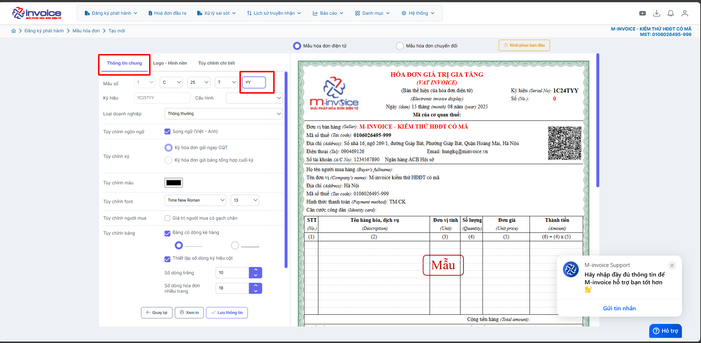

# **Thêm các trường mới theo NĐ70 ở trên mẫu hóa đơn**

???+ note "Nội dung"

    M-invoice xin hướng dẫn quý anh chị tạo mẫu ký hiệu hóa đơn mới và bổ sung thông tin trên mẫu cho Đơn vị có nhu cầu thêm các thông tin theo Nghị định 70/2025/NĐ-CP như: **Mã đơn vị có quan hệ với ngân sách** (gọi tắt là **MĐVCQHVNS**), **Số căn cước công dân, Số hộ chiếu**.

### Hướng dẫn video chi tiết

<iframe style="width: 50rem; height: 480px" src="https://www.youtube.com/embed/H7u3UsnUneY?si=LqN-mYljOz85LaXk" title="YouTube video player" frameborder="0" allow="accelerometer; autoplay; clipboard-write; encrypted-media; gyroscope; picture-in-picture; web-share" referrerpolicy="strict-origin-when-cross-origin" allowfullscreen></iframe>

### **Bước 1: Vào đăng ký phát hành -> Chọn Mẫu hóa đơn -> sau đó quý anh chị ấn Thêm**

### **Bước 2: Tìm kiếm mẫu hóa đơn**

**Thực hiện tìm kiếm loại hình thức hóa đơn phù hợp với công ty của quý anh chị. Công ty quý anh chị thuộc loại hình thức hóa đơn giá trị gia tăng - máy tính tiền thì anh thực hiện chọn như trên video. sau đó tìm mẫu và kích chọn mẫu hóa đơn quý anh chị mong muốn.**

### **Bước 3: Tạo ký hiệu mới**

**Sau khi chọn được mẫu hóa đơn quý anh chị thực hiện chỉnh sửa điền lại 2 ký tự cuối của ký hiệu hoá đơn tại phần thông tin chung (lưu ý 2 ký tự cuối không được trùng với ký hiệu cũ đã khởi tạo)**

### **Bước 4: Chỉnh sửa Logo-Hình nền**

**Chọn phần logo-hình nền để thực hiện thay đổi logo. Nếu có logo thực hiện tích chọn sử dụng logo và chọn hình ảnh từ máy tính để tải lên, có thể kéo tùy chỉnh kích thước logo to nhỏ tùy ý. Nếu không có logo quý anh chị nhấn vào nút để tắt sử dụng logo.**

**Tương tự nếu muốn sử dụng hình nền logo chìm quý anh chị thực hiện bật nút sử dụng hình nền sau đó tải ảnh logo nền chìm lên. Kéo căn chỉnh vị trí logo, tùy chỉnh kích thước, độ mờ của logo**

**Xem chi tiết chỉnh mẫu logo, hình nền [tại đây](../huong-dan/chinh-sua-mau-hoa-don.md#attribute-lists){ data-preview }**

### **Bước 5: Thêm các thông tin trên mẫu hóa đơn theo Nghị định 70/2025/NĐ-CP**

**Quý anh chị chọn phần tùy chỉnh chi tiết, sau đó chọn vào vùng thông tin người mua trên mẫu. Lúc này bên trái sẽ hiện thị các thông tin của vùng thông tin người mua, Bộ mẫu hóa đơn của M-invoice đã được bổ sung đầy đủ các thông tin trên mẫu hóa đơn theo Nghị định 70/2025/NĐ-CP quý anh chị thực hiện tích chọn vào Số hộ chiếu, Mã đơn vị quan hệ ngân sách nếu có nhu cầu sử dụng trên mẫu.**

### **Bước 6: Kiểm tra lại thông tin và lưu**

**Quý anh chị thực hiện kiểm tra lại mẫu số, ký hiệu ở phần thông tin chung. Nếu các thông tin đã chính xác quý anh chị ấn lưu thông tin. Như vậy quý anh chị vừa tạo thành công mẫu ký hiệu hóa đơn mới theo Nghị định 70/2025/NĐ-CP.**

**Sau khi tạo ký hiệu mới xong quý anh chị tích chọn vào hóa đơn đầu ra, lúc này ký hiệu mới tạo sẽ được hiển thị quý anh chị chọn đúng ký hiệu vừa tạo -> ấn thêm để tạo hóa đơn, sau đó quý anh chị thực hiện điền thông tin người mua. Nếu hóa đơn có phát sinh các thông tin bổ sung như mã đơn vị quan hệ ngân sách, số hộ chiếu, căn cước công dân thì quý anh chị thực hiện nhập, khi nhập đầy đủ thông tin xong quý anh chị thực hiện kiểm tra lại và ấn lưu. Khi lưu xong hóa đơn đã được tạo ra thành công quý anh chị ấn xem in, lúc này trên mẫu hóa đơn vừa khởi tạo sẽ hiển thị các thông tin bổ sung theo nghị định 70.**

  Lưu ý: Do cơ quan thuế không quản lý mẫu hóa đơn, nên sau khi tạo mẫu hóa đơn mới thì không cần phải thông báo Cơ quan thuế

???+ info "Xin chân thành cảm ơn quý khách hàng đã tin dùng sản phẩm của M-Invoice"

    Có bất kỳ vướng mắc nào trong quá trình sử dụng hãy liên hệ với M-Invoice tại mục Hỗ trợ kỹ thuật góc phải bên dưới màn hình hoặc gọi tổng đài kỹ thuật của M-Invoice (1900.955.557 Nhánh 1)

Last updated on <strong>Aug 15, 2025</strong> by <strong>nhatth</strong>

