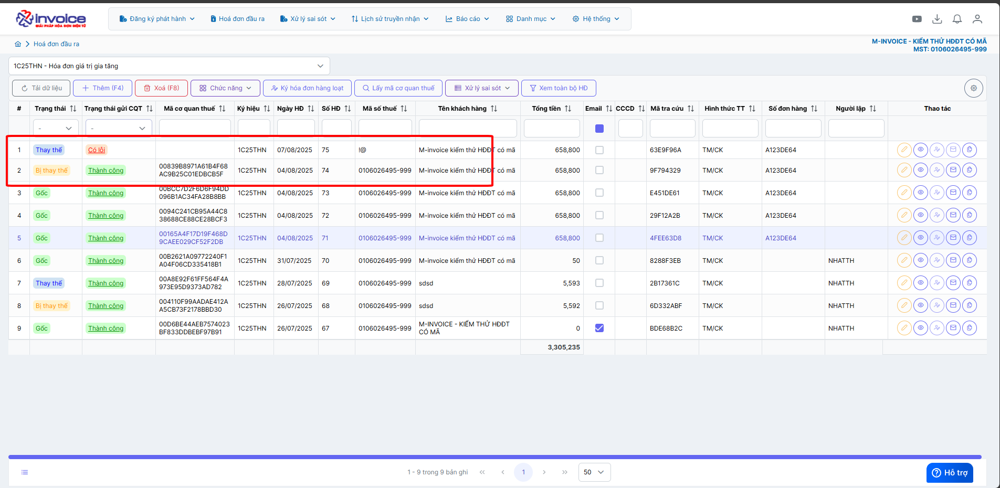
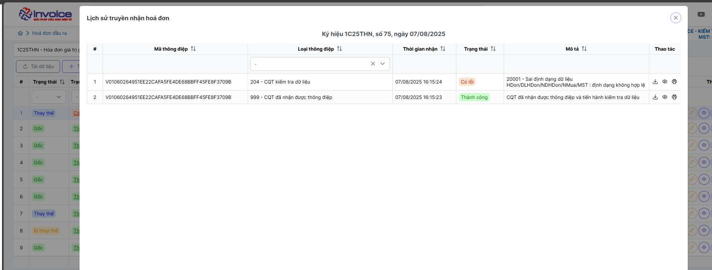
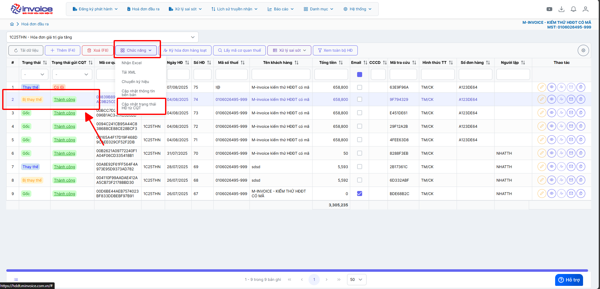
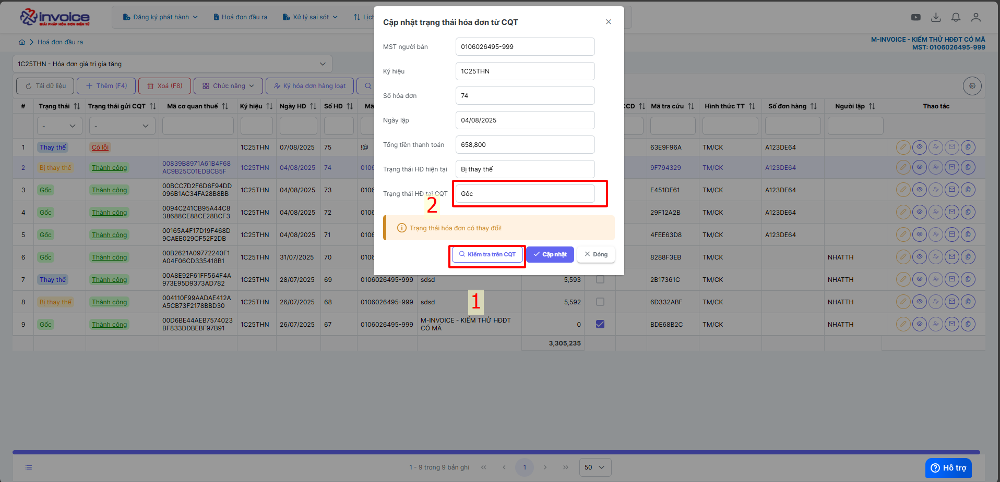
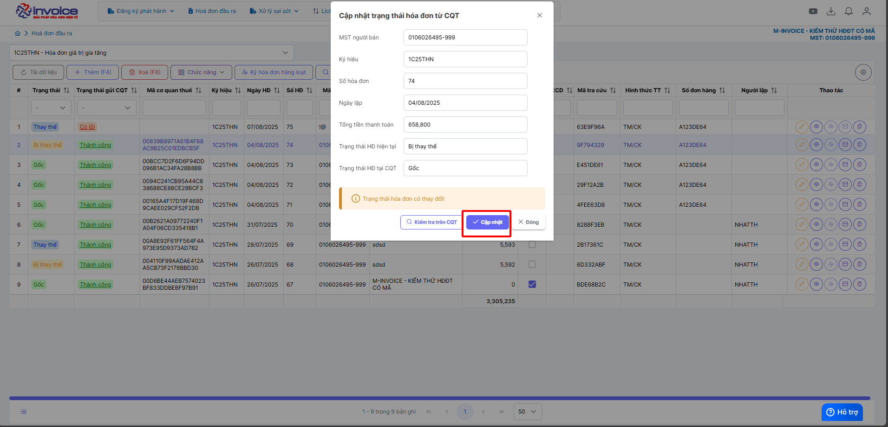
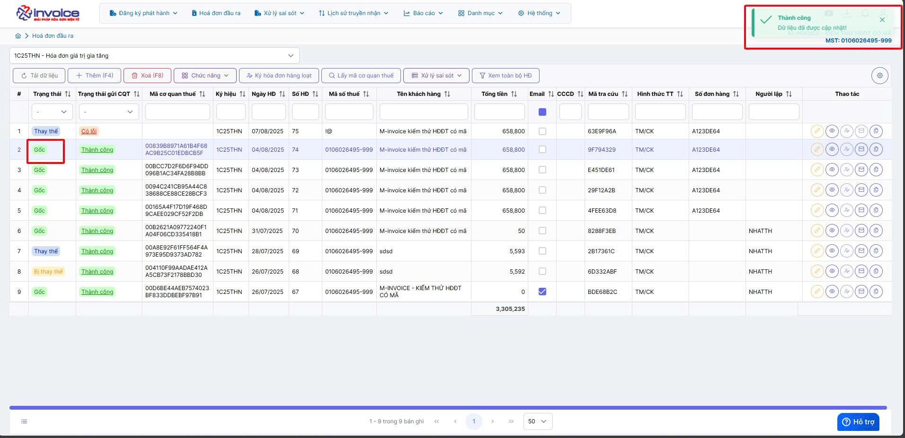

# **Khôi phục trạng thái hóa đơn về hóa đơn gốc 'mới'**

???+ "Điều kiện để có thể khôi phục hóa đơn về trạng thái gốc"

    **Chương trình cho phép khôi phục hóa đơn trong trường hợp:**

    1. Hóa đơn đã hủy nhưng chưa gửi TBSS đến CQT hoặc đã gửi TBSS đến CQT nhưng CQT phản hồi không hợp lệ.

    2. Hóa đơn làm thay thế, nhưng hóa đơn thay thế bị lỗi hoặc không hợp lệ

    3. Hóa đơn làm điều chỉnh, nhưng hóa đơn điều chỉnh bị lỗi hoặc không hợp lệ

---

**Ví dụ TH sau, hoá đơn số 75 thay thế cho hóa đơn 74 nhưng bị sai MST**

## **Hướng dẫn khôi phục trạng thái hóa đơn về hóa đơn gốc 'mới'**

### **Bước 1: Bấm vào vào hóa đơn cần khôi phục trạng thái --> chứng năng --> cập nhật trạng thái từ CQT**

### **Bước 2: Bấm Kiểm tra xem trạng thái HĐ tại CQT có phải là gốc hay không**

### **Bước 3: Nếu là gốc bấm cập nhật**

### **Bước 4: Cập nhật thành công**

Trường hợp như hóa đơn 75 bị lỗi trả về từ CQT --> không cần phải làm điều chỉnh hay thay thế --> Anh chị để nguyên đó và lập hóa đơn khác "Hóa đơn bị lỗi sẽ không tính doanh thu hay báo cáo với CQT"

---

???+ info "Xin chân thành cảm ơn quý khách hàng đã tin dùng sản phẩm của M-Invoice"

    Có bất kỳ vướng mắc nào trong quá trình sử dụng hãy liên hệ với M-Invoice tại mục Hỗ trợ kỹ thuật góc phải bên dưới màn hình hoặc gọi tổng đài kỹ thuật của M-Invoice (1900.955.557 Nhánh 1)

Last updated on <strong>Aug 07, 2025</strong> by <strong>NHATTH</strong>

