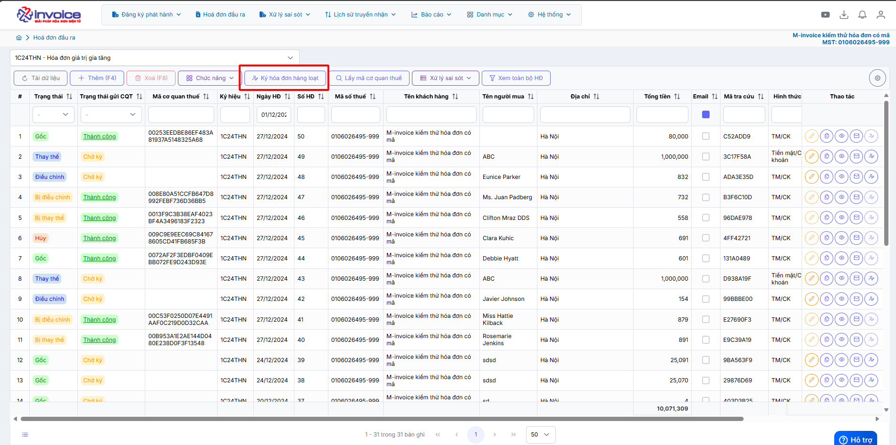
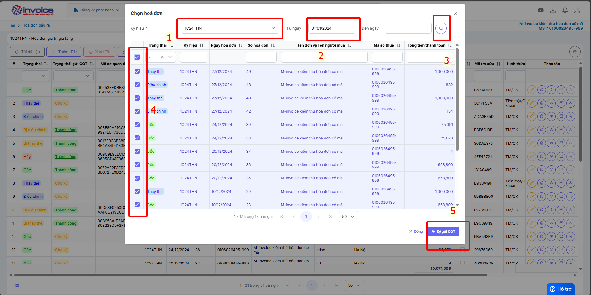

# **Ký Hàng Loạt**

Dưới đây là những hướng dẫn thao tác cơ bản trên phần mềm hóa đơn điện tử M-Invoice ở phiên bản 2.0 vô cùng mạch lạc và dễ hiểu.

## **Ký hàng loạt hoá đơn**

Chức năng này sinh ra nhằm mục đích cung cấp cho khách hàng có nhu cầu muốn ký nhiều hóa đơn liên tiếp. Các bước thực hiện như sau

???+ Note "Ghi chú"

    Trong quá trình sử dụng hóa đơn, người sử dụng đã tạo nhiều hóa đơn cho một hoặc nhiều khách hàng. Và trong khoảng thời gian đó có những khách hàng muốn xuất hóa đơn cùng lúc. Để tránh trường hợp người sử dụng sẽ phải bấm ký từng hóa đơn thì M-invoice xin giới thiệu chức năng ký hàng loạt hóa đơn

Hướng dẫn ký và gửi hóa đơn hàng loạt

<iframe style="width: 43rem; height: 380px" src="https://www.youtube.com/embed/37NwlIB3a7E?si=6_2gv_OdPu33Mf-_" title="YouTube video player" frameborder="0" allow="accelerometer; autoplay; clipboard-write; encrypted-media; gyroscope; picture-in-picture; web-share" referrerpolicy="strict-origin-when-cross-origin" allowfullscreen></iframe>

**Hướng dẫn sử dụng bằng hình ảnh nếu Quý khách không xem được video**

### **Bước 1: Chọn vào chức nằng ký hoá đơn hàng loạt**

### **Bước 2: Chọn các hoá đơn cần ký**

???+ info "Xin chân thành cảm ơn quý khách hàng đã tin dùng sản phẩm của M-Invoice"

    Có bất kỳ vướng mắc nào trong quá trình sử dụng hãy liên hệ với M-Invoice tại mục Hỗ trợ kỹ thuật góc phải bên dưới màn hình hoặc gọi tổng đài kỹ thuật của M-Invoice (1900.955.557 Nhánh 1)

Last updated on <strong>Jun 5, 2025</strong> by <strong>nhatth</strong>

